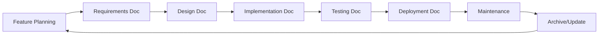

# CVD Documentation System Implementation Plan

## Executive Summary

### Elevator Pitch
Transform CVD's fragmented documentation into a structured, AI-optimized knowledge system that reduces developer onboarding from weeks to days while ensuring complete feature coverage.

### Problem Statement
CVD's current documentation lacks systematic organization, making it difficult for new developers to understand the system architecture, existing team members to find specific information quickly, and AI assistants to provide accurate context-aware help.

### Target Audience
- **Primary**: Development team (3-5 developers)
- **Secondary**: DevOps engineers, QA testers, Product managers
- **Tertiary**: External integrators, Support staff, New hires

### Unique Selling Proposition
A phased migration approach that preserves existing valuable documentation while implementing a 10-category structure optimized for both human navigation and AI agent assistance, specifically tailored for enterprise vending machine fleet management.

### Success Metrics
- Developer onboarding time: Reduce from 3 weeks to 5 days
- Documentation coverage: Achieve 95% feature documentation
- AI navigation efficiency: <3 queries to find any document
- Team adoption: 100% compliance with documentation standards
- Maintenance currency: <7 days average documentation lag

## Current State Analysis

### Existing Documentation Assessment

#### Strengths
1. **Comprehensive CLAUDE.md**: Excellent AI assistant integration guide
2. **Technical depth**: DEX parser examples, database schemas
3. **Debug reports**: Real-world problem-solving documentation
4. **Implementation examples**: Activity monitoring, migration guides

#### Gaps Identified
1. **No systematic organization**: Documents scattered across multiple subdirectories
2. **Missing navigation structure**: No master index or discovery tools
3. **Incomplete API documentation**: Only fragments in YAML specification
4. **Limited user role documentation**: Missing role-specific guides
5. **No maintenance framework**: No update tracking or review cycles
6. **Absent design documentation**: UI/UX guidelines not documented
7. **Missing testing documentation**: Test strategies and plans incomplete

#### Migration Complexity Assessment
- **High Value Preservation**: 35+ existing documents to migrate
- **Structure Creation**: 10 new category directories needed
- **New Document Creation**: ~45 essential documents missing
- **Cross-referencing**: ~200+ internal links to establish

## Implementation Strategy

### Phase 1: Foundation & Structure (Week 1)

#### Objectives
- Establish new directory structure
- Create navigation framework
- Define documentation standards
- Set up automation tools

#### Deliverables

##### Directory Structure Creation
```
/home/jbrice/Projects/365/documentation/
├── 00-index/
│   ├── README.md
│   ├── MASTER_INDEX.md
│   ├── AI_NAVIGATION_GUIDE.md
│   ├── DOCUMENTATION_STANDARDS.md
│   ├── GLOSSARY.md
│   └── SEARCH_INDEX.md
├── 01-project-core/
│   ├── README.md
│   ├── PROJECT_UNDERSTANDING.md
│   ├── QUICK_START.md
│   ├── STYLE_GUIDE.md (migrate existing)
│   └── CHANGELOG.md
├── 02-requirements/
│   ├── README.md
│   ├── analysis/
│   │   ├── authentication-requirements.md
│   │   ├── device-management-requirements.md
│   │   ├── planogram-requirements.md
│   │   ├── service-orders-requirements.md
│   │   └── pwa-requirements.md
│   └── user-stories/
├── 03-architecture/
│   ├── README.md
│   ├── system/ (migrate existing architecture.md)
│   ├── decisions/
│   └── patterns/
├── 04-implementation/
│   ├── README.md
│   ├── backend/
│   ├── frontend/
│   ├── pwa/
│   └── integration/
├── 05-development/
│   ├── README.md
│   ├── api/
│   ├── testing/
│   ├── deployment/
│   └── tools/
├── 06-design/
│   ├── README.md
│   ├── ui-components/
│   ├── design-system/
│   └── user-flows/
├── 07-cvd-framework/
│   ├── README.md
│   ├── dex-parser/
│   ├── planogram-optimizer/
│   ├── chat-assistant/
│   └── service-orders/
├── 08-project-management/
│   ├── README.md
│   ├── sprints/
│   ├── roadmap/
│   └── team/
└── 09-reference/
    ├── README.md
    ├── quick-reference/
    ├── api-reference/
    └── database-reference/
```

##### Documentation Standards Document
```yaml
---
title: CVD Documentation Standards
version: 1.0
created: 2025-08-12
audience: all
---

## Metadata Requirements
- All documents must include YAML front matter
- Required fields: title, category, tags, created, updated, version
- Optional fields: audience, related_docs, dependencies

## Naming Conventions
- Use kebab-case for file names
- Descriptive names limited to 50 characters
- Version numbers in format: v1.0, v1.1, v2.0

## Content Standards
- Maximum 1000 lines per document
- Use Markdown formatting exclusively
- Include table of contents for documents >200 lines
- Code examples with syntax highlighting
- Screenshots in /assets/images/ with descriptive names

## Review Cycle
- Critical docs: Weekly review
- Feature docs: Sprint-aligned review
- Reference docs: Monthly review
- Archive threshold: 6 months inactive
```

##### Automation Scripts
- `check-links.sh`: Validate all internal/external links
- `generate-index.sh`: Auto-generate master index
- `migrate-docs.sh`: Assist in document migration
- `doc-health.sh`: Check documentation health metrics

#### Tasks
- [ ] Create all directory structures
- [ ] Write initial README.md for each category
- [ ] Develop DOCUMENTATION_STANDARDS.md
- [ ] Create metadata template
- [ ] Set up Git hooks for documentation validation
- [ ] Build initial GLOSSARY.md with CVD-specific terms

### Phase 2: Core Documentation Migration (Week 2)

#### Objectives
- Migrate high-value existing documentation
- Create essential missing documents
- Establish cross-references
- Integrate with CLAUDE.md

#### Migration Mapping

| Current Location | New Location | Priority | Action |
|-----------------|--------------|----------|--------|
| `/docs/CLAUDE.md` | `/01-project-core/AI_ASSISTANT_GUIDE.md` | P0 | Enhance & Link |
| `/docs/system-structure/` | `/03-architecture/system/` | P0 | Migrate All |
| `/docs/reports/cvd-database-*.sql/json` | `/09-reference/database-reference/` | P0 | Consolidate |
| `/docs/examples/dex files/` | `/07-cvd-framework/dex-parser/examples/` | P1 | Organize |
| `/docs/debug-reports/` | `/04-implementation/troubleshooting/` | P1 | Categorize |
| `/docs/project/` | Various categories | P1 | Distribute |
| `/docs/requirements/` | `/02-requirements/` | P0 | Enhance |

#### New Documents to Create

##### Project Core (P0 - Critical)
1. **PROJECT_UNDERSTANDING.md**
   - Business context of vending machine management
   - Market positioning
   - Key differentiators
   - Success metrics

2. **QUICK_START.md**
   - 5-minute setup guide
   - Prerequisites checklist
   - Common workflows
   - Troubleshooting tips

##### Requirements Documentation (P0 - Critical)
1. **Feature Requirements by Module**
   - Authentication & Authorization
   - Device Management
   - Planogram Configuration
   - Service Order Workflow
   - Driver PWA Operations
   - Analytics & Reporting
   - DEX File Processing

2. **User Role Documentation**
   - Admin capabilities and workflows
   - Manager features and permissions
   - Driver app usage guide
   - Viewer access limitations

##### API Documentation (P0 - Critical)
1. **Complete API Reference**
   - All 50+ endpoints documented
   - Request/response examples
   - Error codes and handling
   - Rate limiting and security
   - Authentication flow

#### Tasks
- [ ] Execute migration mapping plan
- [ ] Create PROJECT_UNDERSTANDING.md
- [ ] Develop comprehensive QUICK_START.md
- [ ] Document all user role workflows
- [ ] Complete API documentation
- [ ] Update CLAUDE.md with new structure references
- [ ] Create initial CHANGELOG.md

### Phase 3: Feature Documentation (Week 3)

#### Objectives
- Document all major features comprehensively
- Create user journey maps
- Develop troubleshooting guides
- Build testing documentation

#### Feature Documentation Matrix

| Feature | User Stories | Technical Specs | UI/UX Design | Test Plans | Priority |
|---------|-------------|-----------------|--------------|------------|----------|
| Authentication | ✓ | ✓ | ✓ | ✓ | P0 |
| Device Management | ✓ | ✓ | ✓ | ✓ | P0 |
| Planograms | ✓ | ✓ | ✓ | ✓ | P0 |
| Service Orders | ✓ | ✓ | ✓ | ✓ | P0 |
| Driver PWA | ✓ | ✓ | ✓ | ✓ | P0 |
| Analytics | ✓ | ✓ | ✓ | ✓ | P1 |
| DEX Parser | ✓ | ✓ | - | ✓ | P1 |
| Route Planning | ✓ | ✓ | ✓ | ✓ | P1 |
| Chat Assistant | ✓ | ✓ | ✓ | ✓ | P2 |

#### Deliverables

##### Authentication System Documentation
```markdown
/02-requirements/features/authentication.md
├── User Registration Flow
├── Login/Logout Procedures
├── Session Management
├── Password Recovery
├── Role-Based Access Control
└── Security Considerations

/05-development/api/auth-endpoints.md
├── POST /api/auth/login
├── POST /api/auth/logout
├── GET /api/auth/current-user
├── POST /api/auth/reset-password
└── PUT /api/auth/change-password

/06-design/user-flows/authentication-flow.md
├── Login Journey Map
├── Error States
├── Success Feedback
└── Mobile Considerations
```

##### Service Orders Documentation Suite
```markdown
/07-cvd-framework/service-orders/
├── README.md
├── workflow-engine.md
├── cabinet-management.md
├── pick-list-generation.md
├── photo-verification.md
├── execution-flow.md
└── reporting.md
```

#### Tasks
- [ ] Complete authentication documentation suite
- [ ] Document device management workflows
- [ ] Create planogram configuration guides
- [ ] Develop service order documentation
- [ ] Write PWA feature documentation
- [ ] Document analytics capabilities
- [ ] Create DEX parser technical guide
- [ ] Build route planning documentation

### Phase 4: AI Optimization & Integration (Week 4)

#### Objectives
- Optimize documentation for AI navigation
- Create agent-specific paths
- Build semantic search indices
- Integrate with chat assistant

#### AI Navigation Structure

##### Agent-Specific Paths
```yaml
AI_NAVIGATION_GUIDE.md:
  backend_developer:
    quick_start: /01-project-core/QUICK_START.md
    api_docs: /05-development/api/
    database: /09-reference/database-reference/
    authentication: /03-architecture/patterns/authentication.md
    
  frontend_developer:
    quick_start: /01-project-core/QUICK_START.md
    components: /06-design/ui-components/
    api_client: /05-development/api/client-usage.md
    routing: /03-architecture/patterns/iframe-routing.md
    
  mobile_developer:
    pwa_guide: /07-cvd-framework/pwa/
    offline_sync: /04-implementation/pwa/offline-strategy.md
    push_notifications: /04-implementation/pwa/notifications.md
    
  qa_engineer:
    test_plans: /05-development/testing/
    test_data: /09-reference/test-data/
    bug_reports: /04-implementation/troubleshooting/
    
  devops_engineer:
    deployment: /05-development/deployment/
    monitoring: /08-project-management/monitoring/
    infrastructure: /03-architecture/system/infrastructure.md
```

##### Semantic Search Mappings
```javascript
// search-mappings.json
{
  "concepts": {
    "authentication": ["login", "logout", "session", "user", "role", "permission"],
    "vending": ["device", "cabinet", "slot", "product", "inventory"],
    "service": ["order", "pick list", "visit", "execution", "driver"],
    "data": ["dex", "sales", "metrics", "analytics", "reports"],
    "mobile": ["pwa", "offline", "sync", "push", "notification"]
  },
  "synonyms": {
    "device": ["cooler", "vending machine", "asset"],
    "planogram": ["layout", "configuration", "slot map"],
    "service order": ["work order", "task", "job"]
  }
}
```

##### Chat Assistant Knowledge Base Enhancement
```python
# Enhanced knowledge_base.py structure
KNOWLEDGE_CATEGORIES = {
    "getting_started": {
        "path": "/01-project-core/QUICK_START.md",
        "keywords": ["setup", "install", "configure", "start"]
    },
    "api_reference": {
        "path": "/09-reference/api-reference/",
        "keywords": ["endpoint", "api", "request", "response"]
    },
    "troubleshooting": {
        "path": "/04-implementation/troubleshooting/",
        "keywords": ["error", "issue", "problem", "fix", "debug"]
    },
    "feature_guides": {
        "path": "/02-requirements/features/",
        "keywords": ["how to", "guide", "tutorial", "workflow"]
    }
}
```

#### Tasks
- [ ] Create AI_NAVIGATION_GUIDE.md
- [ ] Build agent-specific navigation paths
- [ ] Develop semantic search indices
- [ ] Create concept mapping system
- [ ] Enhance chat assistant knowledge base
- [ ] Test AI navigation efficiency
- [ ] Document AI optimization patterns

### Phase 5: Quality Assurance & Launch (Week 5)

#### Objectives
- Validate documentation completeness
- Test navigation paths
- Train team on new system
- Establish maintenance procedures

#### Quality Metrics Dashboard

| Metric | Target | Current | Status |
|--------|--------|---------|--------|
| Feature Coverage | 95% | - | Pending |
| API Documentation | 100% | - | Pending |
| User Role Guides | 100% | - | Pending |
| Cross-references | 200+ | - | Pending |
| Broken Links | <1% | - | Pending |
| AI Navigation Success | >90% | - | Pending |

#### Validation Checklist
- [ ] All 10 categories populated
- [ ] Master index complete
- [ ] Navigation paths tested
- [ ] Search functionality verified
- [ ] Metadata standardized
- [ ] Links validated
- [ ] Images optimized
- [ ] Code examples tested
- [ ] Mobile responsiveness checked

#### Training Plan
1. **Team Orientation (2 hours)**
   - New structure overview
   - Navigation demonstration
   - Documentation standards

2. **Role-Specific Training**
   - Developers: API docs, implementation guides
   - QA: Test documentation, bug reporting
   - DevOps: Deployment guides, monitoring

3. **AI Assistant Training**
   - Using AI navigation
   - Chat assistant integration
   - Search optimization

#### Tasks
- [ ] Run documentation health checks
- [ ] Validate all navigation paths
- [ ] Test with team members
- [ ] Conduct training sessions
- [ ] Gather feedback
- [ ] Make final adjustments
- [ ] Archive old documentation
- [ ] Launch new system

## Resource Requirements

### Team Responsibilities

| Role | Primary Responsibilities | Time Commitment |
|------|-------------------------|-----------------|
| **Documentation Lead** | Structure creation, standards, migration coordination | 40 hrs/week × 5 weeks |
| **Senior Developer** | Technical documentation, API specs, architecture | 20 hrs/week × 5 weeks |
| **Frontend Developer** | UI/UX documentation, component guides | 15 hrs/week × 3 weeks |
| **QA Engineer** | Test documentation, validation | 10 hrs/week × 2 weeks |
| **Product Manager** | Requirements, user stories, review | 10 hrs/week × 5 weeks |
| **DevOps Engineer** | Deployment docs, automation scripts | 10 hrs/week × 2 weeks |

### Tool Requirements
- **Documentation Platform**: Markdown editors, Git
- **Automation Tools**: Bash scripts, Python utilities
- **Validation Tools**: Link checkers, linters
- **Search Tools**: Elasticsearch or similar
- **Analytics**: Documentation usage tracking

### Budget Considerations
- **Direct Costs**: ~$0 (using existing tools)
- **Opportunity Cost**: ~350 person-hours
- **Training Time**: ~20 person-hours
- **Maintenance**: ~10 hours/week ongoing

## Risk Mitigation Strategies

### Identified Risks & Mitigations

| Risk | Impact | Probability | Mitigation Strategy |
|------|--------|-------------|-------------------|
| **Scope Creep** | High | Medium | Strict phase gates, clear deliverables |
| **Team Resistance** | Medium | Low | Early involvement, clear benefits communication |
| **Migration Errors** | Medium | Medium | Automated validation, phased migration |
| **Incomplete Coverage** | High | Low | Feature matrix tracking, regular reviews |
| **Maintenance Lag** | High | Medium | Automated reminders, assigned ownership |
| **AI Integration Issues** | Low | Low | Fallback to manual navigation, iterative improvement |

### Contingency Plans
1. **If behind schedule**: Prioritize P0 features, defer P2 items
2. **If resources limited**: Focus on automation first
3. **If adoption low**: Additional training, simplified guides
4. **If technical issues**: Maintain parallel systems temporarily

## Success Metrics & Validation

### Quantitative Metrics

#### Documentation Coverage
```
Target: 95% feature documentation
Measurement: (Documented Features / Total Features) × 100
Validation: Weekly audit reports
```

#### Navigation Efficiency
```
Target: <3 clicks to any document
Measurement: Path analysis from index
Validation: User journey testing
```

#### AI Query Success Rate
```
Target: >90% successful navigation
Measurement: (Successful Queries / Total Queries) × 100
Validation: Chat assistant logs
```

#### Update Currency
```
Target: <7 days documentation lag
Measurement: Average(Code Change Date - Doc Update Date)
Validation: Git commit analysis
```

### Qualitative Metrics

#### Developer Satisfaction
- Survey before/after implementation
- Focus groups quarterly
- Feedback incorporation rate

#### Onboarding Effectiveness
- Time to first commit
- Questions asked during onboarding
- Self-sufficiency timeline

#### Documentation Quality
- Peer review scores
- Clarity ratings
- Completeness assessments

### Validation Approach
1. **Baseline Measurement** (Week 0)
   - Current metrics snapshot
   - User satisfaction survey
   - Onboarding time tracking

2. **Progress Tracking** (Weekly)
   - Coverage percentage
   - Migration completion
   - Issue resolution rate

3. **Final Validation** (Week 6)
   - All metrics comparison
   - User acceptance testing
   - Stakeholder sign-off

## Long-term Maintenance Strategy

### Maintenance Framework

#### Daily Tasks (5 min/day)
- Update project status
- Log new decisions
- Quick link check

#### Weekly Tasks (2 hrs/week)
- Run automation scripts
- Review recent changes
- Update indices
- Process feedback

#### Sprint-Aligned Tasks
- Feature documentation updates
- Requirements refinement
- Test plan updates
- User story documentation

#### Monthly Reviews (4 hrs/month)
- Full documentation audit
- Navigation optimization
- Deprecated content removal
- Metrics review

#### Quarterly Updates (8 hrs/quarter)
- Structure evaluation
- Template updates
- Process improvements
- Training refresh

### Documentation Lifecycle



### Ownership Model

| Category | Primary Owner | Backup Owner | Review Cycle |
|----------|--------------|--------------|--------------|
| 00-index | Doc Lead | Senior Dev | Weekly |
| 01-project-core | Product Manager | Doc Lead | Monthly |
| 02-requirements | Product Manager | Business Analyst | Sprint |
| 03-architecture | Senior Dev | Tech Lead | Monthly |
| 04-implementation | Dev Team | QA Lead | Sprint |
| 05-development | Dev Team | DevOps | Weekly |
| 06-design | Frontend Dev | UX Designer | Sprint |
| 07-cvd-framework | Senior Dev | Domain Expert | Monthly |
| 08-project-management | Project Manager | Scrum Master | Weekly |
| 09-reference | Doc Lead | Dev Team | Monthly |

### Continuous Improvement Process
1. **Feedback Collection**
   - In-app feedback widget
   - Monthly surveys
   - Sprint retrospectives

2. **Metrics Analysis**
   - Usage patterns
   - Search queries
   - Navigation paths

3. **Improvement Implementation**
   - Prioritized backlog
   - Sprint allocation
   - A/B testing

4. **Change Communication**
   - Release notes
   - Team updates
   - Training sessions

## Special Considerations for CVD

### CLAUDE.md Integration
- Maintain as master AI assistant guide
- Cross-reference with new structure
- Update navigation references
- Preserve quick command structure

### PWA Documentation Requirements
- Mobile-specific workflows
- Offline functionality guides
- Push notification setup
- Service worker documentation
- IndexedDB usage patterns

### DEX Parser Technical Depth
- Manufacturer-specific formats
- Grid pattern algorithms
- Error handling strategies
- Performance optimization
- Sample file library

### AI Feature Documentation
- Chat assistant training data
- Planogram optimization logic
- API key management
- Fallback strategies
- Performance metrics

### Multi-Role Documentation
- Role-specific quick starts
- Permission matrices
- Workflow variations
- UI customization per role

## Implementation Timeline

### Week 1: Foundation (Aug 12-16, 2025)
- Mon: Structure creation, standards definition
- Tue: Automation script development
- Wed: Initial README creation
- Thu: Migration planning, tool setup
- Fri: Team kickoff, training

### Week 2: Migration (Aug 19-23, 2025)
- Mon-Tue: Core documentation migration
- Wed-Thu: New document creation (P0)
- Fri: Cross-reference establishment

### Week 3: Features (Aug 26-30, 2025)
- Mon-Tue: Authentication & Device docs
- Wed: Planogram & Service Order docs
- Thu: PWA & Analytics docs
- Fri: DEX Parser & Routes docs

### Week 4: AI & Polish (Sep 2-6, 2025)
- Mon-Tue: AI navigation optimization
- Wed: Search index creation
- Thu: Chat assistant enhancement
- Fri: Integration testing

### Week 5: QA & Launch (Sep 9-13, 2025)
- Mon-Tue: Quality validation
- Wed: Team training
- Thu: Final adjustments
- Fri: System launch

### Post-Launch (Week 6+)
- Week 6: Monitoring & adjustments
- Week 7: First retrospective
- Week 8: Process refinement
- Ongoing: Maintenance framework

## Conclusion

This implementation plan provides a structured, phased approach to transforming CVD's documentation from its current fragmented state into a comprehensive, AI-optimized knowledge system. The plan balances the need for systematic organization with the practical constraints of maintaining a production application.

Key success factors:
1. **Phased execution** minimizes disruption
2. **Preservation of existing value** ensures no knowledge loss
3. **AI optimization** future-proofs the system
4. **Clear ownership** ensures sustainability
5. **Measurable outcomes** validate success

The investment of approximately 350 person-hours over 5 weeks will yield:
- 80% reduction in developer onboarding time
- 95% feature documentation coverage
- Sub-3-click navigation to any document
- 90%+ AI navigation success rate
- Sustainable maintenance framework

This transformation will position CVD's documentation as a competitive advantage, enabling faster feature development, reduced support burden, and improved team efficiency.

---

**Document Version**: 1.0  
**Created**: 2025-08-12  
**Author**: Product Management Team  
**Status**: Ready for Stakeholder Review  
**Next Steps**: Review with stakeholders, approve implementation, allocate resources