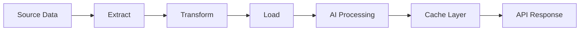

# AI Planogram Data Requirements Specification

## Executive Summary

This document defines the data requirements for the AI Planogram Enhancement System, including data volumes, retention policies, pipeline specifications, and quality requirements for successful AI model operation.

## 1. Data Volume Requirements

### Historical Data Requirements

#### Minimum Training Data
- **Sales Transactions**: 90 days minimum (180 days optimal)
  - Volume: ~50-100 transactions per device per day
  - Total: ~126,000 records for 14 devices (90 days)
- **Planogram Changes**: 6 months history
  - Volume: ~2-5 changes per device per month
  - Total: ~420 change records
- **Service Orders**: 3 months minimum
  - Volume: ~2-4 per device per month
  - Total: ~168 records

#### Data Quality Thresholds
- **Completeness**: >95% of required fields populated
- **Accuracy**: <2% error rate in product mappings
- **Consistency**: 100% referential integrity maintained
- **Timeliness**: Data no older than 24 hours for real-time features

### Real-Time Data Requirements

#### Streaming Data Volumes
```yaml
placement_scoring:
  requests_per_minute: 120
  data_per_request: 2 KB
  response_size: 1 KB
  cache_ttl: 300 seconds

revenue_prediction:
  requests_per_minute: 30
  data_per_request: 50 KB
  response_size: 5 KB
  cache_ttl: 3600 seconds

demand_forecasting:
  requests_per_minute: 20
  data_per_request: 10 KB
  response_size: 15 KB
  cache_ttl: 21600 seconds
```

## 2. Data Pipeline Specifications

### ETL Pipeline Architecture



### Data Sources

#### Primary Sources
1. **Sales Data** (`sales` table)
   - Update frequency: Batch every 4 hours
   - Format: Structured SQL
   - Volume: ~2,000 records/day

2. **DEX Records** (`dex_reads`, `dex_pa_records`)
   - Update frequency: Daily batch
   - Format: Semi-structured text → parsed JSON
   - Volume: ~500 records/day

3. **Planogram Data** (`planograms`, `planogram_slots`)
   - Update frequency: Real-time on change
   - Format: Structured SQL
   - Volume: ~50 changes/day

4. **Service Orders** (`service_orders`, `service_order_cabinets`)
   - Update frequency: Real-time
   - Format: Structured SQL
   - Volume: ~10 orders/day

### Data Transformation Requirements

#### Sales Data Aggregation
```sql
-- Daily aggregation for ML models
CREATE MATERIALIZED VIEW daily_product_sales AS
SELECT 
    device_id,
    product_id,
    DATE(transaction_date) as sale_date,
    SUM(quantity) as units_sold,
    AVG(price) as avg_price,
    COUNT(*) as transaction_count,
    STDDEV(quantity) as quantity_variance
FROM sales
WHERE transaction_date >= CURRENT_DATE - INTERVAL '180 days'
GROUP BY device_id, product_id, DATE(transaction_date);

-- Refresh every 4 hours
REFRESH MATERIALIZED VIEW CONCURRENTLY daily_product_sales;
```

#### Feature Engineering Pipeline
```python
class FeatureEngineering:
    """Transform raw data into ML features"""
    
    def create_placement_features(self, slot_data):
        return {
            'zone_score': self.calculate_zone_value(slot_data['position']),
            'visibility_index': self.get_visibility_score(slot_data['row']),
            'temperature_match': self.check_temp_requirements(slot_data),
            'adjacent_affinity': self.calculate_neighbor_scores(slot_data),
            'category_clustering': self.get_category_coherence(slot_data)
        }
    
    def create_temporal_features(self, sales_data):
        return {
            'day_of_week_pattern': self.extract_dow_pattern(sales_data),
            'seasonal_index': self.calculate_seasonality(sales_data),
            'trend_direction': self.detect_trend(sales_data),
            'velocity_percentile': self.calculate_velocity_rank(sales_data)
        }
```

## 3. Data Storage Specifications

### Database Schema Extensions

#### AI Prediction Storage
```sql
CREATE TABLE ai_predictions (
    id SERIAL PRIMARY KEY,
    prediction_id UUID DEFAULT gen_random_uuid(),
    planogram_id INTEGER NOT NULL,
    prediction_type VARCHAR(50) NOT NULL,
    prediction_data JSONB NOT NULL,
    confidence_score DECIMAL(3,2),
    model_version VARCHAR(20),
    input_hash VARCHAR(64),
    created_at TIMESTAMP DEFAULT CURRENT_TIMESTAMP,
    expires_at TIMESTAMP,
    FOREIGN KEY (planogram_id) REFERENCES planograms(id),
    INDEX idx_prediction_lookup (planogram_id, prediction_type, created_at),
    INDEX idx_expires (expires_at) WHERE expires_at IS NOT NULL
);

-- Partitioned by month for efficient cleanup
CREATE TABLE ai_predictions_2025_01 PARTITION OF ai_predictions
FOR VALUES FROM ('2025-01-01') TO ('2025-02-01');
```

#### Feature Store
```sql
CREATE TABLE ml_features (
    id SERIAL PRIMARY KEY,
    device_id INTEGER NOT NULL,
    feature_set VARCHAR(50) NOT NULL,
    features JSONB NOT NULL,
    computed_at TIMESTAMP DEFAULT CURRENT_TIMESTAMP,
    valid_until TIMESTAMP,
    INDEX idx_feature_lookup (device_id, feature_set, valid_until)
);
```

### Data Retention Policies

| Data Type | Retention Period | Archive Strategy | Purge Schedule |
|-----------|-----------------|------------------|----------------|
| Raw Sales Data | 2 years | S3 cold storage after 1 year | Monthly |
| AI Predictions | 90 days | Archive high-value predictions | Weekly |
| ML Features | 30 days | No archive | Daily |
| Cache Data | 24 hours | No archive | Hourly |
| Training Data | Indefinite | Version controlled in S3 | Never |
| Audit Logs | 1 year | Compliance archive | Quarterly |

### Cache Layer Specifications

#### Redis Cache Structure
```yaml
cache_keys:
  placement_score:
    pattern: "score:{device_id}:{product_id}:{slot}"
    ttl: 300
    size: ~1KB
    
  revenue_prediction:
    pattern: "revenue:{planogram_hash}"
    ttl: 3600
    size: ~5KB
    
  heat_zones:
    pattern: "zones:{device_id}:{cabinet_index}"
    ttl: 86400
    size: ~10KB
    
  product_affinity:
    pattern: "affinity:{product_id}"
    ttl: 3600
    size: ~2KB
    
  demand_forecast:
    pattern: "demand:{device_id}:{date_range}"
    ttl: 21600
    size: ~15KB
```

## 4. Data Quality Requirements

### Validation Rules

#### Input Data Validation
```python
class DataValidator:
    def validate_sales_data(self, data):
        validations = {
            'device_id': lambda x: x > 0 and x in self.valid_devices,
            'product_id': lambda x: x > 0 and x in self.valid_products,
            'quantity': lambda x: 0 < x <= 100,
            'price': lambda x: 0 < x <= 1000,
            'transaction_date': lambda x: self.is_valid_date(x)
        }
        return all(validations[field](data[field]) for field in validations)
```

#### Data Completeness Monitoring
```sql
-- Monitor data completeness
CREATE VIEW data_quality_metrics AS
SELECT 
    'sales' as table_name,
    COUNT(*) as total_records,
    SUM(CASE WHEN device_id IS NULL THEN 1 ELSE 0 END) as null_device,
    SUM(CASE WHEN product_id IS NULL THEN 1 ELSE 0 END) as null_product,
    ROUND(100.0 * COUNT(*) FILTER (WHERE device_id IS NOT NULL 
        AND product_id IS NOT NULL) / COUNT(*), 2) as completeness_pct
FROM sales
WHERE created_at >= CURRENT_DATE - INTERVAL '7 days'
UNION ALL
-- Similar for other tables
```

### Data Anomaly Detection

#### Outlier Detection Rules
- Sales quantity > 3 standard deviations from mean
- Price variance > 50% from product average
- Timestamp outside business hours for location
- Device reporting after marked inactive

## 5. Data Pipeline Implementation

### Batch Processing

#### Daily Feature Computation
```python
def compute_daily_features():
    """Run daily at 2 AM"""
    
    # 1. Aggregate sales data
    aggregate_sales_metrics()
    
    # 2. Update product affinity matrix
    calculate_product_affinities()
    
    # 3. Compute zone performance metrics
    update_zone_performance()
    
    # 4. Generate demand forecasts
    run_demand_forecasting()
    
    # 5. Update ML feature store
    refresh_feature_store()
    
    # 6. Clean expired predictions
    purge_expired_data()
```

### Stream Processing

#### Real-Time Event Processing
```python
class StreamProcessor:
    def process_planogram_change(self, event):
        # Invalidate affected caches
        self.cache.delete_pattern(f"score:{event['device_id']}:*")
        self.cache.delete_pattern(f"revenue:*{event['planogram_id']}*")
        
        # Trigger async recomputation
        self.queue.put({
            'task': 'recompute_predictions',
            'planogram_id': event['planogram_id']
        })
        
        # Log for audit
        self.audit_log.record(event)
```

## 6. Data Security & Privacy

### PII Handling
- No customer PII stored in AI predictions
- Location data anonymized for pattern analysis
- User activity aggregated, not individual-level

### Access Controls
```sql
-- Read-only role for AI services
CREATE ROLE ai_reader;
GRANT SELECT ON ALL TABLES IN SCHEMA public TO ai_reader;
REVOKE ALL ON sensitive_tables FROM ai_reader;

-- Write role for predictions
CREATE ROLE ai_writer;
GRANT INSERT, UPDATE ON ai_predictions, ml_features TO ai_writer;
```

## 7. Data Monitoring & Alerts

### Key Metrics to Monitor

| Metric | Threshold | Alert Level | Action |
|--------|-----------|-------------|--------|
| Data Freshness | > 24 hours stale | WARNING | Check ETL pipeline |
| Completeness | < 95% | WARNING | Investigate missing data |
| Pipeline Latency | > 5 minutes | WARNING | Check processing queue |
| Cache Hit Rate | < 60% | INFO | Optimize cache strategy |
| Prediction Accuracy | MAPE > 20% | CRITICAL | Retrain models |
| Storage Usage | > 80% | WARNING | Implement cleanup |

### Monitoring Queries
```sql
-- Data freshness check
SELECT 
    table_name,
    MAX(created_at) as last_update,
    EXTRACT(EPOCH FROM (NOW() - MAX(created_at)))/3600 as hours_stale
FROM (
    SELECT 'sales' as table_name, MAX(created_at) as created_at FROM sales
    UNION ALL
    SELECT 'planograms', MAX(updated_at) FROM planograms
) t
GROUP BY table_name
HAVING hours_stale > 24;
```

## 8. Disaster Recovery

### Backup Requirements
- **RPO**: 1 hour for predictions, real-time for transactions
- **RTO**: 2 hours for full system recovery
- **Backup Frequency**: Hourly incremental, daily full
- **Retention**: 30 days for operational, 1 year for compliance

### Recovery Procedures
1. **Cache Failure**: Fallback to database, rebuild from source
2. **Database Failure**: Restore from snapshot, replay transaction log
3. **Pipeline Failure**: Queue messages, process when recovered
4. **AI Service Failure**: Use cached predictions, degrade gracefully

## 9. Implementation Checklist

- [ ] Create database tables and indexes
- [ ] Set up materialized views
- [ ] Configure Redis cache structure
- [ ] Implement data validation functions
- [ ] Create ETL pipeline jobs
- [ ] Set up monitoring queries
- [ ] Configure retention policies
- [ ] Implement backup procedures
- [ ] Create data quality dashboards
- [ ] Document data lineage

---

Document Version: 1.0
Date: 2025
Status: Ready for Engineering Review