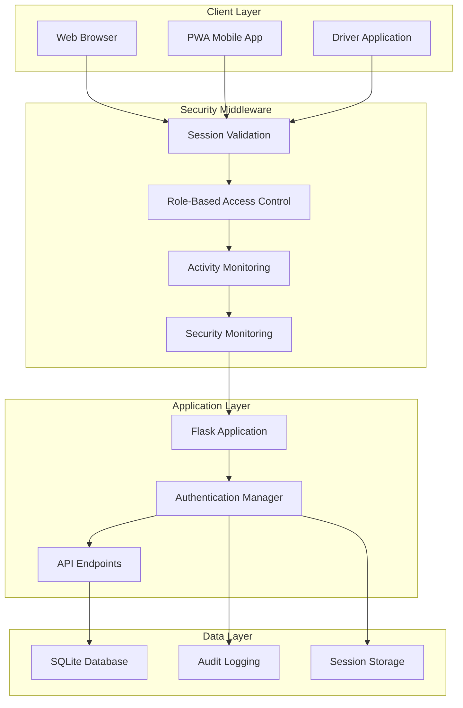

# CVD Security Architecture Documentation


## Metadata
- **ID**: 03_ARCHITECTURE_SECURITY
- **Type**: Architecture
- **Version**: 1.0.0
- **Last Updated**: 2025-08-12
- **Tags**: #ai #analytics #api #architecture #authentication #data-layer #database #debugging #deployment #device-management #devops #driver-app #integration #logistics #machine-learning #metrics #mobile #operations #optimization #planogram #product-placement #pwa #quality-assurance #reporting #route-management #security #service-orders #system-design #technical #testing #troubleshooting #vending-machine
- **Intent**: The CVD system implements comprehensive security measures across authentication, authorization, data protection, and operational security
- **Audience**: system administrators, managers, end users, architects
- **Prerequisites**: See context bridges for dependencies
- **Next Steps**: See context bridges for navigation

## Navigation
- **Parent**: /documentation/03-architecture/
- **Category**: 03 Architecture
- **Search Keywords**: ###, ####, activity, architecture, capabilities, cooler, cvd, data, database, device, documentation, driver, encryption, events, monitoring

## Overview

The CVD system implements comprehensive security measures across authentication, authorization, data protection, and operational security. The security architecture is designed for enterprise vending machine fleet management with sensitive operational and financial data protection requirements.

## Security Architecture Components



## Authentication Implementation

### Session-Based Authentication

The CVD system uses secure session-based authentication rather than stateless JWT tokens to provide better control over user sessions and enable immediate revocation.

#### Session Creation Process

```python
class AuthManager:
    def create_session(self, user_id, db=None):
        """Create a secure session for authenticated user"""
        
        # Generate cryptographically secure session ID
        session_id = secrets.token_urlsafe(32)  # 256-bit entropy
        expires_at = datetime.now() + timedelta(hours=8)
        
        # Extract client information for security tracking
        user_agent = request.headers.get('User-Agent', '')
        device_type = self.get_device_type(user_agent)
        
        # Store session with activity tracking fields
        cursor.execute('''
            INSERT INTO sessions (id, user_id, expires_at, ip_address, user_agent,
                                last_activity, activity_count, device_type)
            VALUES (?, ?, ?, ?, ?, ?, ?, ?)
        ''', (session_id, user_id, expires_at, 
              request.remote_addr, user_agent,
              datetime.now(), 0, device_type))
        
        return session_id
```

#### Session Validation

```python
def validate_session(self, session_id):
    """Comprehensive session validation with security checks"""
    
    # Query active session with user information
    user = cursor.execute('''
        SELECT u.id, u.username, u.email, u.role, u.is_active, u.is_deleted
        FROM users u
        JOIN sessions s ON s.user_id = u.id
        WHERE s.id = ? AND s.expires_at > ? 
        AND u.is_active = 1 AND u.is_deleted = 0
    ''', (session_id, datetime.now())).fetchone()
    
    # Update last activity for session tracking
    if user:
        cursor.execute('''
            UPDATE sessions 
            SET last_activity = ?, activity_count = activity_count + 1
            WHERE id = ?
        ''', (datetime.now(), session_id))
    
    return user
```

### Password Security

#### Password Hashing
```python
from werkzeug.security import generate_password_hash, check_password_hash

# Secure password hashing with bcrypt
password_hash = generate_password_hash(password, method='pbkdf2:sha256:260000')

# Password verification with timing-safe comparison
def verify_password(stored_hash, provided_password):
    return check_password_hash(stored_hash, provided_password)
```

#### Password Policy
- Minimum 8 characters length
- Complexity requirements enforced at application level
- bcrypt with PBKDF2-SHA256 and 260,000 iterations
- Account lockout after 5 failed attempts

#### Account Lockout Implementation
```python
def authenticate_user(username, password):
    """Secure user authentication with lockout protection"""
    
    user = get_user_by_username(username)
    
    if not user:
        return None, "Invalid credentials"
    
    # Check account lockout
    if user['locked_until'] and datetime.now() < user['locked_until']:
        return None, "Account temporarily locked"
    
    # Verify password
    if not check_password_hash(user['password_hash'], password):
        # Increment failed attempts
        failed_attempts = user['failed_login_attempts'] + 1
        
        if failed_attempts >= 5:
            # Lock account for 30 minutes
            lock_until = datetime.now() + timedelta(minutes=30)
            cursor.execute('''
                UPDATE users 
                SET failed_login_attempts = ?, locked_until = ?
                WHERE id = ?
            ''', (failed_attempts, lock_until, user['id']))
        else:
            cursor.execute('''
                UPDATE users 
                SET failed_login_attempts = ?
                WHERE id = ?
            ''', (failed_attempts, user['id']))
        
        return None, "Invalid credentials"
    
    # Reset failed attempts on successful login
    cursor.execute('''
        UPDATE users 
        SET failed_login_attempts = 0, locked_until = NULL, last_login = ?
        WHERE id = ?
    ''', (datetime.now(), user['id']))
    
    return user, None
```

## Role-Based Access Control (RBAC)

### Four-Tier Role System

#### 1. Admin Role
```python
'admin': {
    'devices': ['view', 'create', 'edit', 'delete'],
    'planograms': ['view', 'create', 'edit', 'delete'],
    'routes': ['view', 'create', 'edit', 'delete'],
    'service_orders': ['view', 'create', 'edit', 'delete'],
    'reports': ['view', 'export'],
    'users': ['view', 'create', 'edit', 'delete', 'manage_roles'],
    'database': ['view', 'backup', 'restore'],
    'settings': ['view', 'edit']
}
```

**Capabilities**: Full system access, user management, system configuration

#### 2. Manager Role
```python
'manager': {
    'devices': ['view', 'edit'],
    'planograms': ['view', 'create', 'edit'],
    'routes': ['view', 'create', 'edit'],
    'service_orders': ['view', 'create', 'edit', 'delete'],
    'reports': ['view', 'export'],
    'users': ['view'],
    'database': [],
    'settings': []
}
```

**Capabilities**: Operational management, service order oversight, reporting

#### 3. Driver Role
```python
'driver': {
    'devices': ['view'],
    'planograms': ['view'],
    'routes': ['view'],
    'service_orders': ['view', 'edit'],  # Only assigned orders
    'reports': [],
    'users': [],
    'database': [],
    'settings': []
}
```

**Capabilities**: Field operations, service order execution, inventory updates

#### 4. Viewer Role
```python
'viewer': {
    'devices': ['view'],
    'planograms': ['view'],
    'routes': ['view'],
    'service_orders': ['view'],
    'reports': ['view'],
    'users': [],
    'database': [],
    'settings': []
}
```

**Capabilities**: Read-only access to operational data

### Permission Enforcement

#### API Endpoint Protection
```python
def require_permission(resource, action):
    """Decorator for API endpoint permission enforcement"""
    def decorator(f):
        @wraps(f)
        def decorated_function(*args, **kwargs):
            user = g.get('user')
            if not user:
                return jsonify({'error': 'Authentication required'}), 401
            
            permissions = get_user_permissions(user['role'])
            resource_permissions = permissions.get(resource, [])
            
            if action not in resource_permissions:
                log_audit_event(
                    user['id'], 
                    'unauthorized_access_attempt',
                    resource_type=resource,
                    details=f"Attempted {action} on {resource}"
                )
                return jsonify({'error': 'Insufficient permissions'}), 403
            
            return f(*args, **kwargs)
        return decorated_function
    return decorator

# Usage example
@app.route('/api/users', methods=['POST'])
@require_permission('users', 'create')
def create_user():
    # Only admin can create users
    pass
```

#### Data-Level Access Control
```python
def get_user_service_orders(user_id, role):
    """Role-based service order filtering"""
    
    if role in ['admin', 'manager']:
        # Admin and managers see all orders
        query = '''
            SELECT * FROM service_orders
            WHERE status != 'deleted'
        '''
        params = []
    elif role == 'driver':
        # Drivers only see their assigned orders
        query = '''
            SELECT * FROM service_orders
            WHERE driver_id = ? AND status != 'deleted'
        '''
        params = [user_id]
    else:
        # Viewers see all orders but read-only
        query = '''
            SELECT * FROM service_orders
            WHERE status != 'deleted'
        '''
        params = []
    
    return cursor.execute(query, params).fetchall()
```

## Security Monitoring System

### Real-Time Security Monitoring

```python
class SecurityMonitor:
    def __init__(self):
        self.threat_patterns = {
            'privilege_escalation': self._detect_privilege_escalation,
            'suspicious_activity': self._detect_suspicious_activity,
            'brute_force': self._detect_brute_force,
            'data_exfiltration': self._detect_data_exfiltration
        }
    
    def check_privilege_escalation(self, user_id, role, endpoint, method):
        """Detect privilege escalation attempts"""
        
        # Define high-privilege endpoints
        privileged_endpoints = {
            '/api/users': ['admin'],
            '/api/database': ['admin'],
            '/api/settings': ['admin', 'manager']
        }
        
        required_roles = privileged_endpoints.get(endpoint, [])
        
        if required_roles and role not in required_roles:
            alert_details = {
                'user_id': user_id,
                'role': role,
                'attempted_endpoint': endpoint,
                'method': method,
                'timestamp': datetime.now(),
                'severity': 'high'
            }
            
            return True, True, alert_details  # unauthorized, should_alert, details
        
        return False, False, None
    
    def create_security_alert(self, alert_details):
        """Create security alert in database"""
        cursor.execute('''
            INSERT INTO activity_alerts 
            (alert_type, severity, user_id, description, metadata, status)
            VALUES (?, ?, ?, ?, ?, ?)
        ''', (
            'security_violation',
            alert_details['severity'],
            alert_details['user_id'],
            f"Privilege escalation attempt: {alert_details['attempted_endpoint']}",
            json.dumps(alert_details),
            'pending'
        ))
```

### Activity Monitoring

```python
@app.before_request
def security_monitoring():
    """Pre-request security monitoring"""
    
    if 'session_id' in session:
        user = auth_manager.validate_session(session['session_id'])
        if user:
            g.user = user
            
            # Security monitoring for sensitive operations
            if security_monitor and request.method in ['POST', 'PUT', 'DELETE']:
                is_unauth, should_alert, alert_details = \
                    security_monitor.check_privilege_escalation(
                        user['id'], user['role'], request.path, request.method
                    )
                
                if should_alert:
                    security_monitor.create_security_alert(alert_details)
                
                if is_unauth:
                    return jsonify({'error': 'Unauthorized access'}), 403
```

## Audit Logging Implementation

### Comprehensive Audit Trail

```python
def log_audit_event(user_id, action, resource_type=None, resource_id=None, details=None):
    """Log security and operational events"""
    
    audit_entry = {
        'user_id': user_id,
        'action': action,
        'resource_type': resource_type,
        'resource_id': resource_id,
        'details': json.dumps(details) if details else None,
        'ip_address': request.remote_addr,
        'timestamp': datetime.now()
    }
    
    cursor.execute('''
        INSERT INTO audit_log 
        (user_id, action, resource_type, resource_id, details, ip_address, created_at)
        VALUES (?, ?, ?, ?, ?, ?, ?)
    ''', (
        audit_entry['user_id'],
        audit_entry['action'],
        audit_entry['resource_type'],
        audit_entry['resource_id'],
        audit_entry['details'],
        audit_entry['ip_address'],
        audit_entry['timestamp']
    ))
```

### Audit Event Categories

#### Authentication Events
```python
# Login attempts
log_audit_event(user_id, 'login_success')
log_audit_event(user_id, 'login_failure', details={'reason': 'invalid_password'})
log_audit_event(user_id, 'account_locked', details={'failed_attempts': 5})

# Session management
log_audit_event(user_id, 'session_created', details={'device_type': 'mobile'})
log_audit_event(user_id, 'session_expired')
log_audit_event(user_id, 'logout')
```

#### Data Modification Events
```python
# Device management
log_audit_event(user_id, 'device_created', 'device', device_id, 
               {'asset': asset_number, 'location': location_name})
log_audit_event(user_id, 'device_deleted', 'device', device_id,
               {'soft_delete': True, 'reason': 'decommissioned'})

# User management
log_audit_event(user_id, 'user_created', 'user', new_user_id,
               {'username': username, 'role': role})
log_audit_event(user_id, 'role_changed', 'user', target_user_id,
               {'old_role': old_role, 'new_role': new_role})
```

#### Security Events
```python
# Permission violations
log_audit_event(user_id, 'unauthorized_access_attempt', 
               resource_type='endpoint',
               details={'endpoint': '/api/users', 'method': 'POST'})

# Suspicious activities
log_audit_event(user_id, 'mass_data_export',
               details={'records_exported': 1000, 'resource_type': 'devices'})
```

## API Security Measures

### CORS Configuration

```python
from flask_cors import CORS

# Restrictive CORS policy for production security
CORS(app, origins=[
    'http://localhost:8000',      # Development
    'http://127.0.0.1:8000',      # Local testing
    'https://jeremybrice.duckdns.org'  # Production
], 
     allow_headers=['Content-Type'],
     methods=['GET', 'POST', 'PUT', 'DELETE', 'OPTIONS'],
     supports_credentials=True)
```

### Request Security Headers

```python
@app.after_request
def add_security_headers(response):
    """Add security headers to all responses"""
    
    # Prevent XSS attacks
    response.headers['X-Content-Type-Options'] = 'nosniff'
    response.headers['X-Frame-Options'] = 'DENY'
    response.headers['X-XSS-Protection'] = '1; mode=block'
    
    # HTTPS enforcement
    if request.is_secure:
        response.headers['Strict-Transport-Security'] = 'max-age=31536000; includeSubDomains'
    
    # Content Security Policy
    csp = (
        "default-src 'self'; "
        "script-src 'self' 'unsafe-inline'; "
        "style-src 'self' 'unsafe-inline'; "
        "img-src 'self' data:; "
        "connect-src 'self';"
    )
    response.headers['Content-Security-Policy'] = csp
    
    return response
```

### Input Validation and Sanitization

```python
def validate_device_input(data):
    """Comprehensive input validation for device creation"""
    
    errors = []
    
    # Asset number validation
    if not data.get('asset') or not re.match(r'^[A-Z0-9-]{3,20}$', data['asset']):
        errors.append('Asset number must be 3-20 alphanumeric characters')
    
    # SQL injection prevention - parameterized queries only
    if any(char in str(data.get('asset', '')) for char in [';', '--', '/*', '*/']):
        errors.append('Asset number contains invalid characters')
    
    # XSS prevention
    for field in ['cooler', 'model']:
        if data.get(field):
            data[field] = html.escape(str(data[field]))
    
    return data, errors

# Usage in API endpoint
@app.route('/api/devices', methods=['POST'])
@require_permission('devices', 'create')
def create_device():
    data, errors = validate_device_input(request.json)
    
    if errors:
        return jsonify({'errors': errors}), 400
    
    # Proceed with validated, sanitized data
```

### SQL Injection Prevention

```python
# ALWAYS use parameterized queries
def get_device_by_asset(asset_number):
    """Safe database query with parameter binding"""
    
    # SECURE - parameterized query
    cursor.execute('''
        SELECT * FROM devices 
        WHERE asset = ? AND deleted_at IS NULL
    ''', (asset_number,))
    
    # NEVER do string concatenation:
    # cursor.execute(f"SELECT * FROM devices WHERE asset = '{asset_number}'")
```

## Data Protection Measures

### Soft Delete Implementation

Critical business entities use soft delete to preserve data integrity and enable audit trails:

```python
def soft_delete_device(device_id, user_id):
    """Soft delete device while preserving relational integrity"""
    
    # Mark device as deleted
    cursor.execute('''
        UPDATE devices 
        SET deleted_at = ?, deleted_by = ?
        WHERE id = ? AND deleted_at IS NULL
    ''', (datetime.now(), user_id, device_id))
    
    # Log the deletion
    log_audit_event(user_id, 'device_soft_deleted', 'device', device_id,
                   {'deletion_timestamp': datetime.now()})
    
    # Preserve related data (planograms, service orders, etc.)
    # Data remains accessible for reporting and recovery
```

### Data Recovery

```python
def recover_soft_deleted_device(device_id, user_id):
    """Recover soft-deleted device"""
    
    cursor.execute('''
        UPDATE devices 
        SET deleted_at = NULL, deleted_by = NULL
        WHERE id = ? AND deleted_at IS NOT NULL
    ''', (device_id,))
    
    log_audit_event(user_id, 'device_recovered', 'device', device_id,
                   {'recovery_timestamp': datetime.now()})
```

### Database Encryption

```python
# SQLite database file permissions
import os
import stat

def secure_database_permissions():
    """Set restrictive permissions on database file"""
    db_path = 'cvd.db'
    
    # Read/write for owner only (600)
    os.chmod(db_path, stat.S_IRUSR | stat.S_IWUSR)
    
    # Verify permissions
    current_perms = oct(os.stat(db_path).st_mode)[-3:]
    assert current_perms == '600', f"Database permissions not secure: {current_perms}"
```

## Session Security

### Session Configuration

```python
# Flask session configuration for security
app.config.update(
    SESSION_COOKIE_SECURE=True,      # HTTPS only
    SESSION_COOKIE_HTTPONLY=True,    # No JavaScript access
    SESSION_COOKIE_SAMESITE='Lax',   # CSRF protection
    PERMANENT_SESSION_LIFETIME=timedelta(hours=8)  # 8-hour timeout
)

# Session cleanup
def cleanup_expired_sessions():
    """Remove expired sessions from database"""
    cursor.execute('''
        DELETE FROM sessions 
        WHERE expires_at < ?
    ''', (datetime.now(),))
```

### Session Activity Tracking

```python
class ActivityTracker:
    def track_activity(self):
        """Track user activity for security monitoring"""
        
        if 'session_id' in session:
            # Update session activity
            cursor.execute('''
                UPDATE sessions 
                SET last_activity = ?, 
                    last_page = ?,
                    last_api_endpoint = ?
                WHERE id = ?
            ''', (
                datetime.now(),
                request.path,
                request.endpoint,
                session['session_id']
            ))
            
            # Log detailed activity
            cursor.execute('''
                INSERT INTO user_activity_log
                (session_id, user_id, page_url, action_type, ip_address, user_agent)
                VALUES (?, ?, ?, ?, ?, ?)
            ''', (
                session['session_id'],
                g.user['id'],
                request.path,
                'page_view',
                request.remote_addr,
                request.headers.get('User-Agent')
            ))
```

## Security Incident Response

### Automated Threat Response

```python
def handle_security_incident(alert_type, severity, details):
    """Automated response to security incidents"""
    
    responses = {
        'privilege_escalation': [
            'log_detailed_event',
            'notify_administrators',
            'increase_monitoring'
        ],
        'brute_force': [
            'lock_account',
            'block_ip_temporarily',
            'alert_security_team'
        ],
        'data_exfiltration': [
            'suspend_session',
            'alert_security_team',
            'preserve_audit_trail'
        ]
    }
    
    for action in responses.get(alert_type, []):
        execute_security_action(action, details)
```

### Security Metrics and Monitoring

```python
def generate_security_report():
    """Generate daily security metrics"""
    
    metrics = {
        'failed_logins': cursor.execute('''
            SELECT COUNT(*) FROM audit_log 
            WHERE action = 'login_failure' 
            AND created_at >= date('now', '-1 day')
        ''').fetchone()[0],
        
        'privilege_violations': cursor.execute('''
            SELECT COUNT(*) FROM activity_alerts
            WHERE alert_type = 'security_violation'
            AND created_at >= date('now', '-1 day')
        ''').fetchone()[0],
        
        'active_sessions': cursor.execute('''
            SELECT COUNT(*) FROM sessions
            WHERE expires_at > datetime('now')
        ''').fetchone()[0]
    }
    
    return metrics
```

This comprehensive security architecture ensures enterprise-grade protection for the CVD system while maintaining usability and operational efficiency.