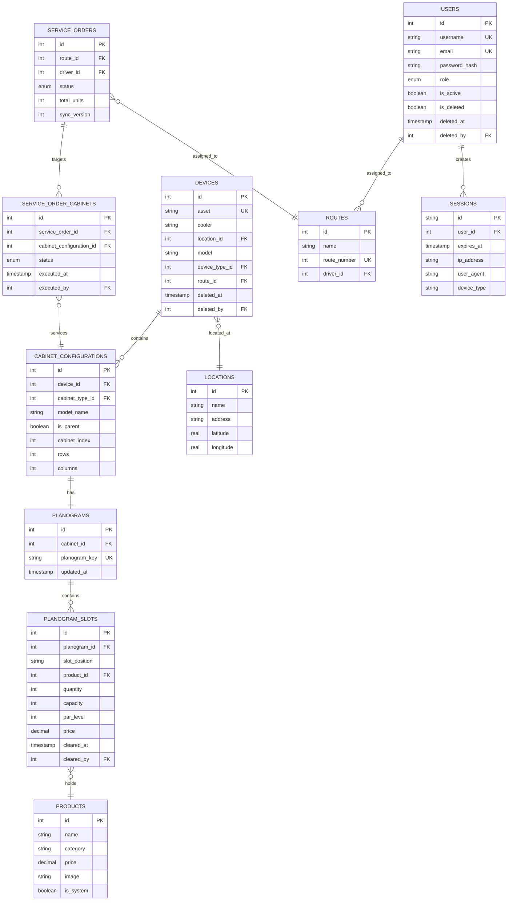

# CVD Database Schema Documentation


## Metadata
- **ID**: 03_ARCHITECTURE_SYSTEM_DATABASE_SCHEMA
- **Type**: Architecture
- **Version**: 1.0.0
- **Last Updated**: 2025-08-12
- **Tags**: #ai #analytics #api #architecture #authentication #data-exchange #data-layer #database #debugging #device-management #dex-parser #integration #logistics #machine-learning #metrics #operations #optimization #performance #planogram #product-placement #quality-assurance #reporting #route-management #security #service-orders #system-design #technical #testing #troubleshooting #vending-machine
- **Intent**: The CVD system uses SQLite 3
- **Audience**: system administrators, managers, end users, architects
- **Prerequisites**: See context bridges for dependencies
- **Next Steps**: See context bridges for navigation

## Navigation
- **Parent**: /documentation/03-architecture/system/
- **Category**: System
- **Search Keywords**: 3.x, `cvd.db`, audit, cabinet, cooler, cvd, cvd.db, database, delete, device, devices, dex, documentation, driver, features

## Overview

The CVD system uses SQLite 3.x as its primary database with a comprehensive schema supporting vending machine fleet management operations. The database contains 31 tables covering authentication, device management, planogram configuration, service orders, analytics, and system monitoring.

## Database Statistics

- **Total Tables**: 31
- **Database File**: `cvd.db`
- **Database Type**: SQLite 3.x
- **Soft Delete Pattern**: Implemented for `devices` and `users` tables
- **Audit Logging**: Comprehensive activity tracking throughout

## Core Entity Relationship Diagram



## Table Categories

### Authentication & Security Tables

#### 1. users
Primary user account management with soft delete support.

```sql
CREATE TABLE users (
    id INTEGER PRIMARY KEY AUTOINCREMENT,
    username TEXT UNIQUE NOT NULL,
    email TEXT UNIQUE NOT NULL,
    password_hash TEXT NOT NULL,
    role TEXT NOT NULL CHECK(role IN ('admin', 'manager', 'driver', 'viewer')),
    is_active BOOLEAN DEFAULT TRUE,
    created_at TIMESTAMP DEFAULT CURRENT_TIMESTAMP,
    updated_at TIMESTAMP DEFAULT CURRENT_TIMESTAMP,
    last_login TIMESTAMP,
    failed_login_attempts INTEGER DEFAULT 0,
    locked_until TIMESTAMP,
    is_deleted BOOLEAN DEFAULT 0,
    deleted_at TIMESTAMP NULL,
    deleted_by INTEGER NULL
);
```

**Key Features**:
- 4-tier role system (admin, manager, driver, viewer)
- Account lockout after failed login attempts
- Soft delete pattern for data retention
- Password security with failed attempt tracking

#### 2. sessions
Session management for authentication.

```sql
CREATE TABLE sessions (
    id TEXT PRIMARY KEY,
    user_id INTEGER NOT NULL,
    expires_at TIMESTAMP NOT NULL,
    created_at TIMESTAMP DEFAULT CURRENT_TIMESTAMP,
    ip_address TEXT,
    user_agent TEXT,
    last_activity TIMESTAMP,
    last_page TEXT,
    last_api_endpoint TEXT,
    activity_count INTEGER,
    device_type TEXT,
    FOREIGN KEY (user_id) REFERENCES users(id) ON DELETE CASCADE
);
```

**Features**:
- Token-based session identification
- Activity tracking for security monitoring
- Device type detection from user agent
- Automatic cleanup of expired sessions

#### 3. audit_log
Comprehensive audit trail for sensitive operations.

```sql
CREATE TABLE audit_log (
    id INTEGER PRIMARY KEY AUTOINCREMENT,
    user_id INTEGER NOT NULL,
    action TEXT NOT NULL,
    resource_type TEXT,
    resource_id INTEGER,
    details TEXT,
    ip_address TEXT,
    created_at TIMESTAMP DEFAULT CURRENT_TIMESTAMP,
    FOREIGN KEY (user_id) REFERENCES users(id)
);
```

### Device Management Tables

#### 4. devices
Core device registry with soft delete support.

```sql
CREATE TABLE "devices" (
    id INTEGER PRIMARY KEY AUTOINCREMENT,
    asset TEXT UNIQUE NOT NULL,
    cooler TEXT NOT NULL,
    location_id INTEGER NOT NULL DEFAULT 1,
    model TEXT NOT NULL,
    device_type_id INTEGER NOT NULL,
    route_id INTEGER,
    created_at TIMESTAMP DEFAULT CURRENT_TIMESTAMP,
    updated_at TIMESTAMP DEFAULT CURRENT_TIMESTAMP,
    deleted_at TIMESTAMP DEFAULT NULL,
    deleted_by INTEGER DEFAULT NULL,
    FOREIGN KEY (device_type_id) REFERENCES device_types(id),
    FOREIGN KEY (route_id) REFERENCES routes(id) ON DELETE SET NULL,
    FOREIGN KEY (location_id) REFERENCES locations(id)
);
```

**Features**:
- Unique asset identifier for fleet tracking
- Soft delete pattern preserves historical data
- Location and route assignment
- Device type categorization

#### 5. device_types
Device type definitions and capabilities.

```sql
CREATE TABLE device_types (
    id INTEGER PRIMARY KEY AUTOINCREMENT,
    name TEXT NOT NULL UNIQUE,
    description TEXT NOT NULL,
    allows_additional_cabinets BOOLEAN NOT NULL
);
```

#### 6. cabinet_configurations
Multi-cabinet device configuration support.

```sql
CREATE TABLE "cabinet_configurations" (
    id INTEGER PRIMARY KEY AUTOINCREMENT,
    device_id INTEGER NOT NULL,
    cabinet_type_id INTEGER NOT NULL,
    model_name TEXT,
    is_parent BOOLEAN DEFAULT 0,
    cabinet_index INTEGER NOT NULL,
    rows INTEGER NOT NULL,
    columns INTEGER NOT NULL,
    FOREIGN KEY (device_id) REFERENCES devices(id) ON DELETE CASCADE,
    FOREIGN KEY (cabinet_type_id) REFERENCES cabinet_types(id)
);
```

**Features**:
- Support for up to 3 cabinets per device
- Parent/child cabinet relationships
- Grid-based slot configuration (rows × columns)

#### 7. cabinet_types
Cabinet type templates with grid specifications.

```sql
CREATE TABLE cabinet_types (
    id INTEGER PRIMARY KEY AUTOINCREMENT,
    name TEXT NOT NULL UNIQUE,
    description TEXT NOT NULL,
    rows INTEGER NOT NULL,
    cols INTEGER NOT NULL,
    icon TEXT NOT NULL
);
```

### Planogram Management Tables

#### 8. planograms
Planogram definitions linked to cabinet configurations.

```sql
CREATE TABLE "planograms" (
    id INTEGER PRIMARY KEY AUTOINCREMENT,
    cabinet_id INTEGER NOT NULL,
    planogram_key TEXT UNIQUE NOT NULL,
    updated_at TIMESTAMP DEFAULT CURRENT_TIMESTAMP,
    FOREIGN KEY (cabinet_id) REFERENCES cabinet_configurations(id) ON DELETE CASCADE
);
```

#### 9. planogram_slots
Individual slot configurations within planograms.

```sql
CREATE TABLE "planogram_slots" (
    id INTEGER PRIMARY KEY AUTOINCREMENT,
    planogram_id INTEGER NOT NULL,
    slot_position TEXT NOT NULL,
    product_id INTEGER,
    product_name TEXT,
    quantity INTEGER DEFAULT 0,
    capacity INTEGER DEFAULT 0,
    par_level INTEGER DEFAULT 0,
    price DECIMAL(10,2),
    cleared_at TIMESTAMP DEFAULT NULL,
    cleared_by INTEGER DEFAULT NULL,
    previous_product_id INTEGER DEFAULT NULL,
    FOREIGN KEY (planogram_id) REFERENCES planograms(id) ON DELETE CASCADE,
    FOREIGN KEY (product_id) REFERENCES products(id) ON DELETE SET NULL,
    UNIQUE(planogram_id, slot_position)
);
```

**Features**:
- Unique slot positioning within planograms
- Inventory tracking with quantity, capacity, par levels
- Product change history with previous_product_id
- Slot clearing audit trail

#### 10. products
Product catalog with system vs. custom products.

```sql
CREATE TABLE products (
    id INTEGER PRIMARY KEY AUTOINCREMENT,
    name TEXT NOT NULL,
    category TEXT NOT NULL,
    price DECIMAL(10,2) NOT NULL,
    image TEXT,
    created_at TIMESTAMP DEFAULT CURRENT_TIMESTAMP,
    is_system BOOLEAN DEFAULT FALSE
);
```

### Service Order Management Tables

#### 11. service_orders
Service order headers with route assignment.

```sql
CREATE TABLE service_orders (
    id INTEGER PRIMARY KEY AUTOINCREMENT,
    route_id INTEGER,
    created_at TIMESTAMP DEFAULT CURRENT_TIMESTAMP,
    created_by TEXT,
    status TEXT DEFAULT 'pending' CHECK(status IN ('pending', 'in_progress', 'completed', 'cancelled')),
    total_units INTEGER,
    estimated_duration_minutes INTEGER,
    driver_id INTEGER REFERENCES users(id),
    sync_version INTEGER DEFAULT 1,
    last_modified TIMESTAMP,
    FOREIGN KEY (route_id) REFERENCES routes(id) ON DELETE SET NULL
);
```

#### 12. service_order_cabinets
Cabinet-specific service tasks within orders.

```sql
CREATE TABLE service_order_cabinets (
    id INTEGER PRIMARY KEY AUTOINCREMENT,
    service_order_id INTEGER NOT NULL,
    cabinet_configuration_id INTEGER NOT NULL,
    created_at TIMESTAMP DEFAULT CURRENT_TIMESTAMP,
    last_modified TIMESTAMP,
    executed_at TIMESTAMP,
    executed_by INTEGER REFERENCES users(id),
    status TEXT DEFAULT 'pending',
    FOREIGN KEY (service_order_id) REFERENCES service_orders(id) ON DELETE CASCADE,
    FOREIGN KEY (cabinet_configuration_id) REFERENCES cabinet_configurations(id)
);
```

#### 13. service_order_cabinet_items
Product-specific requirements within cabinet tasks.

```sql
CREATE TABLE service_order_cabinet_items (
    id INTEGER PRIMARY KEY AUTOINCREMENT,
    service_order_cabinet_id INTEGER NOT NULL,
    product_id INTEGER NOT NULL,
    quantity_needed INTEGER NOT NULL,
    created_at TIMESTAMP DEFAULT CURRENT_TIMESTAMP,
    FOREIGN KEY (service_order_cabinet_id) REFERENCES service_order_cabinets(id) ON DELETE CASCADE,
    FOREIGN KEY (product_id) REFERENCES products(id)
);
```

#### 14. service_visits
Completed service visit records.

```sql
CREATE TABLE service_visits (
    id INTEGER PRIMARY KEY AUTOINCREMENT,
    device_id INTEGER NOT NULL,
    route_id INTEGER,
    service_date TIMESTAMP DEFAULT CURRENT_TIMESTAMP,
    units_restocked INTEGER DEFAULT 0,
    service_type TEXT CHECK(service_type IN ('routine', 'emergency', 'maintenance')),
    technician_id INTEGER,
    duration_minutes INTEGER,
    notes TEXT,
    service_order_cabinet_id INTEGER REFERENCES service_order_cabinets(id),
    FOREIGN KEY (device_id) REFERENCES devices(id) ON DELETE CASCADE,
    FOREIGN KEY (route_id) REFERENCES routes(id) ON DELETE SET NULL
);
```

### Geographic & Route Tables

#### 15. locations
Location registry with geocoding support.

```sql
CREATE TABLE locations (
    id INTEGER PRIMARY KEY AUTOINCREMENT,
    name TEXT NOT NULL,
    created_at TIMESTAMP DEFAULT CURRENT_TIMESTAMP,
    updated_at TIMESTAMP DEFAULT CURRENT_TIMESTAMP,
    address TEXT,
    latitude REAL,
    longitude REAL
);
```

#### 16. routes
Route definitions with driver assignment.

```sql
CREATE TABLE routes (
    id INTEGER PRIMARY KEY AUTOINCREMENT,
    name TEXT NOT NULL,
    route_number INTEGER UNIQUE,
    created_at TIMESTAMP DEFAULT CURRENT_TIMESTAMP,
    updated_at TIMESTAMP DEFAULT CURRENT_TIMESTAMP,
    driver_id INTEGER REFERENCES users(id)
);
```

### Analytics & Sales Tables

#### 17. sales
Transaction record for analytics.

```sql
CREATE TABLE sales (
    id INTEGER PRIMARY KEY AUTOINCREMENT,
    device_id INTEGER NOT NULL,
    product_id INTEGER NOT NULL,
    sale_units INTEGER NOT NULL,
    sale_cash DECIMAL(10,2) NOT NULL,
    created_at TIMESTAMP DEFAULT CURRENT_TIMESTAMP,
    updated_at TIMESTAMP DEFAULT CURRENT_TIMESTAMP,
    FOREIGN KEY (device_id) REFERENCES devices(id) ON DELETE CASCADE,
    FOREIGN KEY (product_id) REFERENCES products(id) ON DELETE CASCADE
);
```

#### 18. device_metrics
Calculated device performance metrics.

```sql
CREATE TABLE device_metrics (
    device_id INTEGER PRIMARY KEY,
    sold_out_count INTEGER DEFAULT 0,
    days_remaining_inventory REAL,
    data_collection_rate REAL DEFAULT 100.0,
    product_level_percent REAL,
    units_to_par INTEGER DEFAULT 0,
    last_calculated TIMESTAMP,
    FOREIGN KEY (device_id) REFERENCES devices(id) ON DELETE CASCADE
);
```

#### 19. slot_metrics
Individual slot performance analytics.

```sql
CREATE TABLE slot_metrics (
    id INTEGER PRIMARY KEY AUTOINCREMENT,
    planogram_slot_id INTEGER NOT NULL UNIQUE,
    
    -- Calculated metrics
    is_sold_out INTEGER DEFAULT 0,
    days_remaining_inventory INTEGER,
    product_level_percent INTEGER,
    units_to_par INTEGER,
    
    -- Sales velocity data
    sales_28_day INTEGER DEFAULT 0,
    sales_all_time INTEGER DEFAULT 0,
    days_with_sales INTEGER DEFAULT 0,
    daily_velocity REAL DEFAULT 0.0,
    
    -- Metadata
    last_calculated TIMESTAMP DEFAULT CURRENT_TIMESTAMP,
    calculation_version INTEGER DEFAULT 1,
    
    FOREIGN KEY (planogram_slot_id) REFERENCES planogram_slots(id) ON DELETE CASCADE
);
```

### DEX File Processing Tables

#### 20. dex_reads
DEX file upload and parsing tracking.

```sql
CREATE TABLE dex_reads (
    id INTEGER PRIMARY KEY AUTOINCREMENT,
    filename VARCHAR(255) NOT NULL,
    machine_serial VARCHAR(50),
    manufacturer VARCHAR(10),
    dex_version VARCHAR(20),
    upload_timestamp DATETIME DEFAULT CURRENT_TIMESTAMP,
    raw_content TEXT NOT NULL,
    total_records INTEGER,
    parsed_successfully BOOLEAN DEFAULT FALSE,
    error_message TEXT,
    error_line INTEGER,
    error_field INTEGER
);
```

#### 21. dex_records
Raw DEX record storage.

```sql
CREATE TABLE dex_records (
    id INTEGER PRIMARY KEY AUTOINCREMENT,
    dex_read_id INTEGER NOT NULL,
    record_type VARCHAR(10) NOT NULL,
    record_subtype VARCHAR(10),
    line_number INTEGER NOT NULL,
    raw_record TEXT NOT NULL,
    parsed_data TEXT,
    created_at DATETIME DEFAULT CURRENT_TIMESTAMP,
    FOREIGN KEY (dex_read_id) REFERENCES dex_reads(id) ON DELETE CASCADE
);
```

#### 22. dex_pa_records
Parsed PA (Product Activity) records with grid pattern analysis.

```sql
CREATE TABLE dex_pa_records (
    id INTEGER PRIMARY KEY AUTOINCREMENT,
    dex_read_id INTEGER NOT NULL,
    record_subtype VARCHAR(10) NOT NULL,
    selection_number VARCHAR(10),
    price_cents INTEGER,
    capacity INTEGER,
    units_sold INTEGER,
    revenue_cents INTEGER,
    test_vends INTEGER,
    free_vends INTEGER,
    cash_sales INTEGER,
    cash_sales_cents INTEGER,
    cashless_sales INTEGER,
    cashless_sales_cents INTEGER,
    discount_sales INTEGER,
    discount_sales_cents INTEGER,
    line_number INTEGER NOT NULL,
    created_at DATETIME DEFAULT CURRENT_TIMESTAMP,
    row VARCHAR(10),
    "column" VARCHAR(10),
    FOREIGN KEY (dex_read_id) REFERENCES dex_reads(id) ON DELETE CASCADE
);
```

### Activity Monitoring Tables

#### 23. user_activity_log
Detailed user activity tracking.

```sql
CREATE TABLE user_activity_log (
    id INTEGER PRIMARY KEY AUTOINCREMENT,
    session_id TEXT NOT NULL,
    user_id INTEGER NOT NULL,
    timestamp TIMESTAMP DEFAULT CURRENT_TIMESTAMP,
    page_url TEXT NOT NULL,
    page_title TEXT,
    action_type TEXT DEFAULT 'page_view',
    duration_ms INTEGER,
    referrer TEXT,
    ip_address TEXT,
    user_agent TEXT,
    metadata TEXT,
    created_at TIMESTAMP DEFAULT CURRENT_TIMESTAMP,
    
    FOREIGN KEY (user_id) REFERENCES users(id),
    FOREIGN KEY (session_id) REFERENCES sessions(id) ON DELETE CASCADE
);
```

#### 24. activity_summary_daily
Daily activity summary aggregations.

```sql
CREATE TABLE activity_summary_daily (
    id INTEGER PRIMARY KEY AUTOINCREMENT,
    date DATE NOT NULL,
    unique_users INTEGER DEFAULT 0,
    total_sessions INTEGER DEFAULT 0,
    total_page_views INTEGER DEFAULT 0,
    total_api_calls INTEGER DEFAULT 0,
    avg_session_duration_seconds INTEGER DEFAULT 0,
    peak_concurrent_users INTEGER DEFAULT 0,
    peak_hour INTEGER,
    top_pages TEXT,
    user_distribution TEXT,
    created_at TIMESTAMP DEFAULT CURRENT_TIMESTAMP,
    
    UNIQUE(date)
);
```

#### 25. activity_alerts
Security and operational alerts.

```sql
CREATE TABLE activity_alerts (
    id INTEGER PRIMARY KEY AUTOINCREMENT,
    alert_type TEXT NOT NULL,
    severity TEXT NOT NULL,
    user_id INTEGER,
    session_id TEXT,
    description TEXT NOT NULL,
    metadata TEXT,
    status TEXT DEFAULT 'pending',
    created_at TIMESTAMP DEFAULT CURRENT_TIMESTAMP,
    acknowledged_at TIMESTAMP,
    acknowledged_by INTEGER,
    resolved_at TIMESTAMP,
    resolved_by INTEGER,
    
    FOREIGN KEY (user_id) REFERENCES users(id),
    FOREIGN KEY (acknowledged_by) REFERENCES users(id),
    FOREIGN KEY (resolved_by) REFERENCES users(id)
);
```

### Knowledge Base Tables

#### 26. knowledge_base_articles
Knowledge base content management.

```sql
CREATE TABLE knowledge_base_articles (
    id TEXT PRIMARY KEY,
    title TEXT NOT NULL,
    author TEXT,
    category TEXT NOT NULL,
    tags TEXT,
    difficulty TEXT CHECK(difficulty IN ('Beginner', 'Intermediate', 'Advanced')),
    word_count INTEGER,
    read_time_minutes INTEGER,
    file_path TEXT NOT NULL,
    file_modified_time TIMESTAMP,
    last_indexed TIMESTAMP DEFAULT CURRENT_TIMESTAMP,
    content_preview TEXT,
    search_content TEXT,
    content_hash TEXT
);
```

#### 27. knowledge_base_categories
Knowledge base categorization.

```sql
CREATE TABLE knowledge_base_categories (
    name TEXT PRIMARY KEY,
    description TEXT,
    icon TEXT,
    color TEXT,
    sort_order INTEGER DEFAULT 0
);
```

### Configuration & System Tables

#### 28. system_config
Application configuration settings.

```sql
CREATE TABLE system_config (
    key TEXT PRIMARY KEY,
    value TEXT NOT NULL,
    description TEXT,
    updated_at TIMESTAMP DEFAULT CURRENT_TIMESTAMP
);
```

#### 29. route_planning_config
Route planning algorithm configuration.

```sql
CREATE TABLE route_planning_config (
    id INTEGER PRIMARY KEY AUTOINCREMENT,
    critical_dri_threshold INTEGER DEFAULT 1,
    warning_dri_threshold INTEGER DEFAULT 3,
    ok_dri_threshold INTEGER DEFAULT 7,
    auto_select_critical BOOLEAN DEFAULT TRUE,
    metrics_cache_ttl_minutes INTEGER DEFAULT 15
);
```

#### 30. migrations
Database schema migration tracking.

```sql
CREATE TABLE migrations (
    id INTEGER PRIMARY KEY AUTOINCREMENT,
    name TEXT NOT NULL UNIQUE,
    applied_at TIMESTAMP DEFAULT CURRENT_TIMESTAMP
);
```

### Junction Tables

#### 31. device_routes
Many-to-many relationship between devices and routes.

```sql
CREATE TABLE device_routes (
    device_id INTEGER NOT NULL,
    route_id INTEGER NOT NULL,
    PRIMARY KEY (device_id, route_id),
    FOREIGN KEY (device_id) REFERENCES devices(id) ON DELETE CASCADE,
    FOREIGN KEY (route_id) REFERENCES routes(id) ON DELETE CASCADE
);
```

## Key Database Patterns

### Soft Delete Implementation
The system implements soft delete for critical entities to preserve data integrity:

```sql
-- Devices table soft delete
deleted_at TIMESTAMP DEFAULT NULL,
deleted_by INTEGER DEFAULT NULL

-- Users table soft delete  
is_deleted BOOLEAN DEFAULT 0,
deleted_at TIMESTAMP NULL,
deleted_by INTEGER NULL
```

### Audit Trail Pattern
Most tables include comprehensive audit trails:

```sql
created_at TIMESTAMP DEFAULT CURRENT_TIMESTAMP,
updated_at TIMESTAMP DEFAULT CURRENT_TIMESTAMP,
last_modified TIMESTAMP
```

### Foreign Key Constraints
Proper referential integrity with cascade behaviors:

```sql
FOREIGN KEY (device_id) REFERENCES devices(id) ON DELETE CASCADE,
FOREIGN KEY (route_id) REFERENCES routes(id) ON DELETE SET NULL
```

## Performance Optimizations

### Indexes
Strategic indexes on frequently queried columns:

```sql
CREATE INDEX idx_products_category ON products(category);
CREATE INDEX idx_devices_asset ON devices(asset);
CREATE INDEX idx_cabinets_device ON cabinet_configurations(device_id);
CREATE INDEX idx_slots_product ON planogram_slots(product_id);
CREATE INDEX idx_planograms_key ON planograms(planogram_key);
CREATE INDEX idx_slots_cleared_at ON planogram_slots(cleared_at);
```

### Unique Constraints
Data integrity through unique constraints:

```sql
asset TEXT UNIQUE NOT NULL,           -- devices
planogram_key TEXT UNIQUE NOT NULL,   -- planograms
route_number INTEGER UNIQUE,          -- routes
```

## Schema Evolution

The database supports versioned migrations through the `migrations` table, allowing for safe schema updates and rollbacks. The current schema represents the accumulated result of multiple migration cycles, with comprehensive feature additions for enterprise fleet management.

This schema provides a robust foundation for vending machine fleet management with comprehensive audit trails, performance optimization, and data integrity constraints.