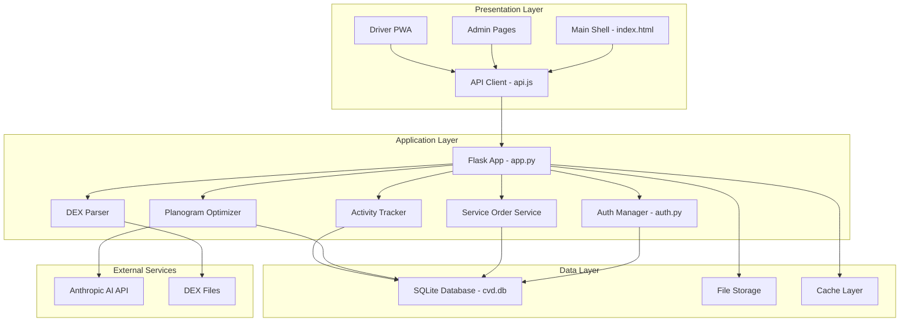
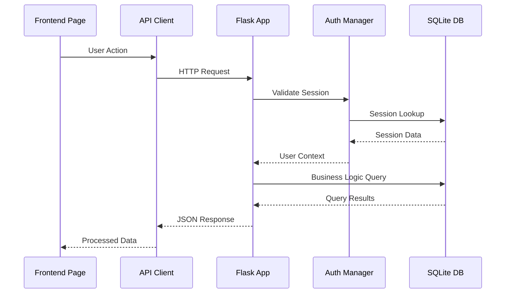
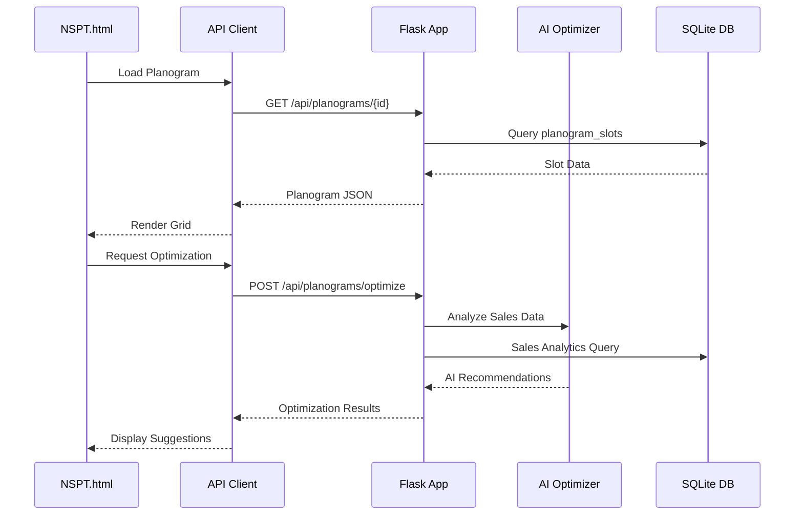
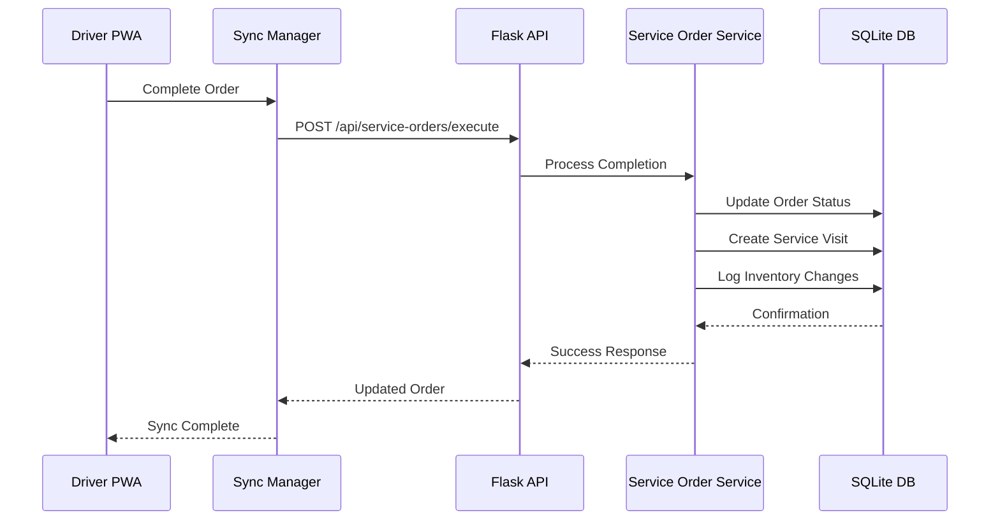

# CVD System Architecture Overview


## Metadata
- **ID**: 03_ARCHITECTURE_SYSTEM_OVERVIEW
- **Type**: Architecture
- **Version**: 1.0.0
- **Last Updated**: 2025-08-12
- **Tags**: #ai #analytics #api #architecture #authentication #data-exchange #data-layer #database #debugging #deployment #device-management #devops #dex-parser #driver-app #integration #logistics #machine-learning #metrics #mobile #operations #optimization #performance #planogram #product-placement #pwa #reporting #route-management #security #service-orders #system-design #technical #troubleshooting #vending-machine
- **Intent**: ## Executive Summary
- **Audience**: system administrators, managers, end users, architects
- **Prerequisites**: See context bridges for dependencies
- **Next Steps**: See context bridges for navigation

## Navigation
- **Parent**: /documentation/03-architecture/system/
- **Category**: System
- **Search Keywords**: ###, (python), 2.x, 3.x, access, anthropic, api, api.js, architecture, asset, audit, authentication, business, caching, charts

## Executive Summary

CVD (Vision Device Configuration) is an enterprise vending machine fleet management system built on a three-tier architecture. The system features a Flask/SQLite backend, modular iframe-based frontend, and progressive web app capabilities for mobile operations. It provides comprehensive device management, planogram optimization, service order management, and real-time analytics for vending machine fleet operations.

## Three-Tier Architecture

### 1. Presentation Layer (Frontend)
- **Main Shell**: `index.html` - Central navigation and iframe orchestration
- **Modular Pages**: Individual HTML pages loaded via iframe routing
- **Driver PWA**: Standalone progressive web app for mobile operations
- **API Client**: JavaScript abstraction layer (`api.js`) with retry logic and offline support

### 2. Application Layer (Backend)
- **Flask Web Server**: RESTful API endpoints with session-based authentication
- **Business Logic Services**: Service order management, planogram optimization
- **Authentication Module**: Role-based access control with audit logging
- **AI Services**: Planogram optimization and chat assistance

### 3. Data Layer (Database)
- **SQLite Database**: Single-file database with comprehensive schema
- **File Storage**: Static assets, uploads, and cached data
- **External Integrations**: DEX file processing and AI service APIs

## Component Architecture



## Technology Stack

### Frontend Technologies
- **Core**: HTML5, CSS3, JavaScript (ES6+)
- **Architecture**: Iframe-based modular pages
- **PWA Features**: Service Worker, Web App Manifest, IndexedDB
- **Styling**: Custom CSS with design system variables
- **Maps**: Leaflet.js for route visualization
- **Charts**: Chart.js for analytics visualization

**Rationale**: No build dependencies, immediate deployment, modular development, progressive enhancement.

### Backend Technologies
- **Framework**: Flask 2.x (Python)
- **Database**: SQLite 3.x
- **Authentication**: Session-based with bcrypt password hashing
- **CORS**: Flask-CORS for cross-origin support
- **Security**: Werkzeug security utilities

**Rationale**: Lightweight, single-file deployment, rapid development, excellent Python ecosystem.

### Infrastructure
- **Web Server**: Python HTTP server (development) / Nginx (production)
- **File System**: Local file storage for uploads and static assets
- **Caching**: In-memory caching with optional Redis integration
- **Monitoring**: Built-in activity tracking and security monitoring

## System Component Details

### Main Navigation Shell (index.html)
```javascript
// Hash-based routing system
const pageRoutes = {
    'home': 'pages/home-dashboard.html',
    'coolers': 'pages/PCP.html',
    'planogram': 'pages/NSPT.html',
    'service-orders': 'pages/service-orders.html'
    // ... additional routes
};
```

**Responsibilities**:
- Central navigation and routing
- User authentication state management
- Cross-frame communication hub
- Progressive web app shell

### API Client Layer (api.js)
```javascript
class CVDApi {
    constructor() {
        this.retryDelay = 1000;
        this.maxRetries = 3;
        this.offlineQueue = [];
    }
}
```

**Features**:
- Automatic retry logic for failed requests
- Offline request queuing
- Global authentication interceptor
- Consistent error handling

### Flask Application (app.py)
```python
# Core application structure
app = Flask(__name__)
auth_manager = AuthManager(app, DATABASE)
activity_tracker = ActivityTracker()
security_monitor = SecurityMonitor()
```

**Key Components**:
- RESTful API endpoints (100+ endpoints)
- Request/response middleware
- Database connection management
- Security monitoring integration

### Authentication System (auth.py)
```python
class AuthManager:
    def create_session(self, user_id, db=None):
        session_id = secrets.token_urlsafe(32)
        expires_at = datetime.now() + timedelta(hours=8)
        # Session creation logic
```

**Features**:
- Session-based authentication (8-hour timeout)
- 4-tier role system (Admin, Manager, Driver, Viewer)
- Device type detection from user agent
- Automatic session cleanup

### Progressive Web App (Driver App)
**Architecture**:
- Standalone mobile-first interface
- Service Worker for offline functionality
- IndexedDB for local data storage
- Push notifications for service orders
- Geolocation tracking for routes

## Data Flow Patterns

### Standard Request Flow


### Planogram Management Flow


### Service Order Workflow


## Security Boundaries

### Authentication Layer
- **Session Validation**: Every protected endpoint validates session tokens
- **Role-Based Access**: 4-tier permission system with endpoint-level controls
- **Password Security**: bcrypt hashing with salt rounds
- **Session Management**: Automatic expiration and cleanup

### API Security
- **CORS Configuration**: Restricted origins for cross-domain requests
- **Input Validation**: Request parameter sanitization and validation
- **SQL Injection Prevention**: Parameterized queries throughout
- **Rate Limiting**: Request throttling for sensitive operations

### Data Protection
- **Audit Logging**: Comprehensive activity tracking for sensitive operations
- **Soft Delete Pattern**: Data retention with recovery capabilities
- **Privilege Escalation Detection**: Security monitoring for unauthorized access attempts
- **Session Security**: HTTPOnly, Secure, and SameSite cookie attributes

### Security Monitoring
```python
@app.before_request
def before_request():
    if security_monitor and request.method in ['POST', 'PUT', 'DELETE']:
        is_unauth, should_alert, alert_details = security_monitor.check_privilege_escalation(
            user['id'], user['role'], request.path, request.method
        )
```

## Performance Considerations

### Database Optimization
- **Indexing Strategy**: Comprehensive indexes on foreign keys and query columns
- **Connection Pooling**: Flask-g based connection management
- **Query Optimization**: Efficient JOIN operations and result caching

### Frontend Performance
- **Modular Loading**: Pages loaded on-demand via iframe routing
- **Asset Caching**: Browser caching with service worker enhancement
- **Offline Functionality**: IndexedDB storage for critical data

### Scalability Patterns
- **Stateless Design**: Session state in database, not memory
- **Horizontal Scaling Ready**: SQLite can be migrated to PostgreSQL
- **Microservice Preparation**: Service layer abstraction for future decomposition

## Integration Points

### External Service Integrations
- **Anthropic AI API**: Planogram optimization and chat assistance
- **DEX File Processing**: 40+ record types from vending machine systems
- **Geolocation Services**: Address geocoding and route optimization

### Internal Service Communication
- **Cross-Frame Messaging**: PostMessage API for iframe communication
- **Service Layer**: Business logic abstraction for reusability
- **Event-Driven Updates**: Real-time UI updates via WebSocket potential

## Deployment Architecture

### Development Environment
```
Frontend: Python HTTP Server (port 8000)
Backend: Flask Development Server (port 5000)
Database: SQLite file-based storage
```

### Production Environment
```
Frontend: Nginx static file serving
Backend: Gunicorn WSGI server
Database: SQLite with backup strategy
Monitoring: Built-in activity tracking
```

This architecture provides a robust, scalable foundation for enterprise vending machine fleet management while maintaining simplicity and development velocity.