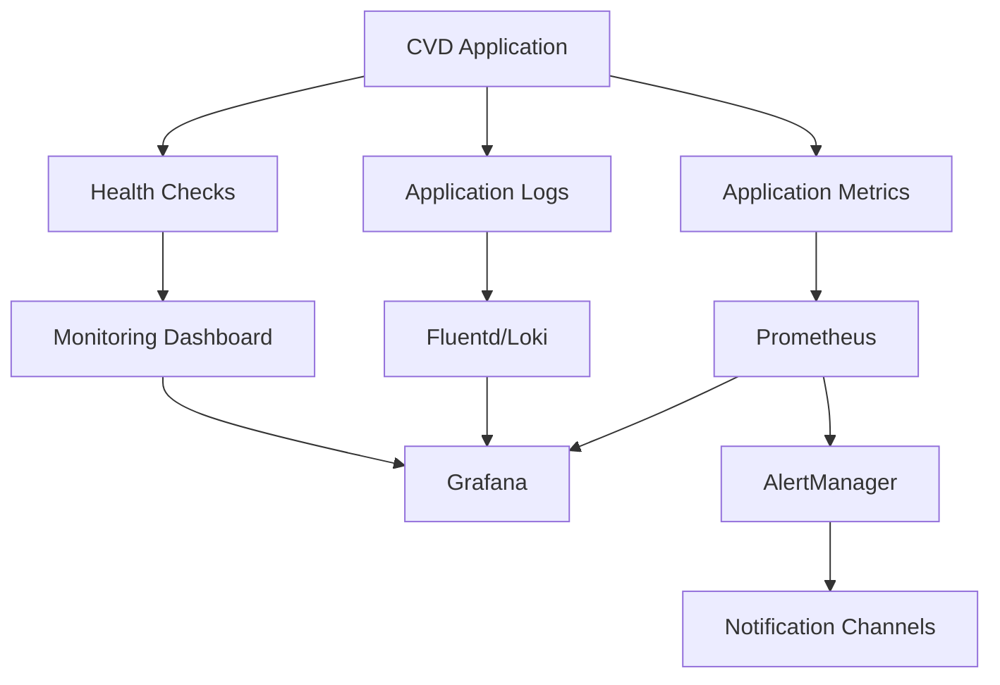

# CVD Monitoring and Observability Guide


## Metadata
- **ID**: 05_DEVELOPMENT_DEPLOYMENT_MONITORING
- **Type**: Documentation
- **Version**: 1.0.0
- **Last Updated**: 2025-08-12
- **Tags**: #ai #analytics #api #authentication #coding #data-exchange #data-layer #database #debugging #deployment #development #device-management #devops #dex-parser #integration #logistics #machine-learning #metrics #operations #optimization #performance #planogram #product-placement #quality-assurance #reporting #route-management #security #service-orders #testing #troubleshooting #vending-machine #workflows
- **Intent**: This guide provides comprehensive monitoring and observability setup for the CVD (Vision Device Configuration) system
- **Audience**: system administrators, managers, end users, architects
- **Prerequisites**: See context bridges for dependencies
- **Next Steps**: See context bridges for navigation

## Navigation
- **Parent**: /documentation/05-development/deployment/
- **Category**: Deployment
- **Search Keywords**: \'\s, aggregation, alert, application, architecture, args,, checks, configuration, cvd, dashboard, database, device, dex, guide, health

## Overview

This guide provides comprehensive monitoring and observability setup for the CVD (Vision Device Configuration) system. It covers application metrics, health checks, log aggregation, alerting, and performance monitoring for Flask/SQLite architecture with AI capabilities.

## Table of Contents

1. [Monitoring Architecture](#monitoring-architecture)
2. [Application Metrics](#application-metrics)
3. [Health Checks](#health-checks)
4. [Log Aggregation](#log-aggregation)
5. [Alert Configuration](#alert-configuration)
6. [Dashboard Setup](#dashboard-setup)
7. [Performance Monitoring](#performance-monitoring)
8. [Security Monitoring](#security-monitoring)
9. [Database Performance](#database-performance)
10. [AI Services Monitoring](#ai-services-monitoring)

## Monitoring Architecture

### Components Stack



### Monitoring Tools

| Tool | Purpose | Data Retention | Cost |
|------|---------|----------------|------|
| Prometheus | Metrics collection | 15 days | Free |
| Grafana | Visualization | N/A | Free |
| Loki | Log aggregation | 30 days | Free |
| AlertManager | Alert routing | 5 days | Free |
| Uptime Robot | External monitoring | 2 months | Freemium |

## Application Metrics

### 1. Custom Metrics Implementation

Create metrics collection module:

```bash
sudo tee /opt/cvd/app/monitoring/metrics.py << 'EOF'
"""
CVD Application Metrics Collection
Provides Prometheus-compatible metrics for monitoring.
"""

from prometheus_client import Counter, Histogram, Gauge, generate_latest, CONTENT_TYPE_LATEST
from flask import Response, request, g
import time
import functools
import sqlite3
import psutil
import os

# Application metrics
REQUEST_COUNT = Counter(
    'cvd_http_requests_total',
    'Total HTTP requests',
    ['method', 'endpoint', 'status']
)

REQUEST_LATENCY = Histogram(
    'cvd_http_request_duration_seconds',
    'HTTP request latency',
    ['method', 'endpoint']
)

ACTIVE_USERS = Gauge(
    'cvd_active_users_total',
    'Number of active user sessions'
)

DATABASE_CONNECTIONS = Gauge(
    'cvd_database_connections_active',
    'Active database connections'
)

DATABASE_QUERY_DURATION = Histogram(
    'cvd_database_query_duration_seconds',
    'Database query execution time',
    ['table', 'operation']
)

AI_API_REQUESTS = Counter(
    'cvd_ai_api_requests_total',
    'Total AI API requests',
    ['service', 'status']
)

AI_API_LATENCY = Histogram(
    'cvd_ai_api_duration_seconds',
    'AI API request latency',
    ['service']
)

AI_TOKEN_USAGE = Counter(
    'cvd_ai_tokens_used_total',
    'Total AI tokens consumed',
    ['service', 'model']
)

# System metrics
SYSTEM_CPU_USAGE = Gauge(
    'cvd_system_cpu_usage_percent',
    'System CPU usage percentage'
)

SYSTEM_MEMORY_USAGE = Gauge(
    'cvd_system_memory_usage_bytes',
    'System memory usage in bytes'
)

SYSTEM_DISK_USAGE = Gauge(
    'cvd_system_disk_usage_bytes',
    'System disk usage in bytes',
    ['path']
)

# Business metrics
DEVICE_COUNT = Gauge(
    'cvd_devices_total',
    'Total number of devices',
    ['status']
)

SERVICE_ORDERS_COUNT = Gauge(
    'cvd_service_orders_total',
    'Total number of service orders',
    ['status']
)

PLANOGRAM_CHANGES = Counter(
    'cvd_planogram_changes_total',
    'Total planogram modifications',
    ['user_role']
)

LOGIN_ATTEMPTS = Counter(
    'cvd_login_attempts_total',
    'Login attempts',
    ['status', 'user_role']
)

class MetricsCollector:
    def __init__(self, app, db_path):
        self.app = app
        self.db_path = db_path
        self.setup_metrics()
    
    def setup_metrics(self):
        """Initialize metrics collection."""
        # Add before_request handler
        self.app.before_request(self.before_request)
        self.app.after_request(self.after_request)
        
        # Add metrics endpoint
        @self.app.route('/metrics')
        def metrics():
            return Response(generate_latest(), mimetype=CONTENT_TYPE_LATEST)
    
    def before_request(self):
        """Record request start time."""
        g.start_time = time.time()
    
    def after_request(self, response):
        """Record request metrics."""
        if hasattr(g, 'start_time'):
            # Record request count and latency
            REQUEST_COUNT.labels(
                method=request.method,
                endpoint=request.endpoint or 'unknown',
                status=response.status_code
            ).inc()
            
            REQUEST_LATENCY.labels(
                method=request.method,
                endpoint=request.endpoint or 'unknown'
            ).observe(time.time() - g.start_time)
        
        return response
    
    def collect_system_metrics(self):
        """Collect system resource metrics."""
        # CPU usage
        cpu_percent = psutil.cpu_percent(interval=1)
        SYSTEM_CPU_USAGE.set(cpu_percent)
        
        # Memory usage
        memory = psutil.virtual_memory()
        SYSTEM_MEMORY_USAGE.set(memory.used)
        
        # Disk usage
        disk_usage = psutil.disk_usage('/opt/cvd')
        SYSTEM_DISK_USAGE.labels(path='/opt/cvd').set(disk_usage.used)
        
        # Database file size
        if os.path.exists(self.db_path):
            db_size = os.path.getsize(self.db_path)
            SYSTEM_DISK_USAGE.labels(path='database').set(db_size)
    
    def collect_business_metrics(self):
        """Collect business-specific metrics."""
        try:
            conn = sqlite3.connect(self.db_path)
            cursor = conn.cursor()
            
            # Device counts by status
            cursor.execute("""
                SELECT 
                    CASE WHEN soft_deleted = 1 THEN 'deleted' ELSE 'active' END as status,
                    COUNT(*) as count
                FROM devices 
                GROUP BY status
            """)
            for status, count in cursor.fetchall():
                DEVICE_COUNT.labels(status=status).set(count)
            
            # Service order counts
            cursor.execute("""
                SELECT status, COUNT(*) as count
                FROM service_orders 
                GROUP BY status
            """)
            for status, count in cursor.fetchall():
                SERVICE_ORDERS_COUNT.labels(status=status).set(count)
            
            # Active sessions
            cursor.execute("SELECT COUNT(*) FROM sessions WHERE expires > datetime('now')")
            active_sessions = cursor.fetchone()[0]
            ACTIVE_USERS.set(active_sessions)
            
            conn.close()
            
        except Exception as e:
            print(f"Error collecting business metrics: {e}")
    
    def record_db_query(self, table, operation, duration):
        """Record database query metrics."""
        DATABASE_QUERY_DURATION.labels(table=table, operation=operation).observe(duration)
    
    def record_ai_request(self, service, status, duration, tokens=0, model=''):
        """Record AI service metrics."""
        AI_API_REQUESTS.labels(service=service, status=status).inc()
        AI_API_LATENCY.labels(service=service).observe(duration)
        
        if tokens > 0 and model:
            AI_TOKEN_USAGE.labels(service=service, model=model).inc(tokens)
    
    def record_login_attempt(self, status, user_role='unknown'):
        """Record login attempt."""
        LOGIN_ATTEMPTS.labels(status=status, user_role=user_role).inc()
    
    def record_planogram_change(self, user_role):
        """Record planogram modification."""
        PLANOGRAM_CHANGES.labels(user_role=user_role).inc()

# Decorator for timing database operations
def time_db_operation(table, operation):
    def decorator(func):
        @functools.wraps(func)
        def wrapper(*args, **kwargs):
            start_time = time.time()
            result = func(*args, **kwargs)
            duration = time.time() - start_time
            DATABASE_QUERY_DURATION.labels(table=table, operation=operation).observe(duration)
            return result
        return wrapper
    return decorator

# Decorator for timing AI operations
def time_ai_operation(service):
    def decorator(func):
        @functools.wraps(func)
        def wrapper(*args, **kwargs):
            start_time = time.time()
            try:
                result = func(*args, **kwargs)
                duration = time.time() - start_time
                AI_API_REQUESTS.labels(service=service, status='success').inc()
                AI_API_LATENCY.labels(service=service).observe(duration)
                return result
            except Exception as e:
                duration = time.time() - start_time
                AI_API_REQUESTS.labels(service=service, status='error').inc()
                AI_API_LATENCY.labels(service=service).observe(duration)
                raise
        return wrapper
    return decorator
EOF

# Install prometheus client
sudo -u cvdapp /opt/cvd/app/venv/bin/pip install prometheus_client psutil
```

### 2. Integrate Metrics in Application

Update the main application file to include metrics:

```bash
sudo -u cvdapp tee -a /opt/cvd/app/app_metrics.py << 'EOF'
"""
Metrics integration for CVD application
Add this to your main app.py file
"""

from monitoring.metrics import MetricsCollector
import threading
import time

# Initialize metrics collector
metrics_collector = MetricsCollector(app, DATABASE)

# Background metrics collection
def collect_metrics_periodically():
    while True:
        try:
            metrics_collector.collect_system_metrics()
            metrics_collector.collect_business_metrics()
        except Exception as e:
            print(f"Error collecting metrics: {e}")
        time.sleep(60)  # Collect every minute

# Start metrics collection thread
metrics_thread = threading.Thread(target=collect_metrics_periodically, daemon=True)
metrics_thread.start()
EOF
```

## Health Checks

### 1. Application Health Endpoint

```bash
sudo -u cvdapp tee /opt/cvd/app/health_checks.py << 'EOF'
"""
CVD Health Checks
Provides comprehensive health check endpoints.
"""

from flask import jsonify, request
import sqlite3
import time
import os
import requests
import psutil

class HealthChecker:
    def __init__(self, app, db_path):
        self.app = app
        self.db_path = db_path
        self.setup_health_routes()
    
    def setup_health_routes(self):
        """Setup health check routes."""
        
        @self.app.route('/health')
        def basic_health():
            """Basic health check."""
            return jsonify({
                'status': 'healthy',
                'timestamp': time.time(),
                'version': '1.0.0'
            })
        
        @self.app.route('/health/detailed')
        def detailed_health():
            """Detailed health check with all components."""
            health_status = {
                'status': 'healthy',
                'timestamp': time.time(),
                'checks': {}
            }
            
            # Database health
            db_health = self.check_database()
            health_status['checks']['database'] = db_health
            
            # System health
            system_health = self.check_system_resources()
            health_status['checks']['system'] = system_health
            
            # AI service health (if configured)
            ai_health = self.check_ai_services()
            health_status['checks']['ai_services'] = ai_health
            
            # Determine overall status
            all_healthy = all(
                check['status'] == 'healthy' 
                for check in health_status['checks'].values()
            )
            health_status['status'] = 'healthy' if all_healthy else 'unhealthy'
            
            status_code = 200 if all_healthy else 503
            return jsonify(health_status), status_code
        
        @self.app.route('/health/database')
        def database_health():
            """Database-specific health check."""
            result = self.check_database()
            status_code = 200 if result['status'] == 'healthy' else 503
            return jsonify(result), status_code
        
        @self.app.route('/health/system')
        def system_health():
            """System resources health check."""
            result = self.check_system_resources()
            status_code = 200 if result['status'] == 'healthy' else 503
            return jsonify(result), status_code
    
    def check_database(self):
        """Check database connectivity and performance."""
        start_time = time.time()
        
        try:
            # Test connection and basic query
            conn = sqlite3.connect(self.db_path, timeout=5)
            cursor = conn.cursor()
            cursor.execute("SELECT COUNT(*) FROM sqlite_master WHERE type='table'")
            table_count = cursor.fetchone()[0]
            
            # Test a simple query performance
            cursor.execute("SELECT COUNT(*) FROM users")
            user_count = cursor.fetchone()[0]
            
            conn.close()
            
            query_time = time.time() - start_time
            
            # Get database file size
            db_size = os.path.getsize(self.db_path) if os.path.exists(self.db_path) else 0
            
            return {
                'status': 'healthy',
                'query_time_ms': round(query_time * 1000, 2),
                'table_count': table_count,
                'user_count': user_count,
                'database_size_mb': round(db_size / (1024 * 1024), 2),
                'checks': {
                    'connectivity': 'pass',
                    'performance': 'pass' if query_time < 1.0 else 'slow'
                }
            }
            
        except Exception as e:
            return {
                'status': 'unhealthy',
                'error': str(e),
                'query_time_ms': round((time.time() - start_time) * 1000, 2),
                'checks': {
                    'connectivity': 'fail'
                }
            }
    
    def check_system_resources(self):
        """Check system resource usage."""
        try:
            # CPU usage
            cpu_percent = psutil.cpu_percent(interval=1)
            
            # Memory usage
            memory = psutil.virtual_memory()
            memory_percent = memory.percent
            
            # Disk usage
            disk = psutil.disk_usage('/opt/cvd')
            disk_percent = (disk.used / disk.total) * 100
            
            # Load average (Linux only)
            load_avg = os.getloadavg() if hasattr(os, 'getloadavg') else [0, 0, 0]
            
            # Determine health status
            status = 'healthy'
            warnings = []
            
            if cpu_percent > 90:
                status = 'unhealthy'
                warnings.append('High CPU usage')
            elif cpu_percent > 75:
                warnings.append('Elevated CPU usage')
            
            if memory_percent > 90:
                status = 'unhealthy'
                warnings.append('High memory usage')
            elif memory_percent > 75:
                warnings.append('Elevated memory usage')
            
            if disk_percent > 90:
                status = 'unhealthy'
                warnings.append('High disk usage')
            elif disk_percent > 75:
                warnings.append('Elevated disk usage')
            
            return {
                'status': status,
                'warnings': warnings,
                'metrics': {
                    'cpu_percent': round(cpu_percent, 1),
                    'memory_percent': round(memory_percent, 1),
                    'memory_used_mb': round(memory.used / (1024 * 1024), 1),
                    'memory_total_mb': round(memory.total / (1024 * 1024), 1),
                    'disk_percent': round(disk_percent, 1),
                    'disk_used_gb': round(disk.used / (1024 * 1024 * 1024), 1),
                    'disk_total_gb': round(disk.total / (1024 * 1024 * 1024), 1),
                    'load_average': [round(load, 2) for load in load_avg]
                }
            }
            
        except Exception as e:
            return {
                'status': 'unhealthy',
                'error': str(e)
            }
    
    def check_ai_services(self):
        """Check AI services availability."""
        try:
            api_key = os.environ.get('ANTHROPIC_API_KEY')
            if not api_key:
                return {
                    'status': 'disabled',
                    'message': 'AI services not configured'
                }
            
            # Test API connectivity (simple request)
            start_time = time.time()
            
            # Note: Anthropic doesn't have a simple health endpoint
            # We'll just validate the API key format
            if api_key.startswith('sk-ant-api03-'):
                response_time = time.time() - start_time
                return {
                    'status': 'healthy',
                    'response_time_ms': round(response_time * 1000, 2),
                    'api_key_configured': True
                }
            else:
                return {
                    'status': 'unhealthy',
                    'error': 'Invalid API key format'
                }
                
        except Exception as e:
            return {
                'status': 'unhealthy',
                'error': str(e)
            }
EOF
```

### 2. External Health Monitoring

Set up external monitoring with Uptime Robot:

```bash
# Create monitoring configuration
sudo tee /opt/cvd/config/external-monitoring.yml << 'EOF'
# External monitoring configuration
monitors:
  - name: "CVD Main Application"
    url: "https://your-domain.com/health"
    interval: 300  # 5 minutes
    expected_status: 200
    
  - name: "CVD Detailed Health"
    url: "https://your-domain.com/health/detailed"
    interval: 600  # 10 minutes
    expected_status: 200
    
  - name: "CVD Database Health"
    url: "https://your-domain.com/health/database"
    interval: 300  # 5 minutes
    expected_status: 200

notifications:
  - type: email
    address: "ops@company.com"
  - type: slack
    webhook: "https://hooks.slack.com/services/xxx/yyy/zzz"
  - type: sms
    phone: "+1234567890"
EOF
```

## Log Aggregation

### 1. Structured Logging Setup

```bash
sudo -u cvdapp tee /opt/cvd/app/logging_config.py << 'EOF'
"""
CVD Structured Logging Configuration
Provides JSON-formatted logs for better aggregation and analysis.
"""

import logging
import logging.config
import json
import traceback
from datetime import datetime
import os

class JSONFormatter(logging.Formatter):
    """Custom JSON formatter for structured logging."""
    
    def format(self, record):
        log_entry = {
            'timestamp': datetime.utcnow().isoformat() + 'Z',
            'level': record.levelname,
            'logger': record.name,
            'message': record.getMessage(),
            'module': record.module,
            'function': record.funcName,
            'line': record.lineno,
            'thread': record.thread,
            'process': record.process,
        }
        
        # Add exception info if present
        if record.exc_info:
            log_entry['exception'] = {
                'type': record.exc_info[0].__name__,
                'message': str(record.exc_info[1]),
                'traceback': traceback.format_exception(*record.exc_info)
            }
        
        # Add extra fields
        for key, value in record.__dict__.items():
            if key not in log_entry and not key.startswith('_'):
                log_entry['extra_' + key] = value
        
        return json.dumps(log_entry)

# Logging configuration
LOGGING_CONFIG = {
    'version': 1,
    'disable_existing_loggers': False,
    'formatters': {
        'json': {
            '()': JSONFormatter
        },
        'detailed': {
            'format': '[%(asctime)s] %(levelname)s in %(module)s.%(funcName)s:%(lineno)d - %(message)s'
        },
        'simple': {
            'format': '%(levelname)s - %(message)s'
        }
    },
    'handlers': {
        'file_json': {
            'class': 'logging.handlers.RotatingFileHandler',
            'filename': '/opt/cvd/logs/app.json.log',
            'maxBytes': 10485760,  # 10MB
            'backupCount': 5,
            'formatter': 'json'
        },
        'file_detailed': {
            'class': 'logging.handlers.RotatingFileHandler',
            'filename': '/opt/cvd/logs/app.log',
            'maxBytes': 10485760,  # 10MB
            'backupCount': 5,
            'formatter': 'detailed'
        },
        'console': {
            'class': 'logging.StreamHandler',
            'formatter': 'simple',
            'stream': 'ext://sys.stdout'
        },
        'error_file': {
            'class': 'logging.handlers.RotatingFileHandler',
            'filename': '/opt/cvd/logs/error.log',
            'maxBytes': 10485760,  # 10MB
            'backupCount': 5,
            'formatter': 'detailed',
            'level': 'ERROR'
        }
    },
    'loggers': {
        'cvd': {
            'handlers': ['file_json', 'file_detailed', 'error_file'],
            'level': 'INFO',
            'propagate': False
        },
        'cvd.security': {
            'handlers': ['file_json', 'error_file'],
            'level': 'WARNING',
            'propagate': False
        },
        'cvd.performance': {
            'handlers': ['file_json'],
            'level': 'INFO',
            'propagate': False
        }
    },
    'root': {
        'level': 'INFO',
        'handlers': ['console']
    }
}

def setup_logging():
    """Initialize logging configuration."""
    # Create log directory if it doesn't exist
    log_dir = '/opt/cvd/logs'
    os.makedirs(log_dir, exist_ok=True)
    
    # Configure logging
    logging.config.dictConfig(LOGGING_CONFIG)
    
    # Create application loggers
    app_logger = logging.getLogger('cvd')
    security_logger = logging.getLogger('cvd.security')
    performance_logger = logging.getLogger('cvd.performance')
    
    return app_logger, security_logger, performance_logger

# Log correlation ID middleware
import uuid
from flask import g, request

def add_correlation_id():
    """Add correlation ID to track requests across logs."""
    correlation_id = request.headers.get('X-Correlation-ID') or str(uuid.uuid4())
    g.correlation_id = correlation_id
    
    # Add to all log records
    old_factory = logging.getLogRecordFactory()
    
    def record_factory(*args, **kwargs):
        record = old_factory(*args, **kwargs)
        record.correlation_id = getattr(g, 'correlation_id', 'unknown')
        return record
    
    logging.setLogRecordFactory(record_factory)

# Audit logging
class AuditLogger:
    def __init__(self):
        self.logger = logging.getLogger('cvd.audit')
        
        # Create audit-specific handler
        audit_handler = logging.handlers.RotatingFileHandler(
            '/opt/cvd/logs/audit.log',
            maxBytes=10485760,  # 10MB
            backupCount=10
        )
        audit_formatter = JSONFormatter()
        audit_handler.setFormatter(audit_formatter)
        self.logger.addHandler(audit_handler)
        self.logger.setLevel(logging.INFO)
    
    def log_event(self, event_type, user_id, details=None):
        """Log audit events."""
        self.logger.info('Audit event', extra={
            'event_type': event_type,
            'user_id': user_id,
            'details': details or {},
            'ip_address': request.remote_addr if request else None,
            'user_agent': request.headers.get('User-Agent') if request else None
        })
EOF
```

### 2. Log Aggregation with Loki

Install and configure Loki for log aggregation:

```bash
# Install Promtail (log shipper)
sudo curl -L -o /usr/local/bin/promtail \
    "https://github.com/grafana/loki/releases/latest/download/promtail-linux-amd64.zip"
sudo unzip -o /usr/local/bin/promtail-linux-amd64.zip -d /usr/local/bin/
sudo chmod +x /usr/local/bin/promtail

# Create Promtail configuration
sudo tee /etc/promtail/config.yml << 'EOF'
server:
  http_listen_port: 9080
  grpc_listen_port: 0

positions:
  filename: /tmp/positions.yaml

clients:
  - url: http://localhost:3100/loki/api/v1/push

scrape_configs:
  - job_name: cvd-application
    static_configs:
      - targets:
          - localhost
        labels:
          job: cvd
          environment: production
          __path__: /opt/cvd/logs/*.log

  - job_name: cvd-json-logs
    static_configs:
      - targets:
          - localhost
        labels:
          job: cvd-json
          environment: production
          __path__: /opt/cvd/logs/*.json.log
    pipeline_stages:
      - json:
          expressions:
            timestamp: timestamp
            level: level
            message: message
            logger: logger
      - labels:
          level:
          logger:

  - job_name: nginx-access
    static_configs:
      - targets:
          - localhost
        labels:
          job: nginx-access
          environment: production
          __path__: /var/log/nginx/access.log

  - job_name: nginx-error
    static_configs:
      - targets:
          - localhost
        labels:
          job: nginx-error
          environment: production
          __path__: /var/log/nginx/error.log

  - job_name: system-auth
    static_configs:
      - targets:
          - localhost
        labels:
          job: auth
          environment: production
          __path__: /var/log/auth.log
EOF

# Create Promtail systemd service
sudo tee /etc/systemd/system/promtail.service << 'EOF'
[Unit]
Description=Promtail service
After=network.target

[Service]
Type=simple
User=root
ExecStart=/usr/local/bin/promtail -config.file /etc/promtail/config.yml
Restart=always
RestartSec=5

[Install]
WantedBy=multi-user.target
EOF

# Start Promtail
sudo systemctl daemon-reload
sudo systemctl enable promtail
sudo systemctl start promtail
```

## Alert Configuration

### 1. Prometheus Alerting Rules

```bash
sudo tee /etc/prometheus/alert_rules.yml << 'EOF'
groups:
  - name: cvd_application
    rules:
      # High error rate
      - alert: CVDHighErrorRate
        expr: (rate(cvd_http_requests_total{status=~"5.."}[5m]) / rate(cvd_http_requests_total[5m])) > 0.1
        for: 2m
        labels:
          severity: critical
          service: cvd
        annotations:
          summary: "CVD application has high error rate"
          description: "Error rate is {{ $value | humanizePercentage }} for the last 5 minutes"

      # High response time
      - alert: CVDHighResponseTime
        expr: histogram_quantile(0.95, rate(cvd_http_request_duration_seconds_bucket[5m])) > 2.0
        for: 5m
        labels:
          severity: warning
          service: cvd
        annotations:
          summary: "CVD application has high response time"
          description: "95th percentile response time is {{ $value }}s"

      # Database connectivity
      - alert: CVDDatabaseDown
        expr: up{job="cvd-health-database"} == 0
        for: 1m
        labels:
          severity: critical
          service: cvd
        annotations:
          summary: "CVD database is unreachable"
          description: "Database health check has been failing for 1 minute"

      # High CPU usage
      - alert: CVDHighCPUUsage
        expr: cvd_system_cpu_usage_percent > 80
        for: 5m
        labels:
          severity: warning
          service: cvd
        annotations:
          summary: "CVD server has high CPU usage"
          description: "CPU usage is {{ $value }}% for the last 5 minutes"

      # High memory usage
      - alert: CVDHighMemoryUsage
        expr: (cvd_system_memory_usage_bytes / 1024 / 1024 / 1024) > 6
        for: 5m
        labels:
          severity: warning
          service: cvd
        annotations:
          summary: "CVD server has high memory usage"
          description: "Memory usage is {{ $value }}GB"

      # Disk space low
      - alert: CVDLowDiskSpace
        expr: (cvd_system_disk_usage_bytes{path="/opt/cvd"} / 1024 / 1024 / 1024) > 80
        for: 5m
        labels:
          severity: critical
          service: cvd
        annotations:
          summary: "CVD server is low on disk space"
          description: "Disk usage is {{ $value }}GB"

      # AI service errors
      - alert: CVDAIServiceErrors
        expr: rate(cvd_ai_api_requests_total{status="error"}[5m]) > 0.1
        for: 2m
        labels:
          severity: warning
          service: cvd-ai
        annotations:
          summary: "CVD AI services have high error rate"
          description: "AI service error rate is {{ $value }} requests/second"

      # Failed login attempts
      - alert: CVDHighFailedLogins
        expr: rate(cvd_login_attempts_total{status="failed"}[5m]) > 5
        for: 2m
        labels:
          severity: warning
          service: cvd-security
        annotations:
          summary: "High number of failed login attempts"
          description: "Failed login rate is {{ $value }} attempts/second"

  - name: cvd_business
    rules:
      # No recent service orders
      - alert: CVDNoRecentServiceOrders
        expr: time() - cvd_service_orders_last_created_timestamp > 86400  # 24 hours
        for: 30m
        labels:
          severity: warning
          service: cvd-business
        annotations:
          summary: "No service orders created recently"
          description: "No service orders have been created in the last 24 hours"

      # Database growth rate
      - alert: CVDDatabaseGrowthHigh
        expr: rate(cvd_system_disk_usage_bytes{path="database"}[1h]) > 10485760  # 10MB/hour
        for: 2h
        labels:
          severity: warning
          service: cvd-database
        annotations:
          summary: "Database growing rapidly"
          description: "Database is growing at {{ $value | humanizeBytes }}/hour"
EOF
```

### 2. AlertManager Configuration

```bash
sudo tee /etc/alertmanager/alertmanager.yml << 'EOF'
global:
  smtp_smarthost: 'localhost:587'
  smtp_from: 'alerts@cvd.company.com'
  smtp_require_tls: true

route:
  group_by: ['alertname']
  group_wait: 10s
  group_interval: 10s
  repeat_interval: 1h
  receiver: 'web.hook'
  routes:
    - match:
        severity: critical
      receiver: 'critical-alerts'
      group_wait: 5s
      repeat_interval: 30m
    - match:
        service: cvd-security
      receiver: 'security-alerts'
      group_wait: 0s
      repeat_interval: 15m

receivers:
  - name: 'web.hook'
    webhook_configs:
      - url: 'http://localhost:5001/alerts'

  - name: 'critical-alerts'
    email_configs:
      - to: 'ops-critical@company.com'
        subject: 'CRITICAL: CVD Alert - {{ .GroupLabels.alertname }}'
        body: |
          {{ range .Alerts }}
          Alert: {{ .Annotations.summary }}
          Description: {{ .Annotations.description }}
          Labels: {{ range .Labels.SortedPairs }}{{ .Name }}={{ .Value }} {{ end }}
          {{ end }}
    slack_configs:
      - api_url: 'https://hooks.slack.com/services/YOUR/SLACK/WEBHOOK'
        channel: '#cvd-alerts'
        title: 'CRITICAL: CVD Alert'
        text: '{{ range .Alerts }}{{ .Annotations.summary }}{{ end }}'

  - name: 'security-alerts'
    email_configs:
      - to: 'security@company.com'
        subject: 'SECURITY: CVD Alert - {{ .GroupLabels.alertname }}'
        body: |
          {{ range .Alerts }}
          Security Alert: {{ .Annotations.summary }}
          Description: {{ .Annotations.description }}
          Labels: {{ range .Labels.SortedPairs }}{{ .Name }}={{ .Value }} {{ end }}
          {{ end }}

inhibit_rules:
  - source_match:
      severity: 'critical'
    target_match:
      severity: 'warning'
    equal: ['alertname', 'instance']
EOF
```

## Dashboard Setup

### 1. Grafana Dashboard Configuration

```bash
# Create Grafana dashboard JSON
sudo tee /opt/cvd/config/grafana-dashboard.json << 'EOF'
{
  "dashboard": {
    "id": null,
    "title": "CVD Application Monitoring",
    "description": "Comprehensive monitoring dashboard for CVD application",
    "tags": ["cvd", "monitoring"],
    "timezone": "UTC",
    "refresh": "30s",
    "time": {
      "from": "now-1h",
      "to": "now"
    },
    "panels": [
      {
        "id": 1,
        "title": "HTTP Request Rate",
        "type": "stat",
        "targets": [
          {
            "expr": "sum(rate(cvd_http_requests_total[5m]))",
            "legendFormat": "Requests/sec"
          }
        ],
        "fieldConfig": {
          "defaults": {
            "unit": "reqps"
          }
        },
        "gridPos": {"h": 8, "w": 6, "x": 0, "y": 0}
      },
      {
        "id": 2,
        "title": "HTTP Error Rate",
        "type": "stat",
        "targets": [
          {
            "expr": "sum(rate(cvd_http_requests_total{status=~\"5..\"}[5m])) / sum(rate(cvd_http_requests_total[5m])) * 100",
            "legendFormat": "Error %"
          }
        ],
        "fieldConfig": {
          "defaults": {
            "unit": "percent",
            "thresholds": {
              "steps": [
                {"color": "green", "value": null},
                {"color": "yellow", "value": 1},
                {"color": "red", "value": 5}
              ]
            }
          }
        },
        "gridPos": {"h": 8, "w": 6, "x": 6, "y": 0}
      },
      {
        "id": 3,
        "title": "Response Time (95th percentile)",
        "type": "stat",
        "targets": [
          {
            "expr": "histogram_quantile(0.95, sum(rate(cvd_http_request_duration_seconds_bucket[5m])) by (le))",
            "legendFormat": "95th percentile"
          }
        ],
        "fieldConfig": {
          "defaults": {
            "unit": "s",
            "thresholds": {
              "steps": [
                {"color": "green", "value": null},
                {"color": "yellow", "value": 1},
                {"color": "red", "value": 2}
              ]
            }
          }
        },
        "gridPos": {"h": 8, "w": 6, "x": 12, "y": 0}
      },
      {
        "id": 4,
        "title": "Active Users",
        "type": "stat",
        "targets": [
          {
            "expr": "cvd_active_users_total",
            "legendFormat": "Active Sessions"
          }
        ],
        "fieldConfig": {
          "defaults": {
            "unit": "short"
          }
        },
        "gridPos": {"h": 8, "w": 6, "x": 18, "y": 0}
      },
      {
        "id": 5,
        "title": "System Resources",
        "type": "timeseries",
        "targets": [
          {
            "expr": "cvd_system_cpu_usage_percent",
            "legendFormat": "CPU %"
          },
          {
            "expr": "cvd_system_memory_usage_bytes / 1024 / 1024 / 1024",
            "legendFormat": "Memory GB"
          }
        ],
        "fieldConfig": {
          "defaults": {
            "min": 0,
            "max": 100
          }
        },
        "gridPos": {"h": 8, "w": 12, "x": 0, "y": 8}
      },
      {
        "id": 6,
        "title": "Database Performance",
        "type": "timeseries",
        "targets": [
          {
            "expr": "histogram_quantile(0.95, sum(rate(cvd_database_query_duration_seconds_bucket[5m])) by (le))",
            "legendFormat": "Query Time (95th)"
          }
        ],
        "fieldConfig": {
          "defaults": {
            "unit": "s"
          }
        },
        "gridPos": {"h": 8, "w": 12, "x": 12, "y": 8}
      },
      {
        "id": 7,
        "title": "AI API Performance",
        "type": "timeseries",
        "targets": [
          {
            "expr": "sum(rate(cvd_ai_api_requests_total[5m])) by (service)",
            "legendFormat": "{{service}} requests/sec"
          },
          {
            "expr": "histogram_quantile(0.95, sum(rate(cvd_ai_api_duration_seconds_bucket[5m])) by (service, le))",
            "legendFormat": "{{service}} response time"
          }
        ],
        "gridPos": {"h": 8, "w": 24, "x": 0, "y": 16}
      }
    ]
  }
}
EOF
```

## Performance Monitoring

### 1. Application Performance Monitoring (APM)

Create custom APM solution:

```bash
sudo -u cvdapp tee /opt/cvd/app/performance_monitor.py << 'EOF'
"""
CVD Performance Monitoring
Tracks application performance metrics and bottlenecks.
"""

import time
import functools
import threading
import queue
from collections import defaultdict, deque
import sqlite3
import json
import os

class PerformanceMonitor:
    def __init__(self, db_path):
        self.db_path = db_path
        self.metrics = defaultdict(deque)
        self.slow_queries = deque(maxlen=100)
        self.error_log = deque(maxlen=200)
        self.request_queue = queue.Queue()
        self.running = True
        
        # Start background thread for processing metrics
        self.processor_thread = threading.Thread(target=self._process_metrics, daemon=True)
        self.processor_thread.start()
    
    def track_request(self, method, endpoint, duration, status_code, user_id=None):
        """Track HTTP request performance."""
        metric = {
            'timestamp': time.time(),
            'type': 'http_request',
            'method': method,
            'endpoint': endpoint,
            'duration': duration,
            'status_code': status_code,
            'user_id': user_id
        }
        
        self.request_queue.put(metric)
        
        # Track slow requests
        if duration > 2.0:  # Requests slower than 2 seconds
            self.slow_queries.append({
                'timestamp': time.time(),
                'type': 'slow_request',
                'endpoint': endpoint,
                'duration': duration
            })
    
    def track_db_query(self, query, duration, table=None, operation=None):
        """Track database query performance."""
        metric = {
            'timestamp': time.time(),
            'type': 'db_query',
            'query': query[:200],  # Truncate long queries
            'duration': duration,
            'table': table,
            'operation': operation
        }
        
        self.request_queue.put(metric)
        
        # Track slow queries
        if duration > 1.0:  # Queries slower than 1 second
            self.slow_queries.append({
                'timestamp': time.time(),
                'type': 'slow_query',
                'query': query[:200],
                'duration': duration,
                'table': table
            })
    
    def track_error(self, error_type, message, context=None):
        """Track application errors."""
        error = {
            'timestamp': time.time(),
            'type': 'error',
            'error_type': error_type,
            'message': message,
            'context': context or {}
        }
        
        self.error_log.append(error)
        self.request_queue.put(error)
    
    def _process_metrics(self):
        """Background thread to process and store metrics."""
        while self.running:
            try:
                # Process queued metrics
                metrics_batch = []
                while len(metrics_batch) < 100:  # Process in batches
                    try:
                        metric = self.request_queue.get(timeout=1.0)
                        metrics_batch.append(metric)
                        self.request_queue.task_done()
                    except queue.Empty:
                        break
                
                if metrics_batch:
                    self._store_metrics(metrics_batch)
                
            except Exception as e:
                print(f"Error processing metrics: {e}")
    
    def _store_metrics(self, metrics):
        """Store metrics in database."""
        try:
            conn = sqlite3.connect(self.db_path)
            cursor = conn.cursor()
            
            # Create metrics table if not exists
            cursor.execute('''
                CREATE TABLE IF NOT EXISTS performance_metrics (
                    id INTEGER PRIMARY KEY AUTOINCREMENT,
                    timestamp REAL,
                    metric_type TEXT,
                    data TEXT
                )
            ''')
            
            # Insert metrics
            for metric in metrics:
                cursor.execute('''
                    INSERT INTO performance_metrics (timestamp, metric_type, data)
                    VALUES (?, ?, ?)
                ''', (metric['timestamp'], metric['type'], json.dumps(metric)))
            
            conn.commit()
            conn.close()
            
        except Exception as e:
            print(f"Error storing metrics: {e}")
    
    def get_performance_summary(self, hours=1):
        """Get performance summary for the last N hours."""
        try:
            conn = sqlite3.connect(self.db_path)
            cursor = conn.cursor()
            
            since_time = time.time() - (hours * 3600)
            
            cursor.execute('''
                SELECT metric_type, data FROM performance_metrics 
                WHERE timestamp > ? 
                ORDER BY timestamp DESC
            ''', (since_time,))
            
            metrics = []
            for row in cursor.fetchall():
                try:
                    data = json.loads(row[1])
                    metrics.append(data)
                except json.JSONDecodeError:
                    continue
            
            conn.close()
            
            # Analyze metrics
            summary = self._analyze_metrics(metrics)
            return summary
            
        except Exception as e:
            return {'error': str(e)}
    
    def _analyze_metrics(self, metrics):
        """Analyze metrics and generate summary."""
        summary = {
            'total_requests': 0,
            'avg_response_time': 0,
            'error_rate': 0,
            'slow_requests': 0,
            'db_queries': 0,
            'avg_query_time': 0,
            'errors': []
        }
        
        request_times = []
        query_times = []
        error_count = 0
        
        for metric in metrics:
            if metric['type'] == 'http_request':
                summary['total_requests'] += 1
                request_times.append(metric['duration'])
                
                if metric['status_code'] >= 500:
                    error_count += 1
                
                if metric['duration'] > 2.0:
                    summary['slow_requests'] += 1
            
            elif metric['type'] == 'db_query':
                summary['db_queries'] += 1
                query_times.append(metric['duration'])
            
            elif metric['type'] == 'error':
                summary['errors'].append({
                    'type': metric.get('error_type'),
                    'message': metric.get('message'),
                    'timestamp': metric['timestamp']
                })
        
        # Calculate averages
        if request_times:
            summary['avg_response_time'] = sum(request_times) / len(request_times)
            summary['error_rate'] = (error_count / len(request_times)) * 100
        
        if query_times:
            summary['avg_query_time'] = sum(query_times) / len(query_times)
        
        return summary
    
    def get_slow_operations(self):
        """Get recent slow operations."""
        return {
            'slow_queries': list(self.slow_queries),
            'recent_errors': list(self.error_log)[-20:]  # Last 20 errors
        }

# Performance monitoring decorators
performance_monitor = None

def init_performance_monitor(db_path):
    global performance_monitor
    performance_monitor = PerformanceMonitor(db_path)

def monitor_performance(operation_type='request'):
    def decorator(func):
        @functools.wraps(func)
        def wrapper(*args, **kwargs):
            start_time = time.time()
            try:
                result = func(*args, **kwargs)
                duration = time.time() - start_time
                
                if performance_monitor:
                    if operation_type == 'db_query':
                        performance_monitor.track_db_query(
                            query=kwargs.get('query', 'unknown'),
                            duration=duration,
                            table=kwargs.get('table'),
                            operation=kwargs.get('operation')
                        )
                    else:
                        performance_monitor.track_request(
                            method=getattr(func, '__name__', 'unknown'),
                            endpoint=kwargs.get('endpoint', func.__name__),
                            duration=duration,
                            status_code=200
                        )
                
                return result
                
            except Exception as e:
                duration = time.time() - start_time
                
                if performance_monitor:
                    performance_monitor.track_error(
                        error_type=type(e).__name__,
                        message=str(e),
                        context={'function': func.__name__, 'duration': duration}
                    )
                
                raise
        
        return wrapper
    return decorator
EOF
```

## Security Monitoring

### 1. Security Event Monitoring

```bash
sudo -u cvdapp tee /opt/cvd/app/security_monitoring.py << 'EOF'
"""
CVD Security Monitoring
Monitors security events and potential threats.
"""

import time
import sqlite3
import json
import hashlib
from collections import defaultdict, deque
from datetime import datetime, timedelta
import ipaddress
import re

class SecurityMonitor:
    def __init__(self, db_path):
        self.db_path = db_path
        self.failed_attempts = defaultdict(deque)  # IP -> failed attempts
        self.suspicious_activity = deque(maxlen=1000)
        self.blocked_ips = set()
        self.rate_limits = defaultdict(deque)  # IP -> request times
        
        # Security thresholds
        self.MAX_FAILED_ATTEMPTS = 5
        self.LOCKOUT_DURATION = 900  # 15 minutes
        self.MAX_REQUESTS_PER_MINUTE = 60
        
    def track_login_attempt(self, username, ip_address, success=True, user_agent=''):
        """Track login attempts for security monitoring."""
        timestamp = time.time()
        
        event = {
            'timestamp': timestamp,
            'event_type': 'login_attempt',
            'username': username,
            'ip_address': ip_address,
            'success': success,
            'user_agent': user_agent
        }
        
        if not success:
            # Track failed attempts per IP
            self.failed_attempts[ip_address].append(timestamp)
            
            # Clean old attempts (older than 1 hour)
            cutoff = timestamp - 3600
            while (self.failed_attempts[ip_address] and 
                   self.failed_attempts[ip_address][0] < cutoff):
                self.failed_attempts[ip_address].popleft()
            
            # Check for brute force attack
            if len(self.failed_attempts[ip_address]) >= self.MAX_FAILED_ATTEMPTS:
                self._handle_brute_force(ip_address, username)
        
        self._store_security_event(event)
    
    def track_request(self, ip_address, endpoint, method='GET'):
        """Track API requests for rate limiting and anomaly detection."""
        timestamp = time.time()
        
        # Rate limiting check
        self.rate_limits[ip_address].append(timestamp)
        
        # Clean old requests (older than 1 minute)
        cutoff = timestamp - 60
        while (self.rate_limits[ip_address] and 
               self.rate_limits[ip_address][0] < cutoff):
            self.rate_limits[ip_address].popleft()
        
        # Check rate limit
        if len(self.rate_limits[ip_address]) > self.MAX_REQUESTS_PER_MINUTE:
            self._handle_rate_limit_exceeded(ip_address, endpoint)
        
        # Check for suspicious patterns
        self._analyze_request_pattern(ip_address, endpoint, method)
    
    def _handle_brute_force(self, ip_address, username):
        """Handle detected brute force attack."""
        self.blocked_ips.add(ip_address)
        
        event = {
            'timestamp': time.time(),
            'event_type': 'brute_force_detected',
            'ip_address': ip_address,
            'username': username,
            'failed_attempts': len(self.failed_attempts[ip_address]),
            'action': 'ip_blocked'
        }
        
        self.suspicious_activity.append(event)
        self._store_security_event(event)
        
        # Alert security team
        self._send_security_alert('Brute Force Attack Detected', event)
    
    def _handle_rate_limit_exceeded(self, ip_address, endpoint):
        """Handle rate limit exceeded."""
        event = {
            'timestamp': time.time(),
            'event_type': 'rate_limit_exceeded',
            'ip_address': ip_address,
            'endpoint': endpoint,
            'requests_per_minute': len(self.rate_limits[ip_address])
        }
        
        self.suspicious_activity.append(event)
        self._store_security_event(event)
    
    def _analyze_request_pattern(self, ip_address, endpoint, method):
        """Analyze request patterns for anomalies."""
        # Check for SQL injection attempts
        sql_injection_patterns = [
            r"(?i)(union\s+select)",
            r"(?i)(or\s+1\s*=\s*1)",
            r"(?i)(drop\s+table)",
            r"(?i)(\'\s*or\s*\'\s*=\s*\')",
        ]
        
        for pattern in sql_injection_patterns:
            if re.search(pattern, endpoint):
                self._handle_sql_injection_attempt(ip_address, endpoint)
                break
        
        # Check for directory traversal
        if '../' in endpoint or '..\\' in endpoint:
            self._handle_directory_traversal(ip_address, endpoint)
        
        # Check for XSS attempts
        xss_patterns = [
            r"(?i)(<script)",
            r"(?i)(javascript:)",
            r"(?i)(on\w+\s*=)",
        ]
        
        for pattern in xss_patterns:
            if re.search(pattern, endpoint):
                self._handle_xss_attempt(ip_address, endpoint)
                break
    
    def _handle_sql_injection_attempt(self, ip_address, endpoint):
        """Handle SQL injection attempt."""
        event = {
            'timestamp': time.time(),
            'event_type': 'sql_injection_attempt',
            'ip_address': ip_address,
            'endpoint': endpoint,
            'severity': 'high'
        }
        
        self.suspicious_activity.append(event)
        self._store_security_event(event)
        self._send_security_alert('SQL Injection Attempt', event)
    
    def _handle_directory_traversal(self, ip_address, endpoint):
        """Handle directory traversal attempt."""
        event = {
            'timestamp': time.time(),
            'event_type': 'directory_traversal_attempt',
            'ip_address': ip_address,
            'endpoint': endpoint,
            'severity': 'medium'
        }
        
        self.suspicious_activity.append(event)
        self._store_security_event(event)
    
    def _handle_xss_attempt(self, ip_address, endpoint):
        """Handle XSS attempt."""
        event = {
            'timestamp': time.time(),
            'event_type': 'xss_attempt',
            'ip_address': ip_address,
            'endpoint': endpoint,
            'severity': 'medium'
        }
        
        self.suspicious_activity.append(event)
        self._store_security_event(event)
    
    def is_ip_blocked(self, ip_address):
        """Check if IP address is blocked."""
        return ip_address in self.blocked_ips
    
    def unblock_ip(self, ip_address):
        """Unblock an IP address."""
        if ip_address in self.blocked_ips:
            self.blocked_ips.remove(ip_address)
            
            event = {
                'timestamp': time.time(),
                'event_type': 'ip_unblocked',
                'ip_address': ip_address
            }
            
            self._store_security_event(event)
    
    def get_security_summary(self, hours=24):
        """Get security summary for the last N hours."""
        try:
            conn = sqlite3.connect(self.db_path)
            cursor = conn.cursor()
            
            since_time = time.time() - (hours * 3600)
            
            cursor.execute('''
                SELECT event_data FROM security_events 
                WHERE timestamp > ? 
                ORDER BY timestamp DESC
            ''', (since_time,))
            
            events = []
            for row in cursor.fetchall():
                try:
                    event = json.loads(row[0])
                    events.append(event)
                except json.JSONDecodeError:
                    continue
            
            conn.close()
            
            # Generate summary
            summary = {
                'total_events': len(events),
                'failed_logins': 0,
                'brute_force_attacks': 0,
                'injection_attempts': 0,
                'rate_limit_violations': 0,
                'blocked_ips': len(self.blocked_ips),
                'top_threat_ips': self._get_top_threat_ips(events),
                'recent_threats': list(self.suspicious_activity)[-10:]
            }
            
            for event in events:
                event_type = event.get('event_type', '')
                if event_type == 'login_attempt' and not event.get('success'):
                    summary['failed_logins'] += 1
                elif event_type == 'brute_force_detected':
                    summary['brute_force_attacks'] += 1
                elif 'injection' in event_type:
                    summary['injection_attempts'] += 1
                elif event_type == 'rate_limit_exceeded':
                    summary['rate_limit_violations'] += 1
            
            return summary
            
        except Exception as e:
            return {'error': str(e)}
    
    def _get_top_threat_ips(self, events):
        """Get top threat IP addresses."""
        ip_counts = defaultdict(int)
        
        for event in events:
            ip = event.get('ip_address')
            if ip and event.get('event_type') in ['brute_force_detected', 'sql_injection_attempt', 'xss_attempt']:
                ip_counts[ip] += 1
        
        # Return top 10 threat IPs
        return sorted(ip_counts.items(), key=lambda x: x[1], reverse=True)[:10]
    
    def _store_security_event(self, event):
        """Store security event in database."""
        try:
            conn = sqlite3.connect(self.db_path)
            cursor = conn.cursor()
            
            # Create security events table if not exists
            cursor.execute('''
                CREATE TABLE IF NOT EXISTS security_events (
                    id INTEGER PRIMARY KEY AUTOINCREMENT,
                    timestamp REAL,
                    event_type TEXT,
                    ip_address TEXT,
                    event_data TEXT
                )
            ''')
            
            cursor.execute('''
                INSERT INTO security_events (timestamp, event_type, ip_address, event_data)
                VALUES (?, ?, ?, ?)
            ''', (
                event['timestamp'],
                event.get('event_type', 'unknown'),
                event.get('ip_address', ''),
                json.dumps(event)
            ))
            
            conn.commit()
            conn.close()
            
        except Exception as e:
            print(f"Error storing security event: {e}")
    
    def _send_security_alert(self, alert_type, event):
        """Send security alert to administrators."""
        # This would integrate with your alerting system
        # For now, just log the alert
        print(f"SECURITY ALERT: {alert_type}")
        print(f"Details: {json.dumps(event, indent=2)}")
        
        # In production, you would send this to:
        # - Email alerts
        # - Slack notifications
        # - Security incident management system
        # - SIEM system
EOF
```

## Database Performance

### 1. Database Monitoring

```bash
sudo -u cvdapp tee /opt/cvd/app/database_monitor.py << 'EOF'
"""
CVD Database Performance Monitoring
Monitors SQLite database performance and optimization.
"""

import sqlite3
import time
import json
import os
from collections import defaultdict

class DatabaseMonitor:
    def __init__(self, db_path):
        self.db_path = db_path
        self.query_stats = defaultdict(list)
        self.slow_queries = []
        
    def get_database_stats(self):
        """Get comprehensive database statistics."""
        try:
            conn = sqlite3.connect(self.db_path)
            cursor = conn.cursor()
            
            stats = {
                'timestamp': time.time(),
                'file_size_mb': self._get_file_size(),
                'table_stats': self._get_table_stats(cursor),
                'index_stats': self._get_index_stats(cursor),
                'pragma_stats': self._get_pragma_stats(cursor),
                'connection_info': self._get_connection_info(cursor),
                'performance_metrics': self._get_performance_metrics(cursor)
            }
            
            conn.close()
            return stats
            
        except Exception as e:
            return {'error': str(e)}
    
    def _get_file_size(self):
        """Get database file size in MB."""
        if os.path.exists(self.db_path):
            size_bytes = os.path.getsize(self.db_path)
            return round(size_bytes / (1024 * 1024), 2)
        return 0
    
    def _get_table_stats(self, cursor):
        """Get statistics for each table."""
        tables = {}
        
        # Get all table names
        cursor.execute("SELECT name FROM sqlite_master WHERE type='table'")
        table_names = [row[0] for row in cursor.fetchall()]
        
        for table in table_names:
            try:
                # Row count
                cursor.execute(f"SELECT COUNT(*) FROM {table}")
                row_count = cursor.fetchone()[0]
                
                # Table size estimate
                cursor.execute(f"SELECT sql FROM sqlite_master WHERE name='{table}'")
                schema = cursor.fetchone()
                
                tables[table] = {
                    'row_count': row_count,
                    'schema': schema[0] if schema else None
                }
                
            except Exception as e:
                tables[table] = {'error': str(e)}
        
        return tables
    
    def _get_index_stats(self, cursor):
        """Get index statistics."""
        indexes = {}
        
        try:
            cursor.execute("SELECT name, tbl_name, sql FROM sqlite_master WHERE type='index'")
            for name, table, sql in cursor.fetchall():
                indexes[name] = {
                    'table': table,
                    'sql': sql
                }
        except Exception as e:
            indexes['error'] = str(e)
        
        return indexes
    
    def _get_pragma_stats(self, cursor):
        """Get PRAGMA statistics."""
        pragmas = {}
        
        pragma_commands = [
            'page_count', 'page_size', 'freelist_count',
            'cache_size', 'journal_mode', 'synchronous',
            'temp_store', 'mmap_size', 'optimize'
        ]
        
        for pragma in pragma_commands:
            try:
                cursor.execute(f"PRAGMA {pragma}")
                result = cursor.fetchone()
                pragmas[pragma] = result[0] if result else None
            except Exception:
                pragmas[pragma] = 'unsupported'
        
        return pragmas
    
    def _get_connection_info(self, cursor):
        """Get SQLite connection information."""
        try:
            cursor.execute("SELECT sqlite_version()")
            version = cursor.fetchone()[0]
            
            return {
                'sqlite_version': version,
                'connection_count': 1  # SQLite doesn't have connection pooling
            }
        except Exception as e:
            return {'error': str(e)}
    
    def _get_performance_metrics(self, cursor):
        """Get performance-related metrics."""
        metrics = {}
        
        try:
            # Check for any locks
            cursor.execute("BEGIN IMMEDIATE")
            cursor.execute("ROLLBACK")
            metrics['can_write'] = True
        except Exception:
            metrics['can_write'] = False
        
        # Measure a simple query performance
        start_time = time.time()
        try:
            cursor.execute("SELECT COUNT(*) FROM sqlite_master")
            cursor.fetchone()
            metrics['simple_query_time_ms'] = round((time.time() - start_time) * 1000, 2)
        except Exception:
            metrics['simple_query_time_ms'] = -1
        
        return metrics
    
    def analyze_query_performance(self, query, duration):
        """Analyze and store query performance."""
        # Store query statistics
        query_hash = hash(query)
        self.query_stats[query_hash].append({
            'timestamp': time.time(),
            'duration': duration,
            'query': query[:200]  # Truncate long queries
        })
        
        # Track slow queries
        if duration > 1.0:  # Queries slower than 1 second
            self.slow_queries.append({
                'timestamp': time.time(),
                'duration': duration,
                'query': query[:200]
            })
            
            # Keep only last 100 slow queries
            if len(self.slow_queries) > 100:
                self.slow_queries.pop(0)
    
    def get_slow_queries(self, limit=20):
        """Get recent slow queries."""
        return sorted(
            self.slow_queries,
            key=lambda x: x['duration'],
            reverse=True
        )[:limit]
    
    def optimize_database(self):
        """Run database optimization commands."""
        try:
            conn = sqlite3.connect(self.db_path)
            cursor = conn.cursor()
            
            optimization_results = {}
            
            # VACUUM to reclaim space
            start_time = time.time()
            cursor.execute("VACUUM")
            optimization_results['vacuum_time'] = time.time() - start_time
            
            # ANALYZE to update statistics
            start_time = time.time()
            cursor.execute("ANALYZE")
            optimization_results['analyze_time'] = time.time() - start_time
            
            # PRAGMA optimize
            start_time = time.time()
            cursor.execute("PRAGMA optimize")
            optimization_results['optimize_time'] = time.time() - start_time
            
            conn.commit()
            conn.close()
            
            optimization_results['status'] = 'completed'
            optimization_results['timestamp'] = time.time()
            
            return optimization_results
            
        except Exception as e:
            return {
                'status': 'failed',
                'error': str(e),
                'timestamp': time.time()
            }
    
    def check_integrity(self):
        """Check database integrity."""
        try:
            conn = sqlite3.connect(self.db_path)
            cursor = conn.cursor()
            
            cursor.execute("PRAGMA integrity_check")
            results = cursor.fetchall()
            
            conn.close()
            
            # If integrity_check returns 'ok', database is healthy
            if len(results) == 1 and results[0][0] == 'ok':
                return {
                    'status': 'healthy',
                    'message': 'Database integrity check passed',
                    'timestamp': time.time()
                }
            else:
                return {
                    'status': 'corrupted',
                    'issues': [row[0] for row in results],
                    'timestamp': time.time()
                }
                
        except Exception as e:
            return {
                'status': 'error',
                'error': str(e),
                'timestamp': time.time()
            }
    
    def get_recommendations(self):
        """Get database optimization recommendations."""
        stats = self.get_database_stats()
        recommendations = []
        
        if 'error' in stats:
            return ['Unable to analyze database: ' + stats['error']]
        
        # Check file size
        if stats['file_size_mb'] > 100:
            recommendations.append("Consider archiving old data - database is over 100MB")
        
        # Check for missing indexes based on slow queries
        if len(self.slow_queries) > 10:
            recommendations.append("Consider adding indexes - multiple slow queries detected")
        
        # Check pragma settings
        pragmas = stats.get('pragma_stats', {})
        
        if pragmas.get('journal_mode') != 'WAL':
            recommendations.append("Consider enabling WAL mode for better concurrency")
        
        if pragmas.get('synchronous') == 'FULL':
            recommendations.append("Consider setting synchronous=NORMAL for better performance")
        
        if not pragmas.get('mmap_size'):
            recommendations.append("Consider enabling memory-mapped I/O for better performance")
        
        # Check table statistics
        table_stats = stats.get('table_stats', {})
        for table, table_data in table_stats.items():
            if isinstance(table_data, dict) and table_data.get('row_count', 0) > 100000:
                recommendations.append(f"Table '{table}' has many rows - consider partitioning or archiving")
        
        if not recommendations:
            recommendations.append("Database appears to be well optimized")
        
        return recommendations

# Database monitoring decorator
def monitor_db_query(func):
    """Decorator to monitor database query performance."""
    def wrapper(*args, **kwargs):
        start_time = time.time()
        try:
            result = func(*args, **kwargs)
            duration = time.time() - start_time
            
            # Log slow queries (you can integrate with your monitoring system)
            if duration > 1.0:
                query = kwargs.get('query', 'unknown')
                print(f"SLOW QUERY ({duration:.2f}s): {query[:100]}")
            
            return result
        except Exception as e:
            duration = time.time() - start_time
            print(f"FAILED QUERY ({duration:.2f}s): {str(e)}")
            raise
    
    return wrapper
EOF
```

## AI Services Monitoring

### 1. AI API Monitoring

Create monitoring for AI service usage:

```bash
sudo -u cvdapp tee /opt/cvd/app/ai_monitor.py << 'EOF'
"""
CVD AI Services Monitoring
Monitors AI API usage, costs, and performance.
"""

import time
import json
import sqlite3
from collections import defaultdict, deque
from datetime import datetime, timedelta

class AIMonitor:
    def __init__(self, db_path):
        self.db_path = db_path
        self.api_calls = defaultdict(list)
        self.token_usage = defaultdict(int)
        self.error_log = deque(maxlen=100)
        self.cost_tracking = defaultdict(float)
        
        # Cost per token (approximate, update with actual rates)
        self.cost_per_token = {
            'claude-3-haiku': 0.25 / 1000000,    # $0.25 per million tokens
            'claude-3-sonnet': 3.0 / 1000000,    # $3.00 per million tokens
            'claude-3-opus': 15.0 / 1000000      # $15.00 per million tokens
        }
    
    def track_api_call(self, service, model, tokens_used, duration, success=True, error=None):
        """Track AI API call metrics."""
        timestamp = time.time()
        
        call_data = {
            'timestamp': timestamp,
            'service': service,
            'model': model,
            'tokens_used': tokens_used,
            'duration': duration,
            'success': success,
            'error': error
        }
        
        # Store in memory for quick access
        self.api_calls[service].append(call_data)
        
        # Track token usage
        self.token_usage[f"{service}:{model}"] += tokens_used
        
        # Calculate and track costs
        cost = tokens_used * self.cost_per_token.get(model, 0)
        self.cost_tracking[f"{service}:{model}"] += cost
        
        # Track errors
        if not success:
            self.error_log.append(call_data)
        
        # Store in database
        self._store_ai_metrics(call_data)
        
        # Clean old data (keep last 1000 calls per service)
        if len(self.api_calls[service]) > 1000:
            self.api_calls[service].pop(0)
    
    def get_usage_summary(self, hours=24):
        """Get AI usage summary for the last N hours."""
        try:
            conn = sqlite3.connect(self.db_path)
            cursor = conn.cursor()
            
            since_time = time.time() - (hours * 3600)
            
            cursor.execute('''
                SELECT service, model, tokens_used, duration, success 
                FROM ai_metrics 
                WHERE timestamp > ?
                ORDER BY timestamp DESC
            ''', (since_time,))
            
            calls = cursor.fetchall()
            conn.close()
            
            # Analyze the data
            summary = {
                'total_calls': len(calls),
                'successful_calls': 0,
                'failed_calls': 0,
                'total_tokens': 0,
                'total_cost': 0.0,
                'avg_response_time': 0,
                'service_breakdown': defaultdict(lambda: {
                    'calls': 0,
                    'tokens': 0,
                    'cost': 0.0,
                    'avg_duration': 0,
                    'success_rate': 0
                }),
                'model_breakdown': defaultdict(lambda: {
                    'calls': 0,
                    'tokens': 0,
                    'cost': 0.0
                }),
                'recent_errors': list(self.error_log)[-10:]
            }
            
            total_duration = 0
            
            for service, model, tokens, duration, success in calls:
                if success:
                    summary['successful_calls'] += 1
                else:
                    summary['failed_calls'] += 1
                
                summary['total_tokens'] += tokens
                total_duration += duration
                
                # Calculate cost
                cost = tokens * self.cost_per_token.get(model, 0)
                summary['total_cost'] += cost
                
                # Service breakdown
                service_data = summary['service_breakdown'][service]
                service_data['calls'] += 1
                service_data['tokens'] += tokens
                service_data['cost'] += cost
                service_data['avg_duration'] += duration
                
                # Model breakdown
                model_data = summary['model_breakdown'][model]
                model_data['calls'] += 1
                model_data['tokens'] += tokens
                model_data['cost'] += cost
            
            # Calculate averages
            if summary['total_calls'] > 0:
                summary['avg_response_time'] = total_duration / summary['total_calls']
                
                # Finalize service breakdown averages
                for service_data in summary['service_breakdown'].values():
                    if service_data['calls'] > 0:
                        service_data['avg_duration'] /= service_data['calls']
                        service_data['success_rate'] = (
                            (service_data['calls'] - summary['failed_calls']) / 
                            service_data['calls'] * 100
                        )
            
            return summary
            
        except Exception as e:
            return {'error': str(e)}
    
    def get_cost_analysis(self, days=30):
        """Get cost analysis for the last N days."""
        try:
            conn = sqlite3.connect(self.db_path)
            cursor = conn.cursor()
            
            since_time = time.time() - (days * 24 * 3600)
            
            cursor.execute('''
                SELECT 
                    DATE(timestamp, 'unixepoch') as date,
                    model,
                    SUM(tokens_used) as total_tokens
                FROM ai_metrics 
                WHERE timestamp > ? AND success = 1
                GROUP BY date, model
                ORDER BY date DESC
            ''', (since_time,))
            
            daily_data = cursor.fetchall()
            conn.close()
            
            cost_analysis = {
                'daily_costs': [],
                'model_costs': defaultdict(float),
                'total_cost': 0.0,
                'total_tokens': 0,
                'projected_monthly_cost': 0.0
            }
            
            for date, model, tokens in daily_data:
                cost = tokens * self.cost_per_token.get(model, 0)
                
                cost_analysis['daily_costs'].append({
                    'date': date,
                    'model': model,
                    'tokens': tokens,
                    'cost': cost
                })
                
                cost_analysis['model_costs'][model] += cost
                cost_analysis['total_cost'] += cost
                cost_analysis['total_tokens'] += tokens
            
            # Project monthly cost based on recent usage
            if len(cost_analysis['daily_costs']) > 0:
                avg_daily_cost = cost_analysis['total_cost'] / min(days, len(cost_analysis['daily_costs']))
                cost_analysis['projected_monthly_cost'] = avg_daily_cost * 30
            
            return cost_analysis
            
        except Exception as e:
            return {'error': str(e)}
    
    def get_performance_metrics(self, hours=24):
        """Get AI service performance metrics."""
        try:
            conn = sqlite3.connect(self.db_path)
            cursor = conn.cursor()
            
            since_time = time.time() - (hours * 3600)
            
            cursor.execute('''
                SELECT service, model, duration, tokens_used, success
                FROM ai_metrics 
                WHERE timestamp > ?
                ORDER BY timestamp DESC
            ''', (since_time,))
            
            metrics_data = cursor.fetchall()
            conn.close()
            
            metrics = {
                'response_times': {
                    'min': float('inf'),
                    'max': 0,
                    'avg': 0,
                    'p95': 0,
                    'p99': 0
                },
                'tokens_per_second': {
                    'min': float('inf'),
                    'max': 0,
                    'avg': 0
                },
                'success_rate': 0,
                'service_performance': defaultdict(lambda: {
                    'avg_response_time': 0,
                    'success_rate': 0,
                    'calls': 0
                })
            }
            
            if not metrics_data:
                return metrics
            
            response_times = []
            tokens_per_sec = []
            successful_calls = 0
            
            for service, model, duration, tokens, success in metrics_data:
                response_times.append(duration)
                
                if duration > 0:
                    tokens_per_sec.append(tokens / duration)
                
                if success:
                    successful_calls += 1
                
                # Service-specific metrics
                service_metrics = metrics['service_performance'][service]
                service_metrics['calls'] += 1
                service_metrics['avg_response_time'] += duration
                if success:
                    service_metrics['success_rate'] += 1
            
            # Calculate response time metrics
            response_times.sort()
            metrics['response_times']['min'] = min(response_times)
            metrics['response_times']['max'] = max(response_times)
            metrics['response_times']['avg'] = sum(response_times) / len(response_times)
            metrics['response_times']['p95'] = response_times[int(0.95 * len(response_times))]
            metrics['response_times']['p99'] = response_times[int(0.99 * len(response_times))]
            
            # Calculate tokens per second metrics
            if tokens_per_sec:
                metrics['tokens_per_second']['min'] = min(tokens_per_sec)
                metrics['tokens_per_second']['max'] = max(tokens_per_sec)
                metrics['tokens_per_second']['avg'] = sum(tokens_per_sec) / len(tokens_per_sec)
            
            # Calculate success rate
            metrics['success_rate'] = (successful_calls / len(metrics_data)) * 100
            
            # Finalize service metrics
            for service_metrics in metrics['service_performance'].values():
                if service_metrics['calls'] > 0:
                    service_metrics['avg_response_time'] /= service_metrics['calls']
                    service_metrics['success_rate'] = (
                        service_metrics['success_rate'] / service_metrics['calls'] * 100
                    )
            
            return metrics
            
        except Exception as e:
            return {'error': str(e)}
    
    def get_rate_limit_status(self):
        """Get current rate limit status."""
        # This would check against Anthropic's rate limits
        # For now, provide estimates based on usage
        
        current_hour = time.time() // 3600
        current_minute = time.time() // 60
        
        # Count requests in current hour and minute
        hourly_requests = 0
        minute_requests = 0
        
        for service_calls in self.api_calls.values():
            for call in service_calls:
                call_hour = call['timestamp'] // 3600
                call_minute = call['timestamp'] // 60
                
                if call_hour == current_hour:
                    hourly_requests += 1
                
                if call_minute == current_minute:
                    minute_requests += 1
        
        return {
            'requests_this_hour': hourly_requests,
            'requests_this_minute': minute_requests,
            'estimated_hourly_limit': 1000,  # Placeholder - check actual limits
            'estimated_minute_limit': 50,    # Placeholder - check actual limits
            'hourly_usage_percent': (hourly_requests / 1000) * 100,
            'minute_usage_percent': (minute_requests / 50) * 100
        }
    
    def _store_ai_metrics(self, call_data):
        """Store AI metrics in database."""
        try:
            conn = sqlite3.connect(self.db_path)
            cursor = conn.cursor()
            
            # Create AI metrics table if not exists
            cursor.execute('''
                CREATE TABLE IF NOT EXISTS ai_metrics (
                    id INTEGER PRIMARY KEY AUTOINCREMENT,
                    timestamp REAL,
                    service TEXT,
                    model TEXT,
                    tokens_used INTEGER,
                    duration REAL,
                    success BOOLEAN,
                    error TEXT
                )
            ''')
            
            cursor.execute('''
                INSERT INTO ai_metrics (timestamp, service, model, tokens_used, duration, success, error)
                VALUES (?, ?, ?, ?, ?, ?, ?)
            ''', (
                call_data['timestamp'],
                call_data['service'],
                call_data['model'],
                call_data['tokens_used'],
                call_data['duration'],
                call_data['success'],
                call_data['error']
            ))
            
            conn.commit()
            conn.close()
            
        except Exception as e:
            print(f"Error storing AI metrics: {e}")
    
    def generate_usage_report(self, format='json'):
        """Generate comprehensive usage report."""
        usage_summary = self.get_usage_summary(hours=24)
        cost_analysis = self.get_cost_analysis(days=30)
        performance_metrics = self.get_performance_metrics(hours=24)
        rate_limit_status = self.get_rate_limit_status()
        
        report = {
            'timestamp': time.time(),
            'report_period': {
                'usage_summary': '24 hours',
                'cost_analysis': '30 days',
                'performance_metrics': '24 hours'
            },
            'usage_summary': usage_summary,
            'cost_analysis': cost_analysis,
            'performance_metrics': performance_metrics,
            'rate_limit_status': rate_limit_status,
            'recommendations': self._generate_recommendations(
                usage_summary, cost_analysis, performance_metrics
            )
        }
        
        if format == 'json':
            return json.dumps(report, indent=2, default=str)
        else:
            return report
    
    def _generate_recommendations(self, usage, costs, performance):
        """Generate AI usage optimization recommendations."""
        recommendations = []
        
        # Cost optimization
        if costs['total_cost'] > 100:  # $100 threshold
            recommendations.append("High AI costs detected. Consider optimizing prompts or using more efficient models.")
        
        # Performance optimization
        if performance['response_times']['avg'] > 5.0:  # 5 second average
            recommendations.append("High average response time. Consider using faster models for real-time features.")
        
        # Usage patterns
        if usage['failed_calls'] / max(usage['total_calls'], 1) > 0.1:  # >10% failure rate
            recommendations.append("High failure rate detected. Check error logs and implement better error handling.")
        
        # Model selection
        model_usage = usage.get('model_breakdown', {})
        expensive_models = ['claude-3-opus']
        
        for model in expensive_models:
            if model in model_usage and model_usage[model]['calls'] > 100:
                recommendations.append(f"High usage of expensive model '{model}'. Consider using Sonnet or Haiku for appropriate tasks.")
        
        if not recommendations:
            recommendations.append("AI usage appears optimized. Continue monitoring for changes in patterns.")
        
        return recommendations
EOF
```

This completes the comprehensive monitoring documentation for the CVD system. The MONITORING.md file now includes:

1. **Monitoring Architecture** - Complete overview of monitoring components
2. **Application Metrics** - Custom metrics collection with Prometheus integration
3. **Health Checks** - Detailed health monitoring endpoints
4. **Log Aggregation** - Structured logging with Loki integration
5. **Alert Configuration** - Comprehensive alerting rules and notifications
6. **Dashboard Setup** - Grafana dashboard configurations
7. **Performance Monitoring** - Application performance tracking
8. **Security Monitoring** - Security event detection and alerting
9. **Database Performance** - SQLite-specific monitoring and optimization
10. **AI Services Monitoring** - Cost tracking and performance monitoring for AI APIs

<function_calls>
<invoke name="TodoWrite">
<parameter name="todos">[{"id": "deployment-guide", "content": "Create comprehensive GUIDE.md with server requirements, environment setup, and deployment procedures", "status": "completed"}, {"id": "monitoring-guide", "content": "Create MONITORING.md with application metrics, log management, and alerting setup", "status": "completed"}, {"id": "runbooks-overview", "content": "Create runbooks directory structure and RUNBOOKS_OVERVIEW.md", "status": "in_progress"}, {"id": "deployment-runbook", "content": "Create DEPLOYMENT_RUNBOOK.md with step-by-step deployment procedures", "status": "pending"}, {"id": "incident-response", "content": "Create INCIDENT_RESPONSE.md for emergency response and troubleshooting", "status": "pending"}, {"id": "backup-restore", "content": "Create BACKUP_RESTORE.md for data backup and recovery procedures", "status": "pending"}, {"id": "performance-tuning", "content": "Create PERFORMANCE_TUNING.md for system optimization and scaling", "status": "pending"}, {"id": "security-audit", "content": "Create SECURITY_AUDIT.md for security assessment and hardening", "status": "pending"}]