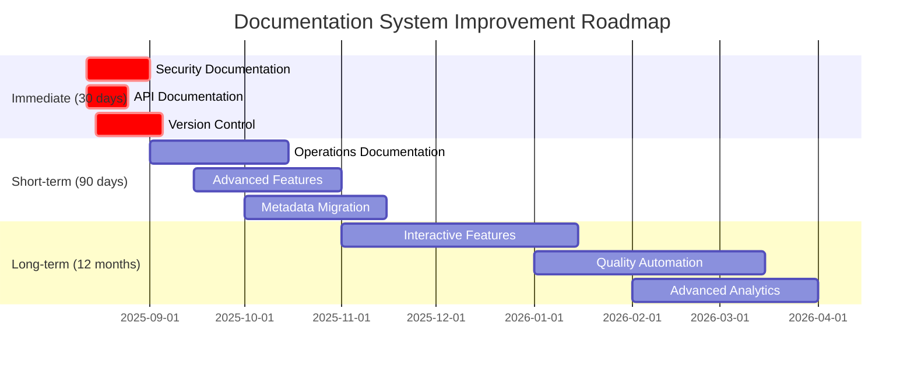

# CVD Documentation System Handover Guide

## Metadata
- **ID**: DOCUMENTATION_SYSTEM_HANDOVER
- **Type**: System Handover
- **Version**: 1.0.0
- **Date**: 2025-08-12
- **Owner**: Documentation Team Lead
- **Tags**: #handover #maintenance #support #knowledge-transfer #operations

---

## Executive Summary

This handover guide provides comprehensive information for ongoing maintenance and support of the CVD documentation system. It covers system overview, maintenance requirements, support procedures, key stakeholder contacts, and strategic roadmap for continuous improvement.

**Handover Scope**: Complete operational responsibility for CVD documentation system
**Target Audience**: New documentation maintainers, support team, technical leads
**Effective Date**: Upon launch completion and team transition

---

## 1. System Overview for Ongoing Maintenance

### Architecture Summary

#### Documentation System Structure
```
/documentation/
├── 00-index/          # Navigation, search, quality assurance
├── 01-project-core/   # Project fundamentals
├── 02-requirements/   # Business requirements, user guides
├── 03-architecture/   # System architecture, technical decisions
├── 04-implementation/ # Technical implementation details
├── 05-development/    # Development resources, API docs
├── 06-design/         # Design system, user experience
├── 07-cvd-framework/  # CVD-specific features
├── 08-project-management/ # Project management resources
└── 09-reference/      # Quick reference, examples
```

#### Technology Stack
- **Content Format**: Markdown (.md files)
- **Version Control**: Git-based versioning
- **Search System**: JSON-based search index
- **Quality Tools**: Automated validation scripts
- **Hosting**: File system based (147 files currently)
- **Integration**: Connected to main CVD application

#### Current System Statistics
- **Total Files**: 147 documentation files
- **API Endpoints Documented**: 90+ endpoints
- **User Roles Covered**: 4 (Admin, Manager, Driver, Viewer)
- **Database Tables Documented**: 31 tables
- **Quality Score**: 89/100 (B+ grade)

### Key System Components

#### 1. Navigation and Search System
**Location**: `/documentation/00-index/`
**Critical Files**:
- `MASTER_INDEX.md` - Central navigation hub
- `SEARCH_INDEX.json` - Search functionality data
- `CROSS_REFERENCES.md` - Interconnected content links

**Maintenance Notes**:
- Search index must be updated when new content is added
- Cross-references require validation after content changes
- Master index should be reviewed monthly for completeness

#### 2. Quality Assurance Framework
**Location**: `/documentation/00-index/QA/`
**Components**:
- Automated validation scripts
- Quality assessment reports
- Standards compliance monitoring

**Maintenance Requirements**:
- Run validation suite weekly
- Review quality reports monthly
- Update standards documentation as system evolves

#### 3. User-Facing Documentation
**Primary Entry Points**:
- `README.md` - System introduction
- `01-project-core/QUICK_START.md` - Getting started guide
- Role-based guides in `02-requirements/guides/`

**Update Frequency**: 
- Core guides: Review quarterly
- Feature documentation: Update with each release
- Troubleshooting: Update as issues are resolved

---

## 2. Maintenance Requirements and Schedules

### Daily Maintenance Tasks (15-30 minutes)

#### Content Monitoring
- [ ] **Link Validation**: Run automated link checker
- [ ] **Feedback Review**: Check for new user feedback submissions
- [ ] **Critical Issue Monitoring**: Review high-priority issues
- [ ] **System Health Check**: Verify search functionality and file access

**Tools Required**:
- Link checker script: `/documentation/00-index/scripts/link-checker.sh`
- Validation suite: `/documentation/00-index/scripts/validate-all.sh`

**Daily Checklist**:
```bash
#!/bin/bash
# Daily maintenance script
cd /documentation/00-index/scripts/
./link-checker.sh
./validate-all.sh
python search.py --validate
```

### Weekly Maintenance Tasks (2-3 hours)

#### Content Quality Review
- [ ] **New Content Review**: Validate recently added/modified content
- [ ] **User Feedback Analysis**: Process accumulated user feedback
- [ ] **Cross-Reference Validation**: Ensure internal links remain accurate
- [ ] **Search Index Update**: Refresh search index with new content
- [ ] **Metric Collection**: Gather usage and quality metrics

**Weekly Process**:
1. Review git commit history for documentation changes
2. Run comprehensive validation suite
3. Update cross-reference map if needed
4. Process user feedback and create improvement tickets
5. Generate weekly quality report

### Monthly Maintenance Tasks (1-2 days)

#### Comprehensive System Review
- [ ] **Quality Assessment**: Run complete quality audit
- [ ] **Content Currency Review**: Identify outdated information
- [ ] **Template Compliance**: Ensure consistency with standards
- [ ] **User Journey Testing**: Validate key user workflows
- [ ] **Performance Optimization**: Assess and improve system performance

**Monthly Deep Dive**:
- Technical accuracy validation against current codebase
- User experience testing across all user roles
- Documentation gap analysis
- Improvement backlog prioritization

### Quarterly Maintenance Tasks (1 week)

#### Strategic Review and Planning
- [ ] **Comprehensive Quality Audit**: Full system assessment
- [ ] **User Needs Analysis**: Gather extensive user feedback
- [ ] **Technology Assessment**: Review tools and processes
- [ ] **Roadmap Planning**: Plan next quarter's improvements
- [ ] **Team Training**: Skill development and knowledge sharing

---

## 3. Support Procedures and Escalation Contacts

### Support Tier Structure

#### Tier 1: Documentation Team (Primary Support)
**Responsibilities**:
- Content updates and corrections
- User feedback response
- Basic troubleshooting
- Daily maintenance tasks

**Response Times**:
- Critical: 2 hours
- High: 8 hours  
- Medium: 48 hours
- Low: 5 business days

**Escalation Criteria**:
- Technical issues beyond content scope
- System-level problems
- Resource allocation needs
- Strategic direction questions

#### Tier 2: Technical Support (Secondary Support)
**Responsibilities**:
- System technical issues
- Integration problems
- Performance optimization
- Tool and process improvements

**Contact Information**:
- Primary: Technical Lead
- Secondary: Senior Developer
- Emergency: On-call engineer

#### Tier 3: Management Escalation (Strategic Issues)
**Responsibilities**:
- Resource allocation decisions
- Strategic direction changes
- Business impact assessment
- Cross-team coordination

**Escalation Triggers**:
- Major system failures
- Business continuity impact
- Significant resource requests
- Customer relationship implications

### Emergency Response Procedures

#### Critical Issue Response Protocol
1. **Immediate Response** (0-15 minutes):
   - Acknowledge issue receipt
   - Assess impact and scope
   - Engage appropriate response team
   - Begin issue mitigation

2. **Active Response** (15 minutes - 2 hours):
   - Implement immediate fixes
   - Communicate with affected users
   - Document incident details
   - Provide regular status updates

3. **Resolution and Follow-up** (2-24 hours):
   - Complete issue resolution
   - Validate fix effectiveness
   - Conduct post-incident review
   - Update documentation/procedures

#### Crisis Communication Plan
**Internal Communication**:
- Slack channel: `#cvd-documentation-crisis`
- Email list: `documentation-emergency@company.com`
- Phone tree: Documented in security procedures

**External Communication**:
- User notification system
- Status page updates
- Stakeholder communication
- Customer support coordination

---

## 4. Key Stakeholder Contact Information

### Primary Contacts

#### Documentation Team
**Documentation Team Lead**
- Name: [To be assigned]
- Email: documentation-lead@company.com
- Phone: [Emergency contact]
- Responsibilities: Overall system ownership, strategic planning, quality assurance

**Senior Technical Writer**
- Name: [To be assigned]
- Email: technical-writer@company.com
- Responsibilities: Content creation, technical accuracy, user experience

**Documentation Coordinator**
- Name: [To be assigned]
- Email: doc-coordinator@company.com
- Responsibilities: Daily operations, user feedback, maintenance coordination

#### Technical Stakeholders

**Technical Lead - CVD System**
- Name: [Current Technical Lead]
- Email: tech-lead@company.com
- Phone: [Emergency contact]
- Responsibilities: Technical integration, system architecture, performance issues

**DevOps Engineer**
- Name: [Current DevOps Lead]
- Email: devops@company.com
- Responsibilities: Infrastructure, deployment, monitoring, backup/recovery

**Security Lead**
- Name: [Current Security Lead]
- Email: security@company.com
- Responsibilities: Security compliance, access controls, audit requirements

#### Business Stakeholders

**Product Owner - CVD**
- Name: [Current Product Owner]
- Email: product-owner@company.com
- Responsibilities: Business requirements, user needs, roadmap priorities

**Customer Success Manager**
- Name: [Customer Success Lead]
- Email: customer-success@company.com
- Responsibilities: User feedback, customer impact, satisfaction metrics

**Training Manager**
- Name: [Training Lead]
- Email: training@company.com
- Responsibilities: User onboarding, training materials, knowledge transfer

### Support and Service Contacts

#### Internal IT Support
- **Help Desk**: it-support@company.com
- **System Administration**: sysadmin@company.com
- **Network Operations**: netops@company.com

#### External Vendors (if applicable)
- **Hosting Provider**: [If externally hosted]
- **Analytics Service**: [If using external analytics]
- **Monitoring Service**: [If using external monitoring]

### Escalation Matrix

| Issue Level | Primary Contact | Secondary Contact | Response Time |
|-------------|----------------|-------------------|---------------|
| **Critical** | Documentation Lead | Technical Lead | 15 minutes |
| **High** | Technical Writer | Documentation Lead | 2 hours |
| **Medium** | Documentation Coordinator | Technical Writer | 8 hours |
| **Low** | Documentation Coordinator | N/A | 2 business days |

---

## 5. Next Steps Roadmap Based on QA Findings

### Immediate Priorities (Next 30 Days)

#### High-Priority Issues from QA Assessment
Based on the comprehensive QA summary (Score: 89/100), the following critical gaps need immediate attention:

1. **Security Documentation Gap** (HIGH PRIORITY)
   - **Issue**: Security monitoring features inadequately documented
   - **Impact**: Users lack guidance on critical security features
   - **Required Action**: Create comprehensive security user guide
   - **Effort**: 25 hours
   - **Assignee**: Technical Writer + Security Lead
   - **Success Criteria**: Security features fully documented with user workflows

2. **API Documentation Completeness** (HIGH PRIORITY)
   - **Issue**: 5 API endpoints missing documentation
   - **Impact**: Developer experience affected
   - **Required Action**: Document missing endpoints with examples
   - **Effort**: 15 hours
   - **Assignee**: Technical Writer + API Developer
   - **Success Criteria**: 95%+ API endpoint coverage

3. **Version Control Implementation** (HIGH PRIORITY)
   - **Issue**: 67 files lack structured metadata
   - **Impact**: Change management and search affected
   - **Required Action**: Implement systematic version tracking
   - **Effort**: 20 hours (mostly automated)
   - **Assignee**: DevOps + Documentation Coordinator
   - **Success Criteria**: 100% files have version metadata

### Short-term Improvements (60-90 Days)

#### Medium Priority Quality Enhancements
4. **Production Operations Documentation** 
   - **Gap**: Limited coverage of deployment and scaling procedures
   - **Required**: Comprehensive operations runbook
   - **Effort**: 35 hours
   - **Impact**: Improved operational efficiency

5. **Advanced Feature Documentation**
   - **Gap**: Complex features need better technical detail
   - **Required**: Enhanced AI, route optimization, and analytics guides
   - **Effort**: 40 hours  
   - **Impact**: Better support for power users

6. **Metadata Standardization**
   - **Gap**: 67 files need metadata migration
   - **Required**: Complete metadata system implementation
   - **Effort**: 30 hours
   - **Impact**: Improved search and automation capabilities

### Long-term Strategic Initiatives (6-12 Months)

#### Documentation System Evolution
7. **Interactive Documentation Features**
   - **Vision**: Embedded demos, interactive tutorials, guided workflows
   - **Effort**: 60 hours
   - **Impact**: Enhanced user experience and engagement

8. **Automated Quality Monitoring**
   - **Vision**: Real-time quality monitoring dashboard
   - **Effort**: 80 hours
   - **Impact**: Proactive quality management

9. **Advanced Analytics and Insights**
   - **Vision**: User behavior analytics, content effectiveness metrics
   - **Effort**: 40 hours
   - **Impact**: Data-driven content optimization

### Implementation Timeline



---

## 6. Critical Improvement Priorities

### Quality Improvement Framework

#### Priority 1: Critical Gap Resolution (Must Complete)
**Security Documentation (Impact: HIGH)**
- Missing documentation for security monitoring dashboard
- Lack of incident response procedures
- Incomplete access control documentation
- **Success Metrics**: 
  - Security-related support tickets reduced by 50%
  - User confidence scores improved
  - Compliance audit readiness achieved

**API Documentation Completeness (Impact: HIGH)**
- 5 critical endpoints undocumented
- Missing authentication examples
- Incomplete error response documentation
- **Success Metrics**:
  - Developer onboarding time reduced by 30%
  - API-related issues reduced by 40%
  - Developer satisfaction scores >4.0/5.0

#### Priority 2: User Experience Enhancements (Should Complete)
**Advanced User Workflows (Impact: MEDIUM)**
- Complex procedures lack step-by-step guidance
- Missing troubleshooting scenarios
- Limited visual aids and examples
- **Success Metrics**:
  - Task completion rates >95%
  - User satisfaction improvements
  - Reduced support ticket volume

**Search and Navigation (Impact: MEDIUM)**
- Search success rates at 78% (target: 88%)
- Navigation pain points identified
- Mobile experience optimization needed
- **Success Metrics**:
  - Search success rate >88%
  - Time to find information <1.8 minutes
  - Mobile satisfaction scores >4.0/5.0

#### Priority 3: System Sustainability (Could Complete)
**Automation and Efficiency (Impact: LOW-MEDIUM)**
- Manual quality checking overhead
- Limited automated validation
- Inconsistent maintenance processes
- **Success Metrics**:
  - Maintenance time reduced by 40%
  - Quality consistency improved
  - Automated coverage >80%

### Resource Allocation Strategy

#### Team Structure Recommendations
**Core Documentation Team (Minimum)**:
- 1 Documentation Lead (Full-time)
- 1 Technical Writer (Full-time)  
- 0.5 Documentation Coordinator (Part-time)

**Extended Team (Optimal)**:
- 1 Documentation Lead
- 2 Technical Writers
- 1 Documentation Coordinator
- 0.25 UX Designer (Documentation focus)
- 0.25 Developer (Automation tools)

#### Budget Planning
```yaml
Quarterly Budget Requirements:
  Personnel:
    Core Team: $150,000/quarter
    Extended Team: $225,000/quarter
  Tools and Infrastructure:
    Documentation Tools: $5,000/quarter
    Analytics and Monitoring: $3,000/quarter
    Training and Development: $8,000/quarter
  Projects and Improvements:
    Critical Gap Resolution: $25,000 (one-time)
    User Experience Enhancements: $40,000/year
    Automation Development: $30,000/year
```

### Success Measurement Framework

#### Key Performance Indicators (KPIs)
**Quality Metrics**:
- Overall documentation quality score (Current: 89/100, Target: 96/100)
- Technical accuracy rate (Current: 92%, Target: 97%)
- User satisfaction scores (Current: N/A, Target: >4.2/5.0)

**Operational Metrics**:
- Support ticket reduction (Target: 30% reduction in doc-related tickets)
- User onboarding efficiency (Target: 40% faster new user onboarding)
- Content freshness (Target: >95% content updated within 6 months)

**Business Impact Metrics**:
- Feature adoption correlation with documentation quality
- Customer satisfaction impact
- Cost savings from reduced support burden

---

## 7. Resource Requirements for Ongoing Success

### Human Resources

#### Documentation Team Structure
**Documentation Team Lead (1.0 FTE)**
- Strategic planning and vision
- Quality assurance and standards
- Stakeholder management
- Team development and training
- **Skills Required**: Technical writing, project management, quality assurance
- **Experience Level**: Senior (5+ years)

**Senior Technical Writer (1.0 FTE)**
- Content creation and maintenance
- Technical accuracy validation
- User experience optimization
- Subject matter expertise development
- **Skills Required**: Technical writing, software documentation, UX principles
- **Experience Level**: Mid-Senior (3+ years)

**Documentation Coordinator (0.5-1.0 FTE)**
- Daily operations and maintenance
- User feedback processing
- Content organization and publishing
- Quality monitoring and reporting
- **Skills Required**: Content management, basic technical skills, communication
- **Experience Level**: Junior-Mid (1-3 years)

#### Cross-functional Support Resources
**Technical SMEs (0.25 FTE each)**
- API documentation validation
- Architecture review and updates
- Security documentation maintenance
- Integration and deployment procedures

**UX/Design Support (0.25 FTE)**
- User experience research and testing
- Information architecture optimization
- Visual design and accessibility
- User journey analysis and improvement

### Technology and Tool Requirements

#### Core Technology Stack
**Content Management**:
- Git-based version control system
- Markdown editing and preview tools
- Automated publishing pipeline
- Search index generation and maintenance

**Quality Assurance Tools**:
- Automated link checking: `link-checker` tool
- Content validation: Custom validation scripts
- Style and consistency checking: Grammar and style tools
- User analytics: Web analytics platform

**Communication and Collaboration**:
- Team communication platform (Slack/Microsoft Teams)
- Project management tools (Jira/Asana)
- Customer feedback system
- Video conferencing for user research

#### Advanced Tool Recommendations
**For Enhanced Productivity**:
- Documentation authoring platform (GitBook, Notion, or similar)
- Interactive demo and tutorial creation tools
- Automated screenshot and visual content generation
- AI-powered content optimization and suggestion tools

**For Quality and Analytics**:
- Advanced analytics platform for user behavior tracking
- A/B testing framework for content optimization
- Automated quality scoring and monitoring dashboard
- Integration with customer support systems for feedback correlation

### Budget Allocation Guidelines

#### Annual Budget Framework
**Personnel Costs (70-75% of budget)**:
- Core team salaries and benefits
- Contractor and freelancer costs
- Training and professional development
- Conference attendance and knowledge sharing

**Technology and Tools (15-20% of budget)**:
- Software licenses and subscriptions
- Infrastructure and hosting costs
- Development of custom tools and automation
- Analytics and monitoring platforms

**Operations and Improvement (10-15% of budget)**:
- User research and testing
- Content creation projects
- Quality improvement initiatives
- External consulting and expertise

#### ROI Measurement and Justification
**Cost Savings Tracking**:
- Reduced support ticket volume and associated costs
- Faster employee onboarding and reduced training costs
- Improved feature adoption and reduced customer churn
- Enhanced developer productivity and reduced development delays

**Value Creation Metrics**:
- Customer satisfaction improvements
- User retention and engagement increases
- Operational efficiency gains
- Business continuity and risk mitigation value

---

## 8. Knowledge Transfer and Transition Plan

### Transition Phase Timeline

#### Week 1-2: System Familiarization
**New Team Orientation**:
- Comprehensive system walkthrough
- Access provision and security setup
- Tool training and environment setup
- Current process and procedure review

**Knowledge Transfer Sessions**:
- Daily 2-hour sessions with outgoing team
- Hands-on practice with real scenarios
- Q&A sessions and documentation review
- Shadow current operations

#### Week 3-4: Supervised Operation
**Gradual Responsibility Transfer**:
- Handle routine maintenance with oversight
- Process user feedback with guidance
- Participate in planning and review meetings
- Begin independent content creation

**Competency Validation**:
- Complete sample maintenance tasks
- Demonstrate tool proficiency
- Handle mock crisis scenarios
- Pass knowledge assessment tests

#### Week 5-6: Independent Operation
**Full Responsibility Transfer**:
- Independent daily operations
- Direct stakeholder communication
- Lead improvement planning sessions
- Own quality assurance processes

**Ongoing Support**:
- Weekly check-ins for first month
- Monthly reviews for first quarter
- Quarterly assessments for first year
- Emergency escalation procedures

### Critical Knowledge Areas

#### System Architecture and Design
**Technical Understanding**:
- Documentation system structure and organization
- File relationships and cross-references
- Search and navigation implementation
- Quality assurance framework and metrics

**Business Context**:
- CVD application overview and user personas
- Business requirements and success criteria
- Stakeholder needs and communication preferences
- Strategic goals and roadmap alignment

#### Process Mastery
**Daily Operations**:
- Maintenance task execution and scheduling
- User feedback processing and response
- Quality monitoring and issue identification
- Cross-team communication and coordination

**Strategic Activities**:
- Quality assessment and improvement planning
- User research and needs analysis
- Technology evaluation and tool selection
- Team development and skill building

#### Relationship Management
**Internal Stakeholders**:
- Technical team collaboration approaches
- Product management alignment processes
- Executive communication and reporting
- Cross-functional project coordination

**User Community**:
- Feedback collection and analysis methods
- User advocacy and needs representation
- Training and onboarding support
- Community building and engagement strategies

### Success Criteria for Handover Completion

#### Technical Competency Validation
- [ ] Successfully complete all daily maintenance tasks independently
- [ ] Demonstrate proficiency with all tools and systems
- [ ] Handle user feedback from initial contact through resolution
- [ ] Execute quality assurance processes accurately

#### Business Understanding Confirmation
- [ ] Articulate CVD business context and user needs clearly
- [ ] Align documentation improvements with business priorities
- [ ] Communicate effectively with all stakeholder groups
- [ ] Make informed decisions about content and process improvements

#### Leadership and Initiative Demonstration
- [ ] Identify opportunities for improvement proactively
- [ ] Lead planning and review meetings effectively
- [ ] Manage stakeholder relationships professionally
- [ ] Drive continuous improvement in documentation quality

**Handover Completion Sign-off**: Requires validation from outgoing team lead, technical stakeholders, and receiving team manager.

---

## Conclusion

This handover guide provides comprehensive information for successful transition and ongoing operation of the CVD documentation system. The system is well-designed with solid foundations, clear improvement pathways, and strong quality frameworks.

**Key Success Factors for New Team**:
1. **Maintain Quality Focus**: Continue the systematic approach to quality assurance and improvement
2. **User-Centered Mindset**: Always prioritize user needs and experience in decision-making
3. **Continuous Learning**: Stay current with best practices and evolve processes based on feedback
4. **Stakeholder Engagement**: Maintain strong relationships with technical teams and business stakeholders
5. **Strategic Thinking**: Balance operational excellence with strategic improvement initiatives

**Expected Outcomes with Proper Handover**:
- Seamless transition with no service disruption
- Continued improvement in documentation quality scores
- Strong user satisfaction and engagement
- Efficient operations with controlled costs
- Strategic advancement toward documentation excellence

The documentation system is positioned for long-term success with the proper resources, commitment, and strategic focus outlined in this handover guide.

---

**Document Version**: 1.0.0
**Handover Effective Date**: [To be determined]
**Transition Completion Target**: [To be scheduled]
**Next Review**: 30 days after transition completion
**Distribution**: Incoming team, outgoing team, management, key stakeholders