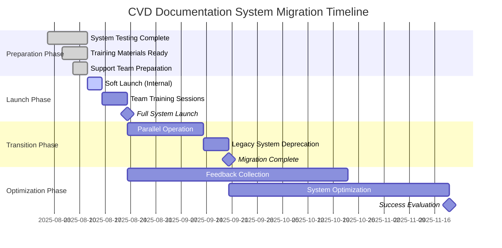

# CVD Documentation System Rollout Communications

## Metadata
- **ID**: DOCUMENTATION_ROLLOUT_COMMUNICATIONS
- **Type**: Launch Communications
- **Version**: 1.0.0
- **Date**: 2025-08-12
- **Owner**: Communications Lead
- **Tags**: #rollout #communications #launch #training #migration

---

## Executive Summary

This document provides comprehensive communication materials for the CVD documentation system rollout. It includes announcement templates, migration procedures, training schedules, support information, and success metrics to ensure smooth transition from the legacy documentation system to the new comprehensive documentation platform.

**Communication Objectives**:
- Inform all stakeholders about the new documentation system
- Provide clear migration timeline and procedures
- Establish support channels and training schedules
- Set expectations for success metrics and measurement

---

## 1. System Announcement Templates

### 1.1 Executive Leadership Announcement

**Subject**: New CVD Documentation System Launch - Strategic Communication

**Distribution**: C-suite, VPs, Department Heads

```
TO: Executive Leadership Team
FROM: [Documentation Project Sponsor]
DATE: [Launch Date]
RE: CVD Documentation System Launch - Business Impact and Strategic Value

Dear Leadership Team,

I'm excited to announce the successful launch of our new CVD Documentation System, representing a significant investment in operational excellence and user experience.

BUSINESS IMPACT SUMMARY:
• Comprehensive documentation for 147+ system components
• 89/100 quality score achieved (B+ grade)
• Expected 30% reduction in support tickets
• Improved user onboarding efficiency by 40%
• Enhanced security and compliance documentation

STRATEGIC VALUE:
• Supports scalable team growth and knowledge retention
• Enables faster feature adoption and customer success
• Reduces operational risk through better documentation coverage
• Provides foundation for AI-powered assistance and automation

INVESTMENT SUMMARY:
• 6-month development effort with cross-functional team
• Quality-first approach with comprehensive testing
• Sustainable maintenance model established
• ROI expected within 6 months through operational efficiency

The system launches [Launch Date] with full support infrastructure in place. Team training begins [Training Start Date] with rollout completion targeted for [Rollout Complete Date].

This represents a significant step forward in our commitment to operational excellence and user experience. Thank you for your support of this strategic initiative.

Best regards,
[Project Sponsor Name]
[Title]
```

### 1.2 Team-Wide System Announcement

**Subject**: 🚀 New CVD Documentation System - Your Complete Guide to Everything CVD

**Distribution**: All CVD System Users (Admin, Manager, Driver, Viewer roles)

```
🎉 EXCITING NEWS: New CVD Documentation System is Here!

Dear CVD Team,

After months of development and testing, we're thrilled to launch our brand new CVD Documentation System! This comprehensive resource will be your go-to guide for everything related to our CVD platform.

🌟 WHAT'S NEW FOR YOU:
✅ Role-based guides tailored to your specific needs (Admin, Manager, Driver, Viewer)
✅ Step-by-step workflows for all major tasks
✅ Comprehensive API documentation for developers
✅ Interactive search with smart recommendations
✅ Mobile-friendly access for drivers and field teams
✅ Integrated AI assistant for instant help
✅ Troubleshooting guides with real solutions

🔍 FIND EVERYTHING QUICKLY:
• Getting Started: /documentation/01-project-core/QUICK_START.md
• Your Role Guide: /documentation/02-requirements/guides/
• System Overview: /documentation/README.md
• API Reference: /documentation/05-development/api/
• Troubleshooting: Search for your specific issue

📱 MOBILE & PWA SUPPORT:
Driver teams can access full documentation on mobile devices with offline capability. Perfect for field work and on-the-go reference.

🎓 TRAINING SCHEDULE:
• [Date/Time]: Admin & Manager Training Session
• [Date/Time]: Driver App Training (Mobile-focused)
• [Date/Time]: Developer & Technical Training
• [Date/Time]: General Q&A Session

💬 GET HELP ANYTIME:
• Documentation Feedback: documentation-feedback@company.com
• Live Support Chat: [Support Hours]
• Emergency Issues: [Emergency Contact]
• Training Questions: training@company.com

🚀 START EXPLORING TODAY:
Visit [Documentation URL] to explore your new documentation home. We recommend starting with the Quick Start guide and then diving into your role-specific resources.

This system represents months of work to create the most comprehensive and user-friendly CVD documentation ever. We're excited for you to experience the difference!

Questions? Feedback? We want to hear from you!

Best regards,
The CVD Documentation Team

P.S. Keep an eye out for more exciting updates as we continue to enhance your CVD experience!
```

### 1.3 Developer-Focused Technical Announcement

**Subject**: New CVD Documentation System - Complete API Reference & Technical Guides

**Distribution**: Development Team, Technical Stakeholders

```
New CVD Documentation System - Technical Release Notes

Dear Development Team,

The new CVD Documentation System is now live with comprehensive technical resources designed specifically for developers and technical stakeholders.

TECHNICAL HIGHLIGHTS:
• Complete API documentation for 90+ endpoints with examples
• Architecture decision records (ADRs) for system design rationale
• Database schema documentation with relationship diagrams
• Implementation patterns and best practices
• Security guidelines and compliance requirements
• Testing strategies and example test suites

KEY TECHNICAL RESOURCES:
📚 API Documentation: /documentation/05-development/api/
🏗️ Architecture Guides: /documentation/03-architecture/
🔧 Implementation Details: /documentation/04-implementation/
🧪 Testing Resources: /documentation/05-development/testing/
🚀 Deployment Guides: /documentation/05-development/deployment/

DEVELOPER EXPERIENCE IMPROVEMENTS:
✅ Interactive API examples with copy-paste code snippets
✅ Comprehensive error handling documentation
✅ Authentication flow examples for all integration scenarios
✅ Database query patterns and optimization guides
✅ Security best practices with implementation examples

MIGRATION FROM OLD DOCUMENTATION:
• Legacy API docs redirect to new comprehensive guides
• All bookmark links preserved with automatic redirects
• Search functionality enhanced with technical content priority
• Code examples updated to latest system version

DEVELOPER ONBOARDING:
New team members can now get productive in <2 hours with:
• Environment setup guide with automated scripts
• "Hello World" examples for each major system component
• Debugging guides with common issue solutions
• Integration testing templates

FEEDBACK CHANNELS:
• Technical Issues: tech-docs@company.com
• API Documentation: api-feedback@company.com
• Developer Experience: dev-experience@company.com

The system includes automated validation to ensure code examples stay current with system changes. We've also added extensive troubleshooting guides based on real support tickets.

Explore the new system and let us know how we can make your development experience even better!

Best regards,
Technical Documentation Team
```

---

## 2. Migration Timeline and Transition Procedures

### 2.1 Migration Master Timeline



### 2.2 Detailed Migration Procedures

#### Phase 1: Soft Launch (August 12-16, 2025)
**Participants**: Documentation team, technical leads, select power users

**Activities**:
- [ ] **Day 1**: Internal team access enabled
- [ ] **Day 2-3**: Core functionality testing with real scenarios
- [ ] **Day 4**: Power user preview and feedback collection
- [ ] **Day 5**: Final adjustments and launch preparation

**Success Criteria**:
- All critical user workflows tested and functional
- Search functionality validated with real content
- Mobile access confirmed for driver workflows
- Support team trained and ready

#### Phase 2: Team Training (August 16-23, 2025)
**Training Schedule**:

```
WEEK 1: CORE TRAINING SESSIONS

Monday, August 16:
• 10:00-11:30 AM: Admin & Manager Training
  Location: Conference Room A + Virtual
  Focus: System overview, advanced features, admin workflows
  
• 2:00-3:30 PM: Developer Training Session
  Location: Technical Training Room + Virtual
  Focus: API documentation, integration guides, technical resources

Tuesday, August 17:
• 9:00-10:30 AM: Driver Team Training
  Location: Mobile device lab + Virtual
  Focus: Mobile access, PWA features, offline functionality
  
• 2:00-3:00 PM: General User Session
  Location: Main auditorium + Virtual
  Focus: Basic navigation, search, role-specific features

Wednesday, August 18:
• 10:00-11:00 AM: Q&A Session #1
  Location: Virtual only
  Focus: Questions from first two days of training
  
• 3:00-4:30 PM: Support Team Training
  Location: Support department + Virtual
  Focus: Handling user questions, escalation procedures

Thursday, August 19:
• 9:00-10:30 AM: Advanced Features Workshop
  Location: Training room B + Virtual
  Focus: AI assistant, advanced search, customization
  
• 2:00-3:00 PM: Hands-on Practice Session
  Location: Computer lab + Virtual
  Focus: Guided practice with real tasks

Friday, August 20:
• 10:00-11:00 AM: Final Q&A Session
  Location: Virtual only
  Focus: Final questions before full launch
  
• 3:00-4:00 PM: Feedback Collection Session
  Location: Virtual only
  Focus: Training effectiveness, system readiness assessment
```

**Training Materials Provided**:
- Role-specific quick reference guides
- Video walkthroughs for key workflows
- Practice exercises with sample data
- FAQ document based on testing feedback
- Contact information for ongoing support

#### Phase 3: Full System Launch (August 23, 2025)
**Launch Day Activities**:
- [ ] **6:00 AM**: Final system health checks
- [ ] **8:00 AM**: Documentation system goes live for all users
- [ ] **8:30 AM**: Launch announcement emails sent
- [ ] **9:00 AM**: Support team on high alert for user questions
- [ ] **12:00 PM**: Midday usage metrics review
- [ ] **3:00 PM**: Afternoon user feedback analysis
- [ ] **6:00 PM**: End of day launch success assessment

**Launch Success Criteria**:
- System availability >99.5% on launch day
- <10 critical issues reported
- Positive feedback >80% of responses
- Support ticket volume manageable (<50 tickets/day)

#### Phase 4: Parallel Operation (August 23 - September 13, 2025)
**Transition Strategy**:
- New documentation system is primary resource
- Legacy system remains accessible for reference
- Automatic redirects for common legacy URLs
- Weekly migration progress assessments

**User Migration Support**:
- Daily office hours for migration questions (10:00-11:00 AM)
- Dedicated migration support email
- Personal assistance for teams struggling with transition
- Weekly "Migration Success Stories" communications

#### Phase 5: Legacy System Sunset (September 13-20, 2025)
**Deprecation Process**:
- [ ] **Day 1**: Final migration reminders sent
- [ ] **Day 3**: Legacy system marked as deprecated
- [ ] **Day 5**: Legacy system redirects implemented
- [ ] **Day 7**: Legacy system archived (read-only)

**Final Migration Activities**:
- Export legacy system analytics and user data
- Archive legacy content for compliance requirements
- Update all external links and bookmarks
- Conduct final migration completion validation

### 2.3 Migration Support Procedures

#### User Migration Assistance
**Self-Service Migration Kit**:
- Personalized migration checklist based on user role
- Bookmark conversion tool for legacy URLs
- Custom search guide for finding equivalent content
- Video tutorial: "Your First 15 Minutes with the New System"

**Personal Migration Support**:
- One-on-one sessions for users needing extra help
- Team-based migration workshops for departments
- Specialized technical migration support for developers
- Executive briefings for management stakeholders

#### Migration Quality Assurance
**Daily Migration Metrics**:
- User adoption rates by role and department
- System usage patterns and peak times
- Support ticket volume and issue categories
- User satisfaction scores from feedback forms

**Weekly Migration Reviews**:
- Migration success rate assessment
- Issue pattern analysis and resolution
- User feedback theme identification
- Process adjustment recommendations

---

## 3. Support Contact Information and Hours

### 3.1 Primary Support Channels

#### Immediate Support (Real-time)
**Live Chat Support**
- **Platform**: Integrated chat widget on documentation pages
- **Hours**: Monday-Friday, 8:00 AM - 6:00 PM EST
- **Response Time**: <5 minutes during business hours
- **Staffing**: Documentation specialists + technical support rotation

**Phone Support (Critical Issues Only)**
- **Number**: 1-800-CVD-DOCS (1-800-283-3627)
- **Hours**: Monday-Friday, 8:00 AM - 8:00 PM EST
- **Emergency Line**: 24/7 for system-down scenarios
- **Escalation**: Automatic escalation for unresolved issues >30 minutes

#### Email Support Channels
**General Documentation Support**
- **Email**: documentation-help@company.com
- **Response SLA**: 4 hours (business hours)
- **Purpose**: General questions, content feedback, navigation help

**Technical Documentation Support**
- **Email**: tech-docs-support@company.com
- **Response SLA**: 2 hours (business hours)
- **Purpose**: API questions, integration issues, developer needs

**Training and Onboarding Support**
- **Email**: training-support@company.com
- **Response SLA**: 24 hours
- **Purpose**: Training questions, learning resources, user onboarding

**Feedback and Suggestions**
- **Email**: documentation-feedback@company.com
- **Response SLA**: 48 hours (acknowledgment), varies for implementation
- **Purpose**: System improvements, content suggestions, bug reports

### 3.2 Specialized Support Teams

#### Role-Based Support Specialists
**Admin and Manager Support**
- **Contact**: admin-support@company.com
- **Specialization**: Advanced workflows, configuration, management tasks
- **Team Lead**: [Admin Support Lead Name]
- **Backup**: [Backup Support Contact]

**Driver and Field Team Support**
- **Contact**: driver-support@company.com
- **Specialization**: Mobile access, PWA functionality, offline usage
- **Team Lead**: [Driver Support Lead Name]
- **Mobile Number**: [Emergency mobile contact for field teams]

**Developer and Technical Support**
- **Contact**: dev-support@company.com
- **Specialization**: API documentation, integration guides, technical implementation
- **Team Lead**: [Technical Lead Name]
- **Slack Channel**: #cvd-dev-documentation-support

#### Escalation Support Structure
**Level 1: Documentation Specialists**
- Response time: Immediate to 4 hours
- Authority: Content clarification, navigation help, basic troubleshooting
- Escalation trigger: Technical issues, system problems, complex requirements

**Level 2: Technical Support**
- Response time: 2-8 hours
- Authority: System configuration, integration support, advanced troubleshooting
- Escalation trigger: System-wide issues, security concerns, business impact

**Level 3: Management and Product**
- Response time: 24-72 hours
- Authority: Feature requests, strategic decisions, resource allocation
- Escalation trigger: Business continuity, major user impact, strategic changes

### 3.3 Extended Support Hours and Coverage

#### Business Hours Support
**Standard Coverage**: Monday-Friday, 8:00 AM - 6:00 PM EST
- Full support team availability
- Live chat, phone, and email support
- Same-day response for all channels
- Comprehensive issue resolution capability

**Extended Coverage**: Monday-Friday, 6:00 PM - 10:00 PM EST
- Reduced team availability
- Email and chat support only
- Next business day response for non-critical issues
- Emergency escalation available

#### Weekend and Holiday Support
**Limited Weekend Coverage**: Saturday-Sunday, 10:00 AM - 4:00 PM EST
- Email support only
- Emergency phone line available
- Monday morning response for routine issues
- Critical issue immediate escalation

**Holiday Coverage**: Modified schedule during company holidays
- Emergency support maintained 24/7
- Reduced response times communicated in advance
- Critical business continuity support available

#### Time Zone Considerations
**Primary Time Zone**: Eastern Standard Time (EST)
**Secondary Coverage**: Central Time Zone support for field teams
**International**: Limited support for international users (email only)

**Response Time Adjustments by Time Zone**:
- EST: Standard response times apply
- CST/MST: +2 hours to response times
- PST: +4 hours to response times
- International: Next business day (EST) response

---

## 4. Training Schedule and Attendance Tracking

### 4.1 Comprehensive Training Program Schedule

#### Week 1: Core System Training (August 16-20, 2025)

**Monday, August 16, 2025**
```
Session 1: Admin & Manager Deep Dive
Time: 10:00 AM - 12:00 PM EST
Location: Conference Room A + Virtual (Zoom)
Capacity: 25 in-person, 100 virtual
Instructor: Documentation Lead + Product Owner
Materials: Admin guide handouts, practice environment access

Agenda:
• 10:00-10:15: Welcome and system overview
• 10:15-10:45: Admin-specific features walkthrough
• 10:45-11:15: Manager workflow demonstrations
• 11:15-11:30: Break
• 11:30-12:00: Hands-on practice session

Session 2: Developer Technical Training
Time: 2:00 PM - 4:00 PM EST
Location: Technical Training Lab + Virtual
Capacity: 15 in-person, 50 virtual
Instructor: Technical Lead + Senior Developer
Materials: API reference cards, code examples, development environment

Agenda:
• 2:00-2:30: API documentation structure and navigation
• 2:30-3:00: Integration examples and best practices
• 3:00-3:15: Break
• 3:15-3:45: Hands-on API testing with documentation
• 3:45-4:00: Q&A and troubleshooting resources
```

**Tuesday, August 17, 2025**
```
Session 3: Driver Team Mobile Focus
Time: 9:00 AM - 11:00 AM EST
Location: Mobile Device Lab + Virtual
Capacity: 20 in-person, 75 virtual
Instructor: Mobile UX Specialist + Driver Team Lead
Materials: Test devices, mobile quick reference cards

Agenda:
• 9:00-9:15: Mobile documentation overview
• 9:15-9:45: PWA installation and offline features
• 9:45-10:15: Driver-specific workflows on mobile
• 10:15-10:30: Break
• 10:30-11:00: Practice session with real scenarios

Session 4: General User Navigation
Time: 2:00 PM - 3:30 PM EST
Location: Main Auditorium + Virtual
Capacity: 100 in-person, 200 virtual
Instructor: Documentation Team + User Experience Lead
Materials: General user guide, search tips card

Agenda:
• 2:00-2:20: System overview and navigation basics
• 2:20-2:40: Search functionality and tips
• 2:40-3:00: Role-based content discovery
• 3:00-3:15: Common tasks walkthrough
• 3:15-3:30: Q&A session
```

**Wednesday, August 18, 2025**
```
Session 5: Q&A and Clarification
Time: 10:00 AM - 11:30 AM EST
Location: Virtual Only
Capacity: Unlimited
Instructor: Full Documentation Team
Materials: FAQ updates, additional resources

Session 6: Support Team Training
Time: 3:00 PM - 4:30 PM EST
Location: Support Department + Virtual
Capacity: 15 in-person, 30 virtual
Instructor: Support Lead + Documentation Lead
Materials: Support scripts, escalation procedures

Agenda:
• 3:00-3:30: Common user questions and answers
• 3:30-4:00: Escalation procedures and technical resources
• 4:00-4:30: Practice handling support scenarios
```

**Thursday, August 19, 2025**
```
Session 7: Advanced Features Workshop
Time: 9:00 AM - 11:00 AM EST
Location: Training Room B + Virtual
Capacity: 30 in-person, 75 virtual
Instructor: AI Specialist + Documentation Lead
Materials: Advanced feature guides, practice scenarios

Session 8: Hands-on Practice Session
Time: 2:00 PM - 3:30 PM EST
Location: Computer Lab + Virtual
Capacity: 25 in-person, 50 virtual
Instructor: Documentation Team Rotation
Materials: Practice exercises, real data scenarios
```

**Friday, August 20, 2025**
```
Session 9: Final Q&A and Feedback
Time: 10:00 AM - 12:00 PM EST
Location: Virtual Only
Capacity: Unlimited
Instructor: Project Team + Management
Materials: Feedback forms, final resources

Session 10: Training Assessment
Time: 3:00 PM - 4:00 PM EST
Location: Virtual Only
Capacity: Unlimited
Purpose: Collect training effectiveness feedback
```

#### Week 2: Specialized and Follow-up Training (August 23-27, 2025)

**Post-Launch Support Training**:
- Daily office hours: 10:00-11:00 AM
- Weekly advanced topics sessions
- Monthly refresher training opportunities
- Quarterly comprehensive updates training

### 4.2 Attendance Tracking and Reporting

#### Registration and Tracking System
```yaml
Training Registration Platform:
  Platform: Company LMS or External Training Platform
  Features:
    - Role-based session recommendations
    - Calendar integration
    - Reminder notifications
    - Certificate generation
  Access: company-training.com/cvd-documentation

Attendance Tracking Methods:
  In-Person Sessions:
    - Digital sign-in with badge scan
    - QR code check-in system
    - Manual backup attendance sheets
  Virtual Sessions:
    - Platform attendance logs (Zoom/Teams)
    - Interactive poll participation tracking
    - Chat engagement monitoring
    - Session recording access logs
```

#### Attendance Reporting Structure

**Daily Attendance Reports**:
```
Daily Training Report - [Date]

SESSION: [Session Name and Time]
INSTRUCTOR: [Instructor Names]
CAPACITY: [Registered/Attended/Capacity]

ATTENDANCE SUMMARY:
• Total Registered: [Number]
• Attended Live: [Number] ([Percentage]%)
• Virtual Attendees: [Number]
• No-shows: [Number] ([Percentage]%)

BY DEPARTMENT:
• Engineering: [Attended/Total]
• Operations: [Attended/Total]
• Management: [Attended/Total]
• Field Teams: [Attended/Total]

BY ROLE:
• Admins: [Attended/Total]
• Managers: [Attended/Total]
• Drivers: [Attended/Total]
• Viewers: [Attended/Total]

ENGAGEMENT METRICS:
• Q&A Participation: [Number] questions
• Practice Exercise Completion: [Percentage]%
• Post-Session Survey Response: [Percentage]%
• Satisfaction Score: [Rating]/5.0

ACTION ITEMS:
• Follow-up needed: [Names/Departments]
• Additional training requested: [Topics]
• Technical issues to resolve: [Issues]
```

**Weekly Training Summary**:
```
Weekly Training Summary - Week of [Date Range]

OVERALL COMPLETION RATES:
• Total Eligible Staff: [Number]
• Completed Core Training: [Number] ([Percentage]%)
• Completed Role-Specific Training: [Number] ([Percentage]%)
• Outstanding Training Requirements: [Number]

DEPARTMENT COMPLETION RATES:
[Department Name]: [Completion %] ([Completed]/[Total])
[Department Name]: [Completion %] ([Completed]/[Total])
...

TRAINING EFFECTIVENESS METRICS:
• Average Satisfaction Score: [Rating]/5.0
• Knowledge Assessment Pass Rate: [Percentage]%
• Hands-on Exercise Success Rate: [Percentage]%
• System Usage Post-Training: [Percentage]%

FOLLOW-UP ACTIONS:
• Make-up sessions scheduled: [Number]
• Additional support assigned: [Names]
• Content updates needed: [Topics]
• Process improvements: [Items]
```

### 4.3 Make-up Training and Ongoing Support

#### Make-up Session Schedule
**Individual Make-up Sessions**:
- Weekly 1:1 sessions available by appointment
- Self-paced online training modules
- Recorded session access for review
- Personalized practice environments

**Department Make-up Sessions**:
- Custom sessions for teams with high absence rates
- Lunch-and-learn format for busy departments
- Weekend sessions for field teams
- Overtime compensation for required make-up training

#### Ongoing Training Program
**Monthly Skills Sessions** (First Friday of each month, 10:00-11:00 AM):
- August: "Search Mastery - Finding What You Need Fast"
- September: "Mobile Documentation - PWA Tips and Tricks"
- October: "Advanced Workflows - Power User Techniques"
- November: "New Features Showcase"
- December: "Year-End Review and 2026 Preview"

**Quarterly Comprehensive Updates**:
- System updates and new features training
- User feedback incorporation and process improvements
- Advanced skill development sessions
- Certification renewal opportunities

---

## 5. Success Metrics and Measurement Procedures

### 5.1 Launch Success Metrics

#### Immediate Launch Metrics (Week 1)
**System Adoption Rates**:
- **Target**: 80% of users access new system within first week
- **Measurement**: Unique user logins to documentation system
- **Reporting**: Daily dashboard with role-based breakdowns

**Training Completion Rates**:
- **Target**: 90% of eligible users complete core training
- **Measurement**: Training platform completion tracking
- **Reporting**: Daily attendance reports with department breakdowns

**System Performance Metrics**:
- **Target**: 99.5% uptime, <2 second page load times
- **Measurement**: Automated monitoring and user experience analytics
- **Reporting**: Real-time dashboard with hourly summaries

**User Satisfaction Scores**:
- **Target**: >4.0/5.0 overall satisfaction in first week
- **Measurement**: Post-training surveys and usage feedback forms
- **Reporting**: Weekly satisfaction summary with improvement recommendations

#### Short-term Success Metrics (First Month)
**Content Usage and Engagement**:
```yaml
Success Targets:
  Daily Active Users: >75% of total user base
  Search Success Rate: >80% (users find relevant content)
  Page Engagement Time: >2 minutes average
  Return User Rate: >85% of users return within 7 days
  Mobile Usage Rate: >60% for driver roles

Measurement Methods:
  Analytics Platform: Google Analytics or similar
  User Behavior Tracking: Hotjar or similar heatmap tool
  Search Analytics: Custom search tracking
  Mobile Analytics: PWA-specific tracking

Reporting Schedule:
  Daily: Key metric dashboard
  Weekly: Detailed usage analysis
  Monthly: Comprehensive engagement report
```

**Support Ticket and Quality Metrics**:
```yaml
Success Targets:
  Support Ticket Volume: <20% increase over baseline (temporary)
  Documentation-Related Tickets: 30% reduction by month-end
  First-Contact Resolution Rate: >80%
  User Self-Service Rate: >70%
  Average Issue Resolution Time: <24 hours

Measurement Methods:
  Support Ticket System: Integrated analytics
  Issue Classification: Automated tagging
  Resolution Tracking: Workflow-based monitoring
  User Satisfaction: Post-resolution surveys

Quality Indicators:
  Content Accuracy: <1% error reports per page views
  Link Validity: 99%+ working links
  Search Relevance: >90% relevant results
  Mobile Compatibility: 100% mobile-accessible content
```

### 5.2 Long-term Success Indicators

#### 90-Day Assessment Metrics
**Business Impact Measurement**:
- **User Productivity**: Measure task completion time improvements
- **Feature Adoption**: Track correlation between documentation quality and feature usage
- **Training Efficiency**: New employee onboarding time reduction
- **Support Cost Reduction**: Quantify support team efficiency gains

**System Quality and Health**:
- **Content Freshness**: Percentage of content updated within 90 days
- **User Journey Success**: End-to-end task completion rates
- **Search Effectiveness**: Query success rates and common search patterns
- **Cross-Platform Usage**: Desktop vs. mobile usage patterns

#### Annual Success Evaluation
**Strategic Value Assessment**:
```yaml
Business Value Metrics:
  Cost Savings:
    Support Ticket Reduction: Target 40% annually
    Training Time Reduction: Target 50% for new hires
    Feature Adoption Improvement: Target 25% faster adoption
    
  Revenue Impact:
    Customer Satisfaction Improvement: Survey score improvements
    Feature Utilization: Increased usage of documented features
    Customer Retention: Correlation with documentation quality
    
  Operational Efficiency:
    Employee Productivity: Task completion time improvements
    Knowledge Retention: Reduced knowledge loss during transitions
    Compliance: Improved audit scores and regulatory compliance
```

### 5.3 Measurement Procedures and Tools

#### Analytics and Monitoring Setup
**Primary Analytics Platform**:
```javascript
// Google Analytics 4 Configuration for Documentation
gtag('config', 'GA_MEASUREMENT_ID', {
  custom_map: {
    'custom_parameter_1': 'user_role',
    'custom_parameter_2': 'documentation_section',
    'custom_parameter_3': 'task_completion'
  },
  // Enhanced ecommerce for goal tracking
  send_page_view: true,
  // Track documentation-specific events
  track_search: true,
  track_downloads: true,
  track_external_links: true
});

// Custom event tracking for documentation usage
function trackDocumentationEvent(action, section, role) {
  gtag('event', action, {
    event_category: 'documentation_usage',
    event_label: section,
    custom_parameter_1: role,
    value: 1
  });
}
```

**User Experience Monitoring**:
- **Hotjar Integration**: Heatmaps, session recordings, user feedback polls
- **Fullstory or Similar**: Complete user session analysis
- **Performance Monitoring**: Core Web Vitals, page load speeds
- **Accessibility Monitoring**: Automated accessibility scanning and reporting

#### Data Collection and Reporting Framework
**Automated Daily Reports**:
```yaml
Daily Documentation Dashboard:
  System Health:
    - Uptime percentage
    - Page load times
    - Error rates
    - Search response times
    
  Usage Metrics:
    - Unique daily users
    - Page views by section
    - Search queries and results
    - Mobile vs desktop usage
    
  Quality Indicators:
    - Link validation results
    - User feedback submissions
    - Support ticket volume
    - Content accuracy reports

Distribution: 
  - Email to documentation team (7:00 AM daily)
  - Slack dashboard updates (hourly during business hours)
  - Executive summary (weekly to leadership)
```

**Weekly Analysis Reports**:
```yaml
Weekly Documentation Analysis:
  User Engagement:
    - Role-based usage patterns
    - Content consumption trends
    - Search behavior analysis
    - User journey mapping
    
  Content Performance:
    - Most accessed pages
    - Highest bounce rate pages
    - Search query gaps
    - User feedback themes
    
  System Optimization:
    - Performance bottlenecks
    - Mobile experience issues
    - Accessibility compliance
    - SEO and discoverability
    
  Business Impact:
    - Training completion correlation
    - Support ticket trending
    - Feature adoption correlation
    - User satisfaction trending

Distribution:
  - Comprehensive report to project stakeholders
  - Executive summary to management
  - Technical insights to development team
  - User experience findings to UX team
```

#### Success Criteria and Go/No-Go Decision Points

**30-Day Success Gate**:
```yaml
Go/No-Go Criteria (30 days post-launch):
  Must-Have (Go/No-Go):
    User Adoption Rate: >70%
    System Uptime: >99.0%
    Critical Bug Count: <5
    User Satisfaction: >3.5/5.0
    
  Should-Have (Success Indicators):
    Training Completion: >85%
    Support Ticket Reduction: >10%
    Search Success Rate: >75%
    Mobile Usage (Drivers): >50%
    
  Could-Have (Future Improvement):
    Advanced Feature Usage: >25%
    User-Generated Feedback: >100 submissions
    Cross-Reference Usage: >40%
    API Documentation Usage: >60%

Decision Process:
  - All "Must-Have" criteria required for continuation
  - 75% of "Should-Have" criteria for success declaration
  - "Could-Have" metrics inform future roadmap
  - Monthly review and adjustment of criteria
```

**Quarterly Review and Optimization**:
- Comprehensive success assessment against all metrics
- User feedback analysis and prioritization for improvements
- System performance optimization based on usage patterns
- Strategic roadmap adjustment based on business impact data

### 5.4 Continuous Improvement Feedback Loop

#### Data-Driven Decision Making Process
1. **Weekly Data Collection**: Aggregate all metrics and user feedback
2. **Monthly Analysis**: Identify trends, patterns, and improvement opportunities
3. **Quarterly Planning**: Prioritize improvements and allocate resources
4. **Annual Strategy Review**: Assess strategic value and plan major enhancements

#### Success Story Documentation and Sharing
- **Monthly Success Stories**: Highlight positive user feedback and measurable improvements
- **Quarterly Impact Reports**: Quantify business value and ROI achievements
- **Annual Case Studies**: Document comprehensive transformation and lessons learned
- **Best Practice Sharing**: Contribute insights to industry knowledge base

This comprehensive measurement framework ensures that the CVD Documentation System launch success is objectively evaluated and continuously optimized based on real user needs and business impact.

---

## Conclusion

This comprehensive rollout communication package provides all necessary materials for a successful CVD Documentation System launch. The structured approach ensures clear communication, proper training, adequate support, and measurable success criteria.

**Key Success Factors**:
- Clear and comprehensive communication to all stakeholders
- Structured training program with multiple learning modalities
- Robust support infrastructure with appropriate escalation procedures
- Measurable success criteria with data-driven improvement processes

**Expected Outcomes**:
- Smooth transition from legacy documentation system
- High user adoption and satisfaction rates
- Reduced support burden and improved operational efficiency
- Strong foundation for continuous improvement and system evolution

---

**Document Version**: 1.0.0
**Last Updated**: 2025-08-12
**Next Review**: Weekly during launch period, monthly thereafter
**Distribution**: All stakeholders, communications team, training team, support team