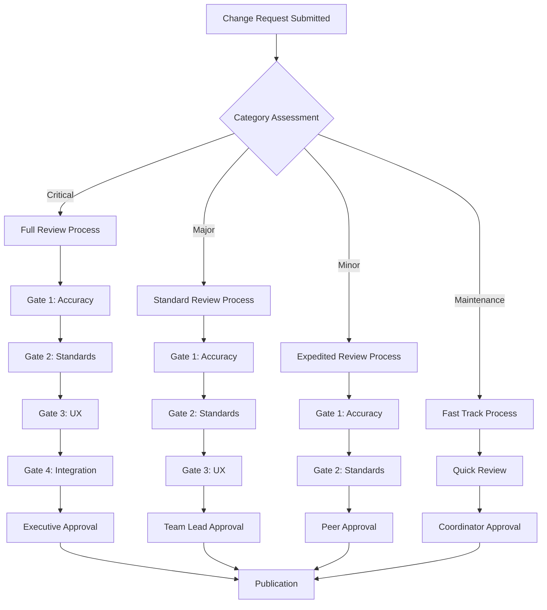

# CVD Documentation Review Process

## Metadata
- **ID**: MAINTENANCE_REVIEW_PROCESS
- **Type**: Process Documentation
- **Version**: 1.0.0
- **Date**: 2025-08-13
- **Lead**: Documentation Review Board
- **Tags**: #review #process #quality #governance #change-management

## Table of Contents

1. [Overview](#overview)
2. [Change Request Procedure](#change-request-procedure)
3. [Review Criteria and Quality Gates](#review-criteria-and-quality-gates)
4. [Approval Workflow](#approval-workflow)
5. [Version Control and Change Tracking](#version-control-and-change-tracking)
6. [Publication Process](#publication-process)
7. [Rollback Procedures](#rollback-procedures)
8. [Templates and Forms](#templates-and-forms)
9. [Metrics and Reporting](#metrics-and-reporting)

## Overview

This document establishes the comprehensive review process for all CVD documentation changes, ensuring quality, accuracy, and consistency across the documentation system. The process addresses the current quality gaps identified in the Phase 7 QA audit and implements governance to maintain the target quality score of 96/100.

### Process Objectives
- **Maintain Documentation Quality**: Ensure all changes meet established standards
- **Enable Controlled Evolution**: Support systematic improvement of documentation
- **Ensure Accuracy**: Validate technical and procedural correctness
- **Support Collaboration**: Facilitate effective team collaboration on documentation
- **Track Changes**: Maintain comprehensive change history and impact analysis

### Quality Standards Enforcement
Based on current quality assessment (89/100), this process specifically addresses:
- **Technical Accuracy**: 92/100 → Target 97/100
- **Content Completeness**: 89/100 → Target 95/100
- **Standards Compliance**: 87/100 → Target 94/100

## Change Request Procedure

### 1. Change Initiation

#### Change Categories
All documentation changes are classified into the following categories:

**A. Critical Changes** (Security/Safety Impact)
- Security procedure modifications
- Emergency response updates
- API authentication changes
- Data privacy procedure updates

**B. Major Changes** (Significant Content Impact)
- New feature documentation
- Workflow procedure changes
- Architecture documentation updates
- API endpoint additions/modifications

**C. Minor Changes** (Content Enhancement)
- Content clarification improvements
- Additional examples or use cases
- UI/process screenshot updates
- Cross-reference improvements

**D. Maintenance Changes** (Administrative)
- Spelling/grammar corrections
- Link updates
- Formatting standardization
- Template compliance updates

#### Change Request Sources
Changes may be initiated by:
- **Development Team**: Feature releases, API changes
- **Product Management**: Business process changes
- **Support Team**: User feedback, common issues
- **Documentation Team**: Quality improvements, maintenance
- **External Users**: Community feedback, issue reports

### 2. Change Request Submission

#### Required Information
All change requests must include:

```markdown
## Change Request Form

### Basic Information
- **Change ID**: CR-YYYY-NNNN (auto-generated)
- **Date**: [Submission date]
- **Requestor**: [Name and role]
- **Category**: [Critical/Major/Minor/Maintenance]
- **Priority**: [High/Medium/Low]

### Change Description
- **Affected Documents**: [List of files/sections]
- **Change Summary**: [Brief description]
- **Rationale**: [Why this change is needed]
- **Impact Assessment**: [User/system impact]

### Technical Details
- **Current Content**: [What exists now]
- **Proposed Content**: [What should change]
- **Dependencies**: [Related systems/docs affected]
- **Testing Requirements**: [How to validate]

### Review Requirements
- **SME Review Needed**: [Yes/No and who]
- **Technical Review Needed**: [Yes/No]
- **User Testing Required**: [Yes/No]
- **Timeline**: [Requested completion date]
```

#### Submission Process
1. **Create Change Request**: Submit via documentation management system
2. **Initial Triage**: Documentation Coordinator assigns priority and reviewers
3. **Impact Assessment**: Evaluate scope and resource requirements
4. **Assignment**: Route to appropriate review team(s)

## Review Criteria and Quality Gates

### Quality Gate Framework

#### Gate 1: Content Accuracy (Mandatory for all changes)
**Criteria:**
- [ ] Technical information is factually correct
- [ ] Code examples are tested and functional
- [ ] Procedures are validated against current system
- [ ] Business processes reflect current workflows
- [ ] No contradictions with existing documentation

**Reviewers:** Subject Matter Expert + Technical Writer
**Timeline:** 2-5 business days depending on complexity

#### Gate 2: Standards Compliance (Mandatory for Major/Critical changes)
**Criteria:**
- [ ] Follows CVD documentation standards
- [ ] Metadata is complete and accurate
- [ ] Formatting adheres to style guide
- [ ] Cross-references are properly implemented
- [ ] Template usage is correct

**Reviewers:** Documentation Standards Officer
**Timeline:** 1-2 business days

#### Gate 3: User Experience Validation (Required for Major changes)
**Criteria:**
- [ ] Information is clearly presented
- [ ] User journey is logical and complete
- [ ] Language is appropriate for target audience
- [ ] Accessibility guidelines are followed
- [ ] Navigation and findability are optimized

**Reviewers:** UX Writer + User Experience Specialist
**Timeline:** 2-3 business days

#### Gate 4: Integration Review (Required for Major/Critical changes)
**Criteria:**
- [ ] Changes integrate well with existing content
- [ ] Cross-references are updated appropriately
- [ ] Related documents are identified and updated
- [ ] Search index implications are considered
- [ ] No orphaned or conflicting content

**Reviewers:** Documentation Architect
**Timeline:** 1-2 business days

### Review Workflow by Change Category

#### Critical Changes
**Review Sequence:** All Gates (1→2→3→4) + Executive Approval
**Timeline:** 5-10 business days
**Approval Authority:** Documentation Review Board + Product Owner

#### Major Changes
**Review Sequence:** Gates 1→2→3→4
**Timeline:** 3-7 business days
**Approval Authority:** Documentation Team Lead + SME

#### Minor Changes
**Review Sequence:** Gate 1→2
**Timeline:** 1-3 business days
**Approval Authority:** Technical Writer + Peer Reviewer

#### Maintenance Changes
**Review Sequence:** Gate 1 (abbreviated)
**Timeline:** 1 business day
**Approval Authority:** Documentation Coordinator

## Approval Workflow

### Role-Based Permissions Matrix

| Role | Create CR | Review Content | Approve Minor | Approve Major | Approve Critical |
|------|-----------|----------------|---------------|---------------|------------------|
| **Documentation Coordinator** | ✅ | ✅ | ✅ | ❌ | ❌ |
| **Technical Writer** | ✅ | ✅ | ✅ | ✅ | ❌ |
| **Documentation Team Lead** | ✅ | ✅ | ✅ | ✅ | ✅* |
| **Subject Matter Expert** | ✅ | ✅ | ❌ | ❌ | ❌ |
| **Documentation Review Board** | ✅ | ✅ | ✅ | ✅ | ✅ |
| **Product Owner** | ✅ | ✅ | ❌ | ✅* | ✅ |

*Requires additional approver for Critical changes

### Approval Process Flow



### Approval Authority Matrix

#### Documentation Review Board
**Composition:**
- Documentation Team Lead (Chair)
- Technical Lead
- Product Manager
- UX Lead
- Quality Assurance Lead

**Meeting Schedule:**
- **Weekly**: Standard review meeting
- **Ad-hoc**: Critical change reviews
- **Monthly**: Process improvement and metrics review

**Decision Making:**
- **Quorum**: 3 of 5 members
- **Consensus**: Preferred decision method
- **Vote**: When consensus cannot be reached
- **Escalation**: To Product Owner for critical business decisions

### Conflict Resolution

#### Review Conflict Process
1. **Initial Disagreement**: Reviewer raises concern with supporting rationale
2. **Discussion**: Stakeholders discuss via review system comments
3. **SME Consultation**: Bring in additional subject matter expert if needed
4. **Team Lead Decision**: Documentation Team Lead makes final decision
5. **Board Escalation**: Unresolved conflicts escalate to Review Board
6. **Executive Decision**: Board escalates to Product Owner if needed

#### Common Conflict Types and Resolution
- **Technical Accuracy Disputes**: Defer to Development Team Lead
- **User Experience Concerns**: Defer to UX Lead
- **Business Process Questions**: Defer to Product Manager
- **Style/Standards Issues**: Defer to Documentation Team Lead
- **Strategic Direction**: Defer to Product Owner

## Version Control and Change Tracking

### Document Versioning Strategy

#### Version Number Schema
**Format**: MAJOR.MINOR.PATCH

**Increment Rules:**
- **MAJOR**: Structural changes, complete rewrites, breaking changes
- **MINOR**: New sections, significant content additions, workflow changes
- **PATCH**: Corrections, clarifications, minor improvements

**Examples:**
- `1.0.0` → `1.0.1`: Fixed typos and broken links
- `1.0.1` → `1.1.0`: Added new troubleshooting section
- `1.1.0` → `2.0.0`: Complete restructure of user workflow

#### Metadata Updates
Every approved change must update document metadata:

```yaml
---
title: "Document Title"
version: "1.1.0"
updated: "2025-08-13"
change_summary: "Added service order troubleshooting section"
reviewer: "Jane Smith"
approved_by: "Documentation Review Board"
change_id: "CR-2025-0123"
---
```

### Change Log Management

#### Document-Level Change Tracking
Maintain change history in each document:

```markdown
## Document History

| Version | Date | Changes | Change ID | Reviewer |
|---------|------|---------|-----------|----------|
| 1.1.0 | 2025-08-13 | Added troubleshooting section | CR-2025-0123 | J. Smith |
| 1.0.1 | 2025-08-01 | Fixed API endpoint examples | CR-2025-0089 | M. Johnson |
| 1.0.0 | 2025-07-15 | Initial version | CR-2025-0045 | J. Smith |
```

#### System-Level Change Tracking
Maintain centralized change registry:

```markdown
# Documentation Change Registry

## August 2025

### CR-2025-0125 - Service Order API Updates
- **Type**: Major
- **Status**: Approved
- **Affected Docs**: service-orders-api.md, service-order-workflow.md
- **Reviewer**: Development Team
- **Impact**: High - affects developer integration

### CR-2025-0124 - User Management Screenshots
- **Type**: Minor
- **Status**: In Review
- **Affected Docs**: user-management-guide.md
- **Reviewer**: UX Team
- **Impact**: Low - improves clarity
```

### Git Integration

#### Branch Naming Convention
```
docs/[change-id]-[brief-description]
```

**Examples:**
- `docs/CR-2025-0123-service-order-troubleshooting`
- `docs/CR-2025-0124-user-mgmt-screenshots`
- `docs/CR-2025-0125-api-endpoint-updates`

#### Commit Message Standards
```
docs(category): brief description (Change ID)

- Detailed change description
- Additional context if needed
- Testing notes

Closes: CR-2025-0123
Reviewed-by: Jane Smith
Approved-by: Documentation Review Board
```

#### Pull Request Template
```markdown
## Change Request Information
- **Change ID**: CR-2025-NNNN
- **Category**: [Critical/Major/Minor/Maintenance]
- **Affected Documents**: [List files]

## Description
Brief description of changes and rationale.

## Review Checklist
- [ ] Content accuracy verified
- [ ] Standards compliance checked
- [ ] Cross-references updated
- [ ] Testing completed (if applicable)

## Approval
- [ ] Subject Matter Expert review
- [ ] Technical Writer review
- [ ] Documentation Team Lead approval
```

## Publication Process

### Pre-Publication Checklist

#### Technical Validation
- [ ] All code examples tested in development environment
- [ ] All links verified and functional
- [ ] All screenshots current and accurate
- [ ] Metadata complete and accurate

#### Quality Assurance
- [ ] Spelling and grammar checked
- [ ] Style guide compliance verified
- [ ] Template usage correct
- [ ] Cross-references validated

#### Integration Verification
- [ ] Related documents updated
- [ ] Search index updated
- [ ] Navigation updated if needed
- [ ] External systems notified if applicable

### Publication Workflow

#### Staging Environment
1. **Deploy to Staging**: All approved changes deploy to staging environment
2. **Integration Testing**: Verify changes work within complete system
3. **Final Review**: Documentation Team Lead conducts final review
4. **Stakeholder Sign-off**: Get final approval from change requestor

#### Production Deployment
1. **Scheduled Deployment**: Deploy during scheduled maintenance window
2. **Smoke Testing**: Verify deployment successful
3. **Notification**: Inform stakeholders of completion
4. **Monitor**: Watch for any immediate issues

#### Post-Publication Activities
1. **Update Change Registry**: Mark change as completed
2. **Analytics Monitoring**: Track usage and user feedback
3. **Follow-up**: Check for any immediate user issues
4. **Documentation**: Update any related process documentation

### Publication Schedule

#### Regular Publication Windows
- **Daily**: Maintenance changes (automated deployment)
- **Weekly**: Minor changes (Wednesday 2 PM EST)
- **Bi-weekly**: Major changes (Tuesday 10 AM EST)
- **Monthly**: Critical changes (First Tuesday, 10 AM EST)

#### Emergency Publication
- **Criteria**: Security issues, critical inaccuracies, system outages
- **Process**: Expedited review + immediate deployment
- **Approval**: Documentation Team Lead + Product Owner
- **Timeline**: Within 2 hours for critical issues

## Rollback Procedures

### Rollback Triggers
- **Technical Issues**: Deployed content causes system problems
- **Accuracy Issues**: Significant factual errors discovered
- **User Impact**: Major user confusion or workflow disruption
- **Compliance Issues**: Legal or regulatory compliance problems

### Rollback Process

#### Immediate Response (Within 1 hour)
1. **Assessment**: Evaluate issue severity and impact
2. **Decision**: Determine if rollback is necessary
3. **Communication**: Notify affected stakeholders
4. **Action**: Execute rollback procedure

#### Rollback Execution
1. **Content Rollback**: Revert to previous document version
2. **System Updates**: Update search index and navigation
3. **Cache Clearing**: Clear all content caches
4. **Verification**: Confirm rollback successful

#### Post-Rollback Activities
1. **Issue Analysis**: Identify root cause of problem
2. **Corrective Action**: Develop solution for the issue
3. **Re-submission**: Submit corrected change request
4. **Process Improvement**: Update procedures to prevent recurrence

### Rollback Decision Matrix

| Issue Severity | Impact Level | Rollback Decision | Authority |
|----------------|--------------|-------------------|-----------|
| **Critical** | High | Immediate | Team Lead |
| **Critical** | Medium | Within 2 hours | Team Lead |
| **Major** | High | Within 4 hours | Review Board |
| **Major** | Medium | Within 24 hours | Team Lead |
| **Minor** | Any | Next publication window | Coordinator |

## Templates and Forms

### Change Request Template

```markdown
# Documentation Change Request

## Request Information
- **Change ID**: [Auto-generated]
- **Date**: [YYYY-MM-DD]
- **Requestor**: [Name, Role, Contact]
- **Priority**: [High/Medium/Low]
- **Category**: [Critical/Major/Minor/Maintenance]

## Change Description
### Summary
[Brief description of the change]

### Rationale
[Why this change is needed]

### Affected Documents
- [ ] [Document 1] - [Type of change]
- [ ] [Document 2] - [Type of change]

### Current State
[What exists now - attach screenshots if helpful]

### Proposed State
[What should change - provide specific content if available]

## Impact Assessment
### User Impact
[How will this affect users?]

### System Impact
[Any technical implications?]

### Dependencies
[What other changes are required?]

## Testing and Validation
### Validation Requirements
- [ ] Code examples tested
- [ ] Procedures verified
- [ ] Screenshots updated
- [ ] Links validated

### Review Requirements
- [ ] Subject Matter Expert review needed
- [ ] Technical review needed
- [ ] User experience review needed

## Timeline
- **Requested Completion**: [Date]
- **Business Justification**: [Why this timeline?]
- **Flexibility**: [Any flexibility in timing?]

## Additional Information
[Any other relevant information]
```

### Review Report Template

```markdown
# Documentation Review Report

## Review Information
- **Change ID**: CR-2025-NNNN
- **Reviewer**: [Name and Role]
- **Review Type**: [Accuracy/Standards/UX/Integration]
- **Date**: [YYYY-MM-DD]
- **Review Status**: [Approved/Approved with Changes/Rejected]

## Review Results
### Content Accuracy
- **Score**: [Pass/Fail/Needs Revision]
- **Comments**: [Detailed feedback]
- **Action Items**: [Specific changes needed]

### Standards Compliance
- **Score**: [Pass/Fail/Needs Revision]
- **Comments**: [Standards adherence feedback]
- **Action Items**: [Compliance improvements needed]

### User Experience
- **Score**: [Pass/Fail/Needs Revision]
- **Comments**: [UX assessment]
- **Action Items**: [UX improvements needed]

## Recommendations
### Required Changes
1. [Specific change 1]
2. [Specific change 2]

### Optional Improvements
1. [Optional improvement 1]
2. [Optional improvement 2]

## Overall Assessment
[Summary recommendation and next steps]

## Sign-off
- **Reviewer Signature**: [Digital signature/approval]
- **Date**: [YYYY-MM-DD]
- **Next Steps**: [What happens next]
```

## Metrics and Reporting

### Review Process Metrics

#### Efficiency Metrics
- **Average Review Time**: Target by category
  - Critical: 5-10 business days
  - Major: 3-7 business days
  - Minor: 1-3 business days
  - Maintenance: 1 business day

- **Review Cycle Time**: Time from submission to publication
- **Reviewer Utilization**: Workload distribution across reviewers
- **Rework Rate**: Percentage of changes requiring revision

#### Quality Metrics
- **First-Time Approval Rate**: Target >80%
- **Post-Publication Issues**: Target <5% of published changes
- **User Satisfaction**: Feedback on published changes
- **Standards Compliance Rate**: Target >95%

### Monthly Review Process Report

```markdown
# Monthly Review Process Report - [Month Year]

## Summary Statistics
- **Total Change Requests**: [Number]
- **Completed Reviews**: [Number]
- **Average Review Time**: [Days]
- **Approval Rate**: [Percentage]

## Category Breakdown
| Category | Submitted | Completed | Avg. Review Time | Approval Rate |
|----------|-----------|-----------|------------------|---------------|
| Critical | X | Y | Z days | A% |
| Major | X | Y | Z days | A% |
| Minor | X | Y | Z days | A% |
| Maintenance | X | Y | Z days | A% |

## Quality Assessment
- **Standards Compliance**: [Percentage]
- **Technical Accuracy**: [Assessment]
- **User Feedback**: [Summary]
- **Post-Publication Issues**: [Number and severity]

## Process Improvements
### Implemented This Month
1. [Improvement 1]
2. [Improvement 2]

### Planned for Next Month
1. [Planned improvement 1]
2. [Planned improvement 2]

## Recommendations
[Key recommendations for process optimization]
```

### Dashboard Requirements
- **Real-time Review Status**: Current change requests and their status
- **Reviewer Workload**: Active assignments and capacity
- **Quality Trends**: Month-over-month quality metrics
- **Process Performance**: Efficiency and effectiveness indicators

---

## Implementation Plan

### Phase 1: Foundation (30 days)
1. **Setup Review Infrastructure**
   - Configure review management system
   - Create review templates and forms
   - Establish reviewer assignments

2. **Train Review Team**
   - Conduct process training sessions
   - Practice with test change requests
   - Refine procedures based on feedback

### Phase 2: Full Implementation (60 days)
1. **Deploy Complete Process**
   - Implement all review gates
   - Begin tracking metrics
   - Establish regular reporting

2. **Process Optimization**
   - Monitor performance metrics
   - Gather reviewer feedback
   - Optimize procedures for efficiency

### Phase 3: Continuous Improvement (Ongoing)
1. **Regular Process Review**
   - Monthly process assessment
   - Quarterly procedure updates
   - Annual process overhaul

2. **Advanced Features**
   - Automated quality checks
   - Integrated workflow tools
   - Enhanced analytics and reporting

---

**Document Owner**: Documentation Review Board  
**Review Frequency**: Quarterly  
**Next Review Date**: 2025-11-13  
**Approval Required**: Documentation Team Lead, Product Owner  
**Distribution**: All documentation team members, review board members, stakeholders